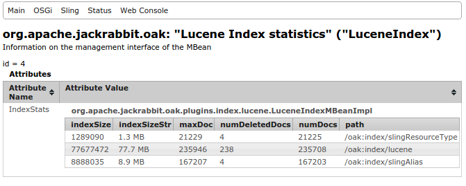

<!--
   Licensed to the Apache Software Foundation (ASF) under one or more
   contributor license agreements.  See the NOTICE file distributed with
   this work for additional information regarding copyright ownership.
   The ASF licenses this file to You under the Apache License, Version 2.0
   (the "License"); you may not use this file except in compliance with
   the License.  You may obtain a copy of the License at

       http://www.apache.org/licenses/LICENSE-2.0

   Unless required by applicable law or agreed to in writing, software
   distributed under the License is distributed on an "AS IS" BASIS,
   WITHOUT WARRANTIES OR CONDITIONS OF ANY KIND, either express or implied.
   See the License for the specific language governing permissions and
   limitations under the License.
  -->

## Lucene Index

**Following details are applicable for Oak release 1.0.8 and earlier. For current
documentation  refer to [Current Lucene documentation](lucene.html)**

Oak supports Lucene based indexes to support both property constraint and full
text constraints

### The Lucene Full-Text Index

The full-text index handles the 'contains' type of queries:

    //*[jcr:contains(., 'text')]

If a full-text index is configured, then all queries that have a full-text condition
use the full-text index, no matter if there are other conditions that are indexed,
and no matter if there is a path restriction.

If no full-text index is configured, then queries with full-text conditions
may not work as expected. (The query engine has a basic verification in place 
for full-text conditions, but it does not support all features that Lucene does,
and it traverses all nodes if there are no indexed constraints).

The full-text index update is asynchronous via a background thread, 
see `Oak#withAsyncIndexing`.
This means that some full-text searches will not work for a small window of time: 
the background thread runs every 5 seconds, plus the time is takes to run the diff 
and to run the text-extraction process. 

The async update status is now reflected on the `oak:index` node with the help of 
a few properties, see [OAK-980](https://issues.apache.org/jira/browse/OAK-980)

TODO Node aggregation [OAK-828](https://issues.apache.org/jira/browse/OAK-828)

The index definition node for a lucene-based full-text index:

* must be of type `oak:QueryIndexDefinition`
* must have the `type` property set to __`lucene`__
* must contain the `async` property set to the value `async`, this is what sends the 
index update process to a background thread

_Optionally_ you can add

 * what subset of property types to be included in the index via the  
 `includePropertyTypes` property
 * a blacklist of property names: what property to be excluded from the index
   via the `excludePropertyNames` property
 * the `reindex` flag which when set to `true`, triggers a full content re-index.

Example:

    {
      NodeBuilder index = root.child("oak:index");
      index.child("lucene")
        .setProperty("jcr:primaryType", "oak:QueryIndexDefinition", Type.NAME)
        .setProperty("type", "lucene")
        .setProperty("async", "async")
        .setProperty(PropertyStates.createProperty("includePropertyTypes", ImmutableSet.of(
            PropertyType.TYPENAME_STRING, PropertyType.TYPENAME_BINARY), Type.STRINGS))
        .setProperty(PropertyStates.createProperty("excludePropertyNames", ImmutableSet.of( 
            "jcr:createdBy", "jcr:lastModifiedBy"), Type.STRINGS))
        .setProperty("reindex", true);
    }

__Note__ The Oak Lucene index will only index _Strings_ and _Binaries_ by default. 
If you need to add another data type, you need to add it to the  
_includePropertyTypes_ setting, and don't forget to set the _reindex_ flag to true.

### Lucene Property Index (Since 1.0.8)

Oak uses Lucene for creating index to support queries which involve property 
constraint that is not full-text

    select * from [nt:base] where [alias] = '/admin'

To define a property index on a subtree for above query you have to add an 
index definition 

```js
"uuid" : {
        "jcr:primaryType": "oak:QueryIndexDefinition",
        "type": "lucene",
        "async": "async",
        "fulltextEnabled": false,
        "includePropertyNames": ["alias"]
    }
```
The index definition node for a lucene-based full-text index:

* must be of type `oak:QueryIndexDefinition`
* must have the `type` property set to __`lucene`__
* must contain the `async` property set to the value `async`, this is what sends the 
index update process to a background thread
* must have `fulltextEnabled` set to `false`
* must provide a whitelist of property names which should be indexed via 
`includePropertyNames`

_Note that compared to [Property Index](query.html#property-index) Lucene 
Property Index is always configured in Async mode hence it might lag behind 
in reflecting the current repository state while performing the query_

Taking another example. 

```
select
    *
from
    [app:Asset] as a
where
    [jcr:content/jcr:lastModified] > cast('2014-10-01T00:00:00.000+02:00' as date)
    and [jcr:content/metadata/format] = 'image'
order by
    jcr:content/jcr:lastModified
```

To enable faster execution for above query you can create following Lucene 
property index 

```
"assetIndex":
{
  "jcr:primaryType":"oak:QueryIndexDefinition",
  "declaringNodeTypes":"app:Asset",
  "includePropertyNames":["jcr:content/jcr:lastModified" , 
      "jcr:content/metadata/format"],
  "type":"lucene",
  "async":"async",
  "reindex":true,
  "fulltextEnabled":false,
  "orderedProps":["jcr:content/jcr:lastModified"]
  "properties":	{
    "jcr:primaryType":"oak:Unstructured",
    "jcr:content": {
      "jcr:primaryType":"oak:Unstructured",
      "jcr:lastModified":	{
        "jcr:primaryType":"oak:Unstructured",
        "type":"Date"
      }
    }
  }	
}
```

Above index definition makes use of various features supported by property index

* `declaringNodeTypes` - As the query involves nodes of type `app:Asset` 
index is restricted to only index nodes of type `app:Asset`
* `orderedProps` - As the query performs sorting via `order by` clause index is
configured with property names which are used in sorting
* `properties` - For ordering to work properly we need to tell the type of 
property

For implementation details refer to [OAK-2005][OAK-2005]. Following sections 
would provide more details about supported features

### Index Definition

Lucene index definition is managed via `NodeStore` and supports following 
attributes

type
: Required and should always be `lucene`

async
: Required and should always be `async`

fulltextEnabled
: For Lucene based property index this should *always* be set to `false`

declaringNodeTypes
: Node type names whose properties should be indexed. If not specified then all
  nodes would indexed if they have properties defined in `includePropertyNames`.
  For smaller and efficient indexes its recommended that `declaringNodeTypes`
   should be specified according to your query needs

includePropertyNames
: List of property name which should be indexed. Property name can be 
  relative e.g. `jcr:content/jcr:lastModified`

orderedProps
: List of property names which would be used in the `order by` clause of the 
  query
   
includePropertyTypes
: Used in Lucene Fulltext Index
: For full text index defaults to `String, Binary`
: List of property types which should be indexed. The values can be one 
  specified in [PropertyType Names][1]
  
[blobSize][OAK-2201]
: Default value 32768 (32kb)
: Size in bytes used for splitting the index files when storing them in NodeStore

functionName
: Name to be used to enable index usage with [native query support](#native-query)

### Property Definition

In some cases property specific configurations are required. For example 
typically while performing order by in query user does not specify the 
property type. In such cases you need to specify the property type explicitly.

Property definition nodes are created as per there property name under 
`properties` node of index definition node. For relative properties you would
need to create the required path structure under `properties` node. For e.g.
for property `jcr:content/metadata/format` you need to create property node at
path `<index definition node>/properties/jcr:content/jcr:lastModified`

```
"properties":
  {
    "jcr:primaryType":"oak:Unstructured",
    "jcr:content":
    {
      "jcr:primaryType":"oak:Unstructured",
      "jcr:lastModified":
      {
        "jcr:primaryType":"oak:Unstructured",
        "type":"Date"
      }
    }
  }	
```

type
: JCR Property type. Can be one of `Date`, `Boolean`, `Double` or `Long`

boost
: The boost value. Defaults to 1.0
: Since 1.0.9

### Ordering

Lucene property index provides efficient sorting support based on Lucene 
DocValue fields. To configure specify the list of property names which can be
used in the `order by` clause as part of `orderedProps` property.

If the property is of type other than string then you must specify the property
definition with `type` details

Refer to [Lucene based Sorting][OAK-2196] for more details. 

<a name="osgi-config"></a>
### LuceneIndexProvider Configuration

Some of the runtime aspects of the Oak Lucene support can be configured via OSGi
configuration. The configuration needs to be done for PID `org.apache
.jackrabbit.oak.plugins.index.lucene.LuceneIndexProviderService`


enableCopyOnReadSupport
: Enable copying of Lucene index to local file system to improve query 
performance. See [Copy Indexes On Read](#copy-on-read)

localIndexDir
: Directory to be used for when copy index files to local file system. To be 
specified when `enableCopyOnReadSupport` is enabled

debug
: Boolean value. Defaults to `false`
: If enabled then Lucene logging would be integrated with Slf4j

<a name="non-root-index"></a>
### Non Root Index Definitions

Lucene index definition can be defined at any location in repository and need
not always be defined at root. For example if your query involves path 
restrictions like

    select * from [app:Asset] as a where ISDESCENDANTNODE(a, '/content/companya') and [format] = 'image'
    
Then you can create the required index definition say `assetIndex` at 
`/content/companya/oak:index/assetIndex`. In such a case that index would 
contain data for the subtree under `/content/companya`

<a name="native-query"></a>
### Native Query and Index Selection

Oak query engine supports native queries like

    //*[rep:native('lucene', 'name:(Hello OR World)')]

If multiple Lucene based indexes are enabled on the system and you need to 
make use of specific Lucene index like `/oak:index/assetIndex` then you can 
specify the index name via `functionName` attribute on index definition. 

For example for assetIndex definition like 

```
{
  "jcr:primaryType":"oak:QueryIndexDefinition",
  "type":"lucene",
  ...
  "functionName" : "lucene-assetIndex",
}
```

Executing following query would ensure that Lucene index from `assetIndex` 
should be used

    //*[rep:native('lucene-assetIndex', 'name:(Hello OR World)')]

### Persisting indexes to FileSystem

By default Lucene indexes are stored in the `NodeStore`. If required they can
be stored on the file system directly

```
{
  "jcr:primaryType":"oak:QueryIndexDefinition",
  "type":"lucene",
  ...
  "persistence" : "file",
  "path" : "/path/to/store/index"
}
```
To store the Lucene index in the file system, in the Lucene index definition 
node, set the property `persistence` to `file`, and set the property `path` 
to the directory where the index should be stored. Then start reindexing by 
setting `reindex` to `true`.

Note that this setup would only for those non cluster `NodeStore`. If the 
backend `NodeStore` supports clustering then index data would not be 
accessible on other cluster nodes

<a name="copy-on-read"></a>
### CopyOnRead

Lucene indexes are stored in `NodeStore`. Oak Lucene provides a custom directory
implementation which enables Lucene to load index from `NodeStore`. This 
might cause performance degradation if the `NodeStore` storage is remote. For
such case Oak Lucene provide a `CopyOnReadDirectory` which copies the index 
content to a local directory and enables Lucene to make use of local 
directory based indexes while performing queries.

At runtime various details related to copy on read features are exposed via
`CopyOnReadStats` MBean. Indexes at JCR path e.g. `/oak:index/assetIndex` 
would be copied to `<index dir>/<hash of jcr path>`. To determine mapping 
between local index directory and JCR path refer to the MBean details


  
For more details refer to [OAK-1724][OAK-1724]. This feature can be enabled via
[Lucene Index provider service configuration](#osgi-config)

### Lucene Index MBeans

Oak Lucene registers a JMX bean `LuceneIndex` which provide details about the 
index content e.g. size of index, number of documents present in index etc



<a name="luke"></a>
### Analyzing created Lucene Index

[Luke]  is a handy development and diagnostic tool, which accesses already 
existing Lucene indexes and allows you to display index details. In Oak 
Lucene index files are stored in `NodeStore` and hence not directly 
accessible. To enable analyzing the index files via Luke follow below 
mentioned steps

1. Download the Luke version which includes the matching Lucene jars used by 
   Oak. As of Oak 1.0.8 release the Lucene version used is 4.7.1. So download
    the jar from [here](https://github.com/DmitryKey/luke/releases)
     
        $wget https://github.com/DmitryKey/luke/releases/download/4.7.0/luke-with-deps.jar
        
2. Use the [Oak Console][oak-console] to dump the Lucene index from `NodeStore`
   to filesystem directory. Use the `lc dump` command
   
        $ java -jar oak-run-*.jar console /path/to/oak/repository
        Apache Jackrabbit Oak 1.1-SNAPSHOT
        Jackrabbit Oak Shell (Apache Jackrabbit Oak 1.1-SNAPSHOT, JVM: 1.7.0_55)
        Type ':help' or ':h' for help.
        -------------------------------------------------------------------------
        /> lc info /oak:index/lucene
        Index size : 74.1 MB
        Number of documents : 235708
        Number of deleted documents : 231
        /> lc 
        dump   info   
        /> lc dump /path/to/dump/index/lucene /oak:index/lucene
        Copying Lucene indexes to [/path/to/dump/index/lucene]
        Copied 74.1 MB in 1.209 s
        /> lc dump /path/to/dump/index/slingAlias /oak:index/slingAlias
        Copying Lucene indexes to [/path/to/dump/index/lucene-index/slingAlias]
        Copied 8.5 MB in 218.7 ms
        />
       
3. Post dump open the index via Luke. Oak Lucene uses a [custom 
   Codec][OAK-1737]. So oak-lucene jar needs to be included in Luke classpath
   for it to display the index details

        $ java -XX:MaxPermSize=512m luke-with-deps.jar:oak-lucene-1.0.8.jar org.getoptuke.Luke
        
From the Luke UI shown you can access various details.

### Index performance

Following are some best practices to get good performance from Lucene based 
indexes

1. Make use on [non root indexes](#non-root-index). If you query always 
  perform search under certain paths then create index definition under those 
  paths only. This might be helpful in multi tenant deployment where each tenant 
  data is stored under specific repository path and all queries are made under 
  those path.
   
2. Index only required data. Depending on your requirement you can create 
   multiple Lucene indexes. For example if in majority of cases you are 
   querying on various properties specified under `<node>/jcr:content/metadata`
   where node belong to certain specific nodeType then create single index 
   definition listing all such properties and restrict it that nodeType. You 
   can the size of index via mbean

[1]: http://www.day.com/specs/jsr170/javadocs/jcr-2.0/constant-values.html#javax.jcr.PropertyType.TYPENAME_STRING
[OAK-2201]: https://issues.apache.org/jira/browse/OAK-2201
[OAK-1724]: https://issues.apache.org/jira/browse/OAK-1724
[OAK-2196]: https://issues.apache.org/jira/browse/OAK-2196
[OAK-2005]: https://issues.apache.org/jira/browse/OAK-2005
[OAK-1737]: https://issues.apache.org/jira/browse/OAK-1737 
[luke]: https://code.google.com/p/luke/
[oak-console]: https://github.com/apache/jackrabbit-oak/tree/trunk/oak-run#console