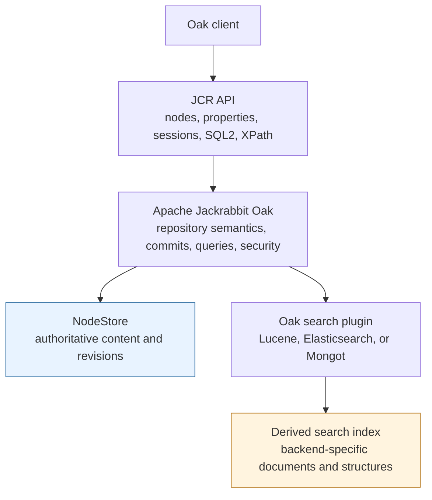
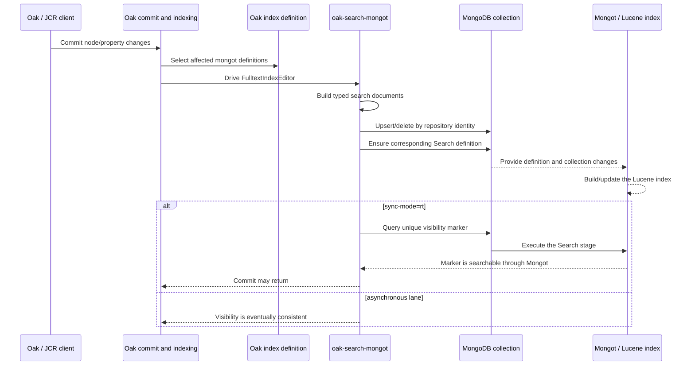
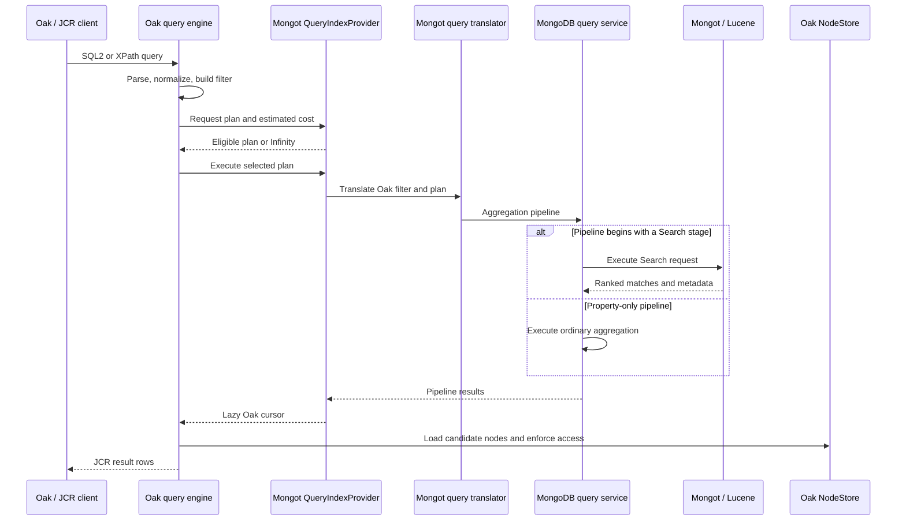
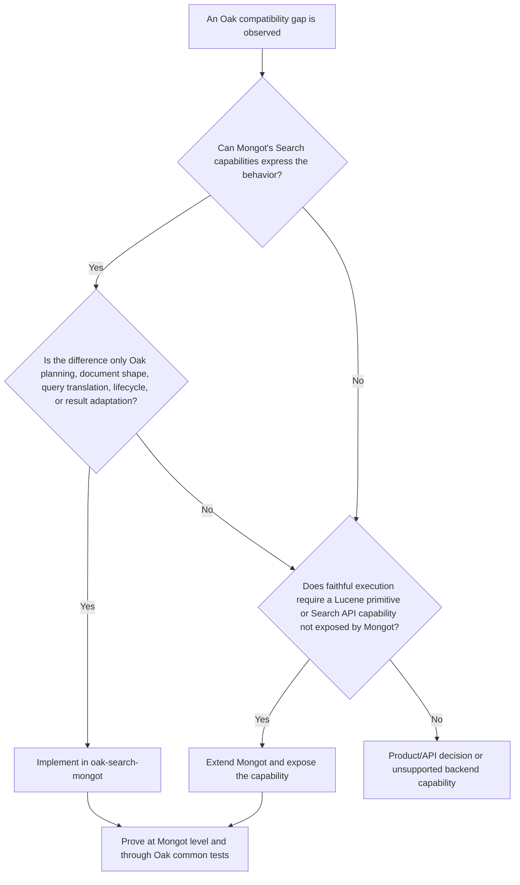

# Apache Oak and the Mongot search connector PoC

## TL;DR

The PoC cleared its strict compatibility gate: the complete executable portable Oak search suite reports **468 tests, 0 failures, 0 errors, and 4 skips inherited from upstream Oak**. This demonstrates a near drop-in Mongot search backend for the qualified Oak indexing and JCR query surface without an Elasticsearch runtime dependency.

- **Oak plugin:** [`oak-search-mongot`](oak-search-mongot/) translates Oak index definitions and SQL2/XPath queries into MongoDB Search operations, indexes repository updates and reindex generations, provides near-real-time visibility when requested, and adapts results back to Oak's cursor and metadata contracts.
- **Mongot:** Oak required several Lucene analyzer primitives that Mongot's public Search schema did not expose. The [draft Mongot PR](https://github.com/10gen/mongot/pull/7272) adds those analyzer definitions and Lucene implementations so the same contracts work end to end.

## Executive summary

Applications interact with Apache Jackrabbit Oak through the Java Content Repository (JCR) APIs and query repository content primarily through JCR-SQL2 or XPath. Oak owns the content model, repository semantics, index definitions, query parsing and planning, and the plugin contracts through which a search engine participates.

Lucene and Elasticsearch are not alternative application APIs. They are Oak search implementations. `oak-lucene` executes searches in an embedded Lucene index. `oak-search-elastic` translates the same broad Oak search model into requests to a remote Elasticsearch service. Both allow Oak clients and index definitions to remain expressed in Oak terms.

The Mongot PoC follows the same extension model. It adds an `oak-search-mongot` module with index type `mongot`. The module interprets Oak index definitions, converts Oak content changes into search documents, translates Oak query plans into Mongot requests through MongoDB's aggregation API, and adapts results back to Oak cursors and JCR result rows. It has no Elasticsearch client, protocol, container, or runtime dependency.

Most compatibility work belongs in this connector. Some analyzer behavior, however, cannot be recreated faithfully at the connector boundary. When an Oak analyzer definition requires a Lucene primitive that Mongot's public Search analyzer configuration does not expose, the correct implementation point is Mongot—the service that constructs and executes the Lucene analyzer. The PoC therefore includes a targeted Mongot extension for those missing primitives.

The result is evidence of **functional and architectural feasibility**, not a claim that the PoC is production-ready. The prototype demonstrates that Oak's plugin model can drive Mongot across the executable portable Oak search surface without materially rewriting Oak clients. Productionization still requires careful code inspection, simplification, API review, removal of PoC assumptions, robustness work, and deeper test scrutiny. That work should improve the implementation behind the boundaries already proven rather than challenge the basic Oak-plugin-plus-Mongot-extension approach.

## 1. The problem this PoC is evaluating

The first PoC asks a deliberately narrower question than “is this production-ready?”:

> Can Mongot behave as a near drop-in Oak search implementation, preserving Oak's index-definition and JCR-query contracts while creating a path to lexical, semantic, and vector search?

The functional acceptance criteria are:

- interpret existing, customized, and new Oak index definitions;
- index repository content according to Oak rules;
- preserve property, full-text, path, facet, aggregate, ordering, scoring, and related query behavior;
- support JCR-SQL2 and XPath without material Oak-client changes;
- demonstrate near-real-time behavior where required;
- provide a path to vector similarity and hybrid lexical-semantic retrieval; and
- run the portable Oak common search tests against the new backend.

The current implementation phase intentionally concentrates on the connector and search interface. Here, “productionize” refers specifically to turning the PoC implementation into code that is maintainable, reviewable, well-tested, and suitable for broader evaluation. Deployment architecture is outside this document.

## 2. Where an Oak client, JCR, Oak, and the search engine fit

The easiest way to understand the system is to separate the application contract, repository implementation, durable content storage, and derived search data.



### Oak client

An Oak client reads and writes repository content through JCR or Oak APIs. It should not need to know how a particular search backend represents a phrase query, facet, path restriction, or analyzer chain.

### JCR

JCR is the repository-facing API and data model. Content is a hierarchy of nodes with typed properties, node types, paths, and access controls. JCR-SQL2 and XPath are the important query surfaces for this PoC. They are the stable application contract above the search implementation.

### Apache Jackrabbit Oak

Oak is the repository implementation behind the JCR API. Its responsibilities extend well beyond search:

- the tree and node-state model;
- sessions, roots, commits, revisions, and conflict handling;
- authentication and authorization integration;
- observation of repository changes;
- pluggable durable storage through the `NodeStore` API;
- query parsing, normalization, optimization, limits, and result handling; and
- pluggable indexing and search.

Oak is a multi-module framework because these responsibilities need different extension points. For this PoC, the relevant modules are:

| Oak area | Role in this PoC |
| --- | --- |
| `oak-api` and `oak-jcr` | Expose repository and JCR query behavior to clients. |
| `oak-core` and `oak-query-spi` | Parse queries, build filters, compare index costs, choose plans, and consume index cursors. |
| `oak-store-spi` and a NodeStore implementation | Hold the authoritative repository state. Search indexes are derived from this state. |
| `oak-search` | Provide shared full-text index definitions, planners, editors, document makers, writers, and test contracts. |
| `oak-lucene` | Implement the embedded Lucene search backend and define much of Oak's richest search behavior. |
| `oak-search-elastic` | Implement a remote Elasticsearch backend using Oak's shared search framework. |
| `oak-search-mongot` | The PoC module implementing the corresponding Mongot backend. |

### NodeStore is not the search index

This distinction is especially important when Oak's Document NodeStore uses MongoDB for authoritative repository content. That does not mean Oak automatically uses MongoDB Search, nor that the repository document shape is an appropriate search schema.

The NodeStore preserves Oak revisions and repository semantics. The search connector creates **derived, rebuildable search documents** based on Oak index definitions. The PoC uses a collection and Search index generation per Oak index definition. Whether repository content and search data eventually share or separate deployments is an operational architecture decision; the functional connector does not depend on that choice.

## 3. Oak's search philosophy

Oak deliberately puts a repository-level contract between applications and a physical search engine.

### Index definitions are repository configuration

Indexes are defined as content under `/oak:index`. An index definition describes which node types and properties participate, whether values are analyzed or ordered, which paths are covered, how aggregates are formed, which analyzer is used, and which advanced features are enabled.

A simplified definition looks like this:

```text
/oak:index/assets
  type = "lucene" | "elasticsearch" | "mongot"
  async = "..."
  evaluatePathRestrictions = true
  + indexRules
    + dam:Asset
      + properties
        + title
          name = "jcr:content/metadata/dc:title"
          analyzed = true
          propertyIndex = true
```

The definition is not merely a backend mapping file. It is the declarative search behavior that Oak clients expect the repository to preserve. A near drop-in backend therefore consumes this vocabulary rather than requiring application queries and index definitions to be rewritten in backend-native terms.

### Oak chooses an index; the plugin does not own the whole query engine

Oak parses SQL2 or XPath into its internal query model. It asks available indexes whether they can serve the filter and what they estimate the query will cost. The lowest-cost eligible plan is selected. An index returns candidate paths, scores, excerpts, facets, or other requested metadata through Oak cursor interfaces.

Oak may still perform work above the plugin. For example, it can apply constraints the selected index did not evaluate, enforce query limits, combine union results, or sort when the index cannot provide the requested ordering. Oak also loads result nodes from the NodeStore and enforces repository read permissions. Consequently, backend compatibility is about participating correctly in Oak's plan and cursor contracts—not merely returning plausible search hits from a standalone backend query.

### Indexes are derived state

Oak observes repository changes and drives index editors. Synchronous indexing can participate in a commit; asynchronous indexing processes repository checkpoints through named indexing lanes. Full reindexing rebuilds derived state from repository content.

This has two architectural consequences:

1. The NodeStore remains authoritative. A search collection can be rebuilt.
2. The plugin must preserve Oak's update, deletion, move, aggregate-refresh, reindex, and visibility semantics—not only its query syntax.

## 4. What the Lucene and Elasticsearch integrations do

The two existing integrations provide complementary reference points.

### `oak-lucene`: semantic reference and embedded execution

The Lucene module provides a full-text and property index embedded in the Oak process. It converts Oak content into Lucene documents, manages index files, constructs Lucene queries, and adapts Lucene results into Oak results. Its index-definition vocabulary covers property and full-text indexing, path restrictions, ordering, aggregates, analyzers, functions, facets, excerpts, suggestions, spellcheck, dynamic boost, similarity, and related features.

For this PoC, `oak-lucene` is important primarily as the **semantic reference**. Much of the Oak common test framework is expressed in terms developed for this implementation. “Lucene compatibility” does not mean the new connector embeds another Lucene instance. It means the connector preserves the portable Oak behavior that the Lucene implementation established.

Lucene also contains backend-specific mechanisms that should not be copied into a remote connector: local index directories, codecs, file import, copy-on-read/write caches, and local near-real-time/hybrid indexing machinery.

### `oak-search-elastic`: structural reference for a remote backend

The Elasticsearch module implements a similar functional surface using a remote service. It reuses `oak-search` abstractions, translates Oak definitions into Elasticsearch mappings and settings, turns Oak filters into Elasticsearch requests, sends content changes through remote writers, and converts remote results into Oak cursors.

This makes it the closest **structural reference** for Mongot. It demonstrates the intended Oak way to integrate a network search service:

- provide an `IndexEditorProvider` for indexing;
- provide a `QueryIndexProvider` for planning and queries;
- observe definition changes and manage active index nodes;
- reuse the shared `FulltextIndex`, `FulltextIndexPlanner`, editor, and writer contracts;
- register the implementation as OSGi services for a distinct index type; and
- implement backend-native lifecycle and administration without exposing them to client queries.

Elasticsearch is not a required intermediary in the Mongot design. It is a useful implementation precedent. The PoC depends on Oak's public/shared search contracts and the MongoDB Java driver, not on Elasticsearch code or protocols.

### Comparison

| Concern | `oak-lucene` | `oak-search-elastic` | `oak-search-mongot` PoC |
| --- | --- | --- | --- |
| Execution location | Embedded Lucene | Remote Elasticsearch | Remote Mongot |
| Primary reference value | Rich Oak search semantics | Remote-plugin architecture | Candidate replacement |
| Index type | `lucene` | `elasticsearch` | `mongot` |
| Physical data | Lucene files | Elasticsearch indexes | MongoDB collections and Search indexes |
| Query transport | Java/Lucene calls | Elasticsearch client | MongoDB driver and aggregation pipeline |
| Shared Oak abstractions | Partial/historical plus shared editor pieces | Extensive `oak-search` reuse | Extensive `oak-search` reuse |
| Client query API | JCR-SQL2/XPath | JCR-SQL2/XPath | JCR-SQL2/XPath |
| Backend-specific mechanisms | Directories, codecs, local NRT | Aliases, shards, replicas, HTTP | Collections, Search index definitions, cursors, visibility markers |

## 5. The Mongot connector architecture

The PoC implements an ordinary Oak plugin for index definitions whose `type` is `mongot`. In OSGi, its provider service registers the three principal roles `Observer`, `QueryIndexProvider`, and `IndexEditorProvider`. A separate `IndexImporterProvider` implements Oak's remote-index reindex/import-state contract.

### Indexing flow



The connector's indexing side is responsible for:

- interpreting Oak index rules and aggregates;
- producing stable backend names and document identities;
- mapping repository paths, typed properties, full-text fields, ordered fields, node types, facets, suggestions, spellcheck data, similarity tags, and vectors;
- applying incremental upserts, exact deletes, subtree deletes, moves, and aggregate refreshes;
- creating Search index definitions idempotently;
- rebuilding into a new collection generation and switching the Oak definition pointer only after the replacement is queryable; and
- implementing synchronous visibility semantics when `sync-mode=rt` is requested.

### Query flow



The query side is responsible for:

- deciding whether a Mongot index can satisfy the requested Oak filter;
- estimating cost without executing the query;
- translating full-text expressions, property restrictions, paths, node types, ordering, facets, excerpts, suggestions, spellcheck, native queries, similarity, and vectors;
- choosing `$search`, ordinary MongoDB aggregation, or the appropriate mixed pipeline;
- preserving score, ordering, pagination, and special result shapes; and
- adapting backend documents into lazy Oak cursors and result metadata.

This layer is sometimes called a “shim,” but that term understates it. It is a real Oak index implementation with indexing, planning, query, result, lifecycle, and OSGi responsibilities. It remains smaller in conceptual scope than changing clients because Oak already defines those extension points.

## 6. The connector/Mongot ownership boundary

The clean boundary is based on where behavior can be implemented faithfully.



### Connector-owned examples

- Translating an Oak property restriction to a Search or `$match` clause.
- Naming and provisioning collections and Search indexes from `/oak:index` definitions.
- Flattening Oak aggregates into derived documents.
- Mapping backend hits, scores, highlights, facets, and suggestions into Oak result shapes.
- Handling updates, deletes, moves, reindex generations, and visibility markers.
- Declining a query plan when the backend cannot produce the required result contract.
- Translating Oak's internal `native('lucene', ...)` surface. The name `lucene` is part of Oak's historical query convention; supporting it does not require an Elasticsearch dependency or an embedded Lucene query engine in the connector.

### Mongot-owned examples

- Constructing a Lucene character or token filter that the public Search analyzer vocabulary does not expose.
- Executing the filter with the exact Lucene token-stream semantics Oak expects.
- Applying only normalization-safe filters during multi-term normalization.
- Supporting a required stemmer implementation absent from the current Lucene dependency.

The analyzer gaps exposed this distinction. The connector could translate names and parameters, but it could not reproduce a missing token filter after data reached the search service. The [draft Mongot analyzer PR](https://github.com/10gen/mongot/pull/7272) therefore adds `patternReplace`, common-grams, dictionary-compound-word, fingerprint, Hunspell, keep-word, keyword-marker, MinHash, pattern-capture-group, type, extended word-delimiter behavior, and the legacy KP stemmer. The connector then provisions those capabilities through the Search definition it derives from Oak.

Mongot remains Lucene-backed; the PoC does not replace Lucene inside Mongot. It extends the configuration and construction surface by which Mongot uses Lucene. This is different from `oak-lucene`, where Lucene is embedded directly in the Oak runtime.

## 8. Current PoC status

See the [compatibility report](oak-search-mongot/COMPATIBILITY.md) for the qualified surface, current test results, remaining gaps, and reproducible verification gate.

## 9. What the prototype proves—and what it does not

| Question | Current conclusion | Confidence boundary |
| --- | --- | --- |
| Can Mongot participate as an Oak search backend? | Yes. The plugin uses Oak's indexing, planning, query, and OSGi contracts. | Proven in the PoC environment; production deployment remains unqualified. |
| Can portable Oak definitions and JCR queries be preserved? | Yes for the executable common-test surface currently qualified. | Representative custom definitions and production query corpora still require validation. |
| Does this require changing the client query API? | No architectural rewrite is indicated. JCR-SQL2/XPath remain the client surfaces. | Packaging, configuration, migration, and guarded integration changes may still be required. |
| Can connector code alone close every gap? | No. Missing analyzer primitives require Mongot support. | The required Mongot analyzer capabilities must become deliberate, supported product/API behavior. |
| Is Elasticsearch part of the runtime design? | No. It is a reference implementation only. | Some Oak conventions retain historical names such as `lucene`; those names are not runtime dependencies. |
| Is vector/hybrid search architecturally possible? | Yes. Storage, similarity, filtering, and query plumbing are demonstrated. | Embedding generation, model lifecycle, relevance, and workload-specific tuning remain product decisions. |
| Is near-real-time behavior possible? | The connector implements and tests a synchronous Search-observed visibility marker. | Latency must be measured under representative load and topology. |
| Is the implementation production-ready? | No. | The architecture is qualified, but the PoC code requires a substantial engineering-quality pass first. |

## References

### Oak references

- [Apache Jackrabbit Oak documentation](../../../Downloads/oak-search-mongot-poc-main/oak-doc/src/site/markdown/index.md)
- [Oak query engine](../../../Downloads/oak-search-mongot-poc-main/oak-doc/src/site/markdown/query/query-engine.md)
- [Oak indexing concepts](../../../Downloads/oak-search-mongot-poc-main/oak-doc/src/site/markdown/query/indexing.md)
- [Oak Lucene index documentation](../../../Downloads/oak-search-mongot-poc-main/oak-doc/src/site/markdown/query/lucene.md)
- [Oak Elasticsearch index documentation](../../../Downloads/oak-search-mongot-poc-main/oak-doc/src/site/markdown/query/elastic.md)

### Source modules

- [Oak shared search framework](oak-search/)
- [Oak Lucene integration](oak-lucene/)
- [Oak Elasticsearch integration](oak-search-elastic/)
- [Mongot analyzer compatibility draft PR](https://github.com/10gen/mongot/pull/7272)
- [Mongot connector compatibility evidence](oak-search-mongot/COMPATIBILITY.md)
