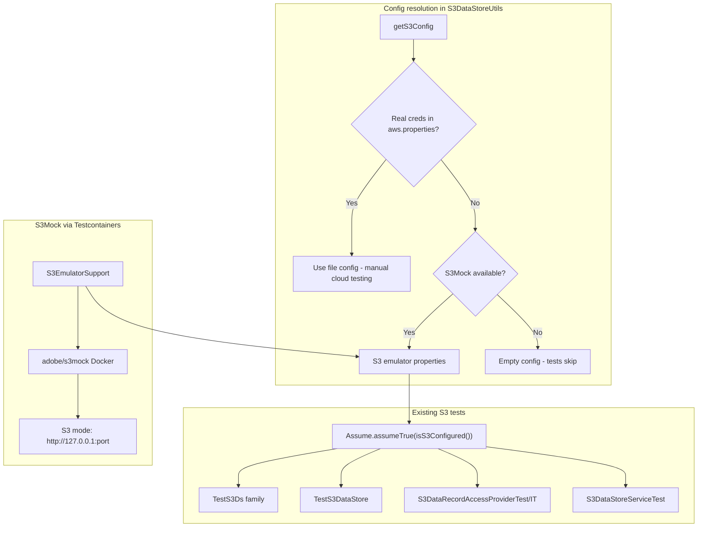

<!--
   Licensed to the Apache Software Foundation (ASF) under one or more
   contributor license agreements.  See the NOTICE file distributed with
   this work for additional information regarding copyright ownership.
   The ASF licenses this file to You under the Apache License, Version 2.0
   (the "License"); you may not use this file except in compliance with
   the License.  You may obtain a copy of the License at

       http://www.apache.org/licenses/LICENSE-2.0

   Unless required by applicable law or agreed to in writing, software
   distributed under the License is distributed on an "AS IS" BASIS,
   WITHOUT WARRANTIES OR CONDITIONS OF ANY KIND, either express or implied.
   See the License for the specific language governing permissions and
   limitations under the License.
  -->

# oak-blob-cloud: S3 emulator tests

**JIRA title:** `OAK-12241: oak-blob-cloud: run S3 integration tests with S3Mock in CI`

## Goal

Run existing `oak-blob-cloud` S3-mode tests in Apache CI without AWS secrets by using Adobe S3Mock through Testcontainers.

GCP emulator coverage is intentionally out of scope. Oak's GCP mode uses the AWS S3 SDK with GCP-specific client configuration, and S3Mock is not compatible with that configuration. Real GCP validation remains a manual cloud tier through `aws.properties` or `-Ds3.config`.

## Architecture



**Emulator choice:** Adobe S3Mock Docker image through Testcontainers. It is S3-focused, Apache 2.0 licensed, AWS SDK v2 compatible, and supports path-style requests. LocalStack is heavier for this use case, and fake-gcs-server does not cover Oak's S3-interoperability path.

**Real cloud precedence:** A populated `aws.properties` or explicit `-Ds3.config` with `accessKey`, `secretKey`, and region or endpoint always wins over the emulator. Manual AWS and GCP testing must keep using that path.

## Test tiers

| Tier | Trigger | Purpose |
|------|---------|---------|
| Unit | Always | Unit tests such as `UtilsTest` and request decorators |
| S3 emulator | S3Mock available and no real AWS credentials | Run S3-mode integration tests without cloud secrets |
| Real cloud | Populated `aws.properties` or `-Ds3.config` | Manual AWS/GCP validation against real services |

## Implementation checklist

- [x] Add Testcontainers test dependency to `oak-blob-cloud/pom.xml`
- [x] Create `S3MockRule` and `S3EmulatorSupport` for lazy S3Mock startup and S3 emulator properties
- [x] Update `S3DataStoreUtils.getS3Config()` to prefer real credentials and fall back to the emulator
- [x] Add opt-in `pathStyleAccess` to `S3Constants` and `Utils`
- [x] Fix S3 test HTTP upload helper for `http://` presigned URLs
- [x] Add `UtilsTest` and `S3EmulatorSupportTest` coverage
- [ ] Run the S3-mode `oak-blob-cloud` suite with Docker and no `aws.properties`
- [ ] Keep explicit JUnit assumptions for S3Mock-unsupported behavior
- [ ] Document S3-only emulator scope in the PR/JIRA

## Implementation details

### 1. Maven dependencies

Add `org.testcontainers:testcontainers` with test scope in `oak-blob-cloud/pom.xml`. The current implementation starts the published `adobe/s3mock` Docker image through `GenericContainer`.

### 2. `S3MockRule`

`S3MockRule` starts `adobe/s3mock` on the HTTP port and exposes a mapped `http://127.0.0.1:<port>` endpoint. Docker startup failure should cause S3 emulator tests to skip, not fail. Startup failure must be memoized so repeated `isS3Configured()` checks do not repeatedly pay the container startup timeout.

### 3. `S3EmulatorSupport`

`S3EmulatorSupport` lazy-starts `S3MockRule` and returns S3 emulator properties:

| Property | Value |
|----------|-------|
| `accessKey` | `foo` |
| `secretKey` | `bar` |
| `s3Bucket` | `s3mock-default-test-bucket` |
| `s3ConnProtocol` | `http` |
| `s3EndPoint` | `http://127.0.0.1:<port>` |
| `s3Region` | `us-east-1` |
| `pathStyleAccess` | `true` |
| `s3Encryption` | `NONE` |

Unsupported emulator modes, including `-Ds3.test.mode=GCP`, must return empty properties so the existing `Assume.assumeTrue(isS3Configured())` path skips tests cleanly.

### 4. Config fallback

`S3DataStoreUtils.getS3Config()` keeps the existing config-file/system-property lookup. When real credentials are present, it returns that config unchanged. When real credentials are absent and S3Mock is available, it returns emulator properties. Otherwise it returns empty properties so existing tests skip.

### 5. Path-style access

`pathStyleAccess` is an opt-in S3 property. Default production behavior stays unchanged. GCP mode continues to force path-style internally; S3-compatible endpoints can opt in with:

```properties
pathStyleAccess=true
```

### 6. Unsupported S3Mock behavior

Some S3DataStore tests remain intentionally skipped under S3Mock because the emulator does not support the required behavior or the AWS SDK presigner does not inherit the S3 client endpoint override. These skips must use JUnit assumptions, not early returns, so CI reports them as skipped.

Examples that can remain cloud-only until separately fixed:

- direct-access presigned GET/PUT URLs that point to real AWS because the presigner lacks the emulator endpoint override
- S3Mock-unsupported copy-to-self behavior used for duplicate record updates
- cache/concurrency checks that rely on real S3 behavior and are unreliable through S3Mock's local HTTP implementation
- SSE modes requiring real service semantics or keys
- transfer acceleration and other AWS-service-only behavior

## How to run

```bash
mvn test -pl oak-blob-cloud
mvn verify -pl oak-blob-cloud -PintegrationTesting
mvn test -pl oak-blob-cloud -Dtest=UtilsTest,S3EmulatorSupportTest,S3DataRecordAccessProviderTest
mvn test -pl oak-blob-cloud -Ds3.config=/path/to/aws.properties
```

## Out of scope

- GCP emulator execution with S3Mock
- dual S3/GCP surefire executions
- `oak-it` S3 GC tests
- `oak-jcr` `S3DataStoreFixture`
- `oak-upgrade` S3 migration tests
- migrating `oak-segment-aws` from findify S3Mock to Adobe S3Mock
- fake-gcs-server / native GCS client testing
- root-level local MCP, npm, or generated graph artifacts

## Acceptance criteria

- [ ] `mvn test -pl oak-blob-cloud` passes on a machine with Docker and no `aws.properties`
- [ ] `mvn verify -pl oak-blob-cloud -PintegrationTesting` passes or skips only explicitly unsupported S3Mock behavior
- [ ] Real `aws.properties` still takes precedence over emulator fallback
- [ ] Unsupported S3Mock behavior uses JUnit assumptions
- [ ] Production S3/GCP behavior is unchanged unless `pathStyleAccess=true` is explicitly set
- [ ] No secrets, local MCP files, npm artifacts, or generated output are committed with this change

## Risk mitigations

| Risk | Mitigation |
|------|------------|
| Docker unavailable locally | Memoize failed startup and let tests skip through assumptions |
| S3Mock presigned URL limitations | Keep unsupported presigned URL contracts cloud-only with explicit assumptions |
| S3Mock does not model GCP mode | Keep GCP emulator out of scope; real GCP remains a manual cloud tier |
| Test startup cost | Start S3Mock lazily and once per JVM |

## Suggested branch / commit

- Branch: `issue/OAK-12241`
- Commit: `OAK-12241: run oak-blob-cloud S3 tests against S3Mock emulator in CI`
