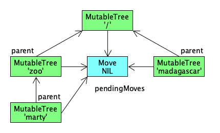
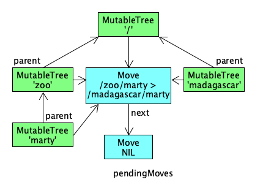
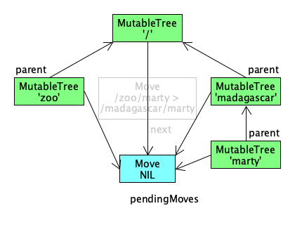
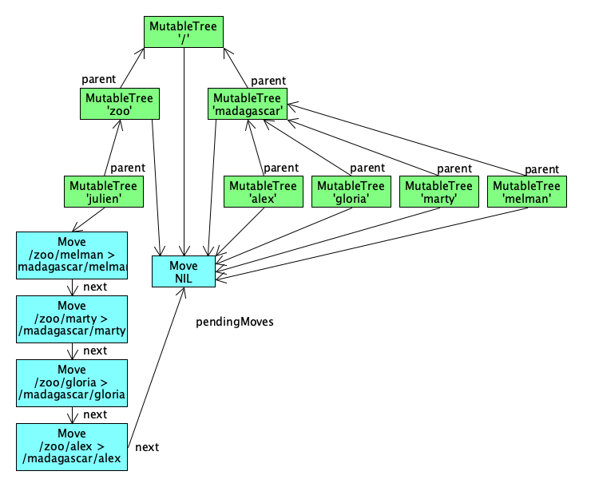

<!--
   Licensed to the Apache Software Foundation (ASF) under one or more
   contributor license agreements.  See the NOTICE file distributed with
   this work for additional information regarding copyright ownership.
   The ASF licenses this file to You under the Apache License, Version 2.0
   (the "License"); you may not use this file except in compliance with
   the License.  You may obtain a copy of the License at

       http://www.apache.org/licenses/LICENSE-2.0

   Unless required by applicable law or agreed to in writing, software
   distributed under the License is distributed on an "AS IS" BASIS,
   WITHOUT WARRANTIES OR CONDITIONS OF ANY KIND, either express or implied.
   See the License for the specific language governing permissions and
   limitations under the License.
  -->

I like to move it
--------------------------------------------------------------------------------

This page describes how move operations are implemented in Oak and highlights
some of the interesting and potentially surprising side effects it has on memory
usage.

JCR `Node` and Oak `Tree` instances are basic entities how to access
content in a repository. In Jackrabbit Oak the implementation of a JCR `Node` is
backed by a `MutableTree` that implements `Tree`. As the name indicates this
`Tree` is mutable and its state can change over time. The following example
illustrates this.

    ContentSession s = ...
    Root r = s.getLatestRoot();
    Tree t = r.getTree("/zoo/marty");
    r.move("/zoo/marty", "/madagascar/marty");
    String p = t.getPath();

Even though the move operation was not invoked on the `Tree` `t` directly, the
change will be reflected in the value returned by `t.getPath()`. The returned
path will be `/madagascar/marty`.

The impact of a move operation on a `Tree` instance is evaluated lazily. The
main benefit of this approach is that we don't need to spend time to update
`Tree` instances unnecessarily when they are referenced by the heap, but not
used by the application and later garbage collected. 

So, how are move operations applied lazily to `Tree` instances? Each
`MutableTree` object has a `pendingMoves` reference to the next `Move` it
needs to apply before any read or write operation. Reading a child `Tree` passes
on the current `pendingMoves` reference to the child. That is, while reading an
entire subtree, all `MutableTree` instances will have a `pendingMoves` reference
pointing to the same `Move`. Initially, the referenced `Move` will be empty,
which indicates no move operation happened.

Going back to the example. A slightly simplified state before the move operation
looks like the following.

Right after the move operation, the state of `MutableTree` instances are still
the same. Only the `Move` object referenced by them was modified with information
about the move operation and a new  empty `Move` object appended via the `next`
reference.

The effect of a move operation on `Tree` objects is applied when a `Tree`
is accessed, e.g. by calling `getPath()`. Whenever a read or write happens, a
`MutableTree` will check if there is anything to do via `pendingMoves` and apply
an operation when the source path of the move matches its own path. A `MutableTree`
simply moves on to the next `Move` if the source path does not match, until an empty
`Move` is reached. This entire process is also done recursively by first applying any
potential move operations on the parent. This ensures hierarchical integrity when
a subtree is moved.

After this read operation the `Move` object with the source and destination
information is not referenced anymore by any `MutableTree`, and it is eligible
for garbage collection.

This implementation has drawbacks for some usage patterns. A `MutableTree`
obtained  from a `ContentSession` and referenced by the application can retain
significant memory when the tree is not accessed while move operations are
performed with the same `ContentSession`.

Let's consider an example where Julien stays at the zoo, while the others move
to Madagascar. 

    Tree zoo = r.getTree("/zoo");
    Tree madagascar = r.getTree("/madagascar");
    Tree julien = zoo.getChild("julien");
    List<Tree> move = StreamSupport.stream(target.getChildren().spliterator(), false)
            .filter(t -> !t.getName().equals(julien.getName()))
            .collect(Collectors.toList());
    move.forEach(t -> r.move(t.getPath(), concat(madagascar.getPath(), t.getName())));
    move.forEach(t -> System.out.println(t.getName() + " made it to Madagascar"));

At the end the `Tree` `julien` will have accumulated move information, while all
`Tree` instances in the `List` have `pendingMoves` pointing to the empty `Move`.
Please note, memory retained by julien is independent of whether changes are
committed or not through `ContentSession.commit()`. The linked `Move` objects
referenced by `pendingMoves` are the same. Intuition might suggest committing
changes frees memory, but it is not the case in this scenario.

Memory usage in this situation is significant because a `Move` object not just
remembers path information but actually references a `MutableTree`
object as the destination parent and a `String` for the name of the moved tree
under the new parent. Behind the scenes, a `MutableTree` also references its parent
and a `NodeBuilder` to access properties. This also means, moving nodes deep
down will use more memory compared to nodes closer to the root.

It is therefore advisable to release references to `Tree` instances as soon as
possible in code that performs many move operations. Alternatively, code should
call a method once in a while on a `Tree` it references for a longer period of
time.
