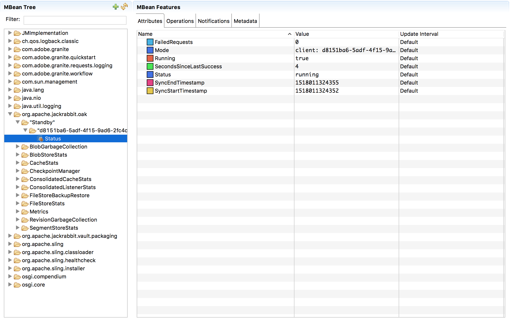
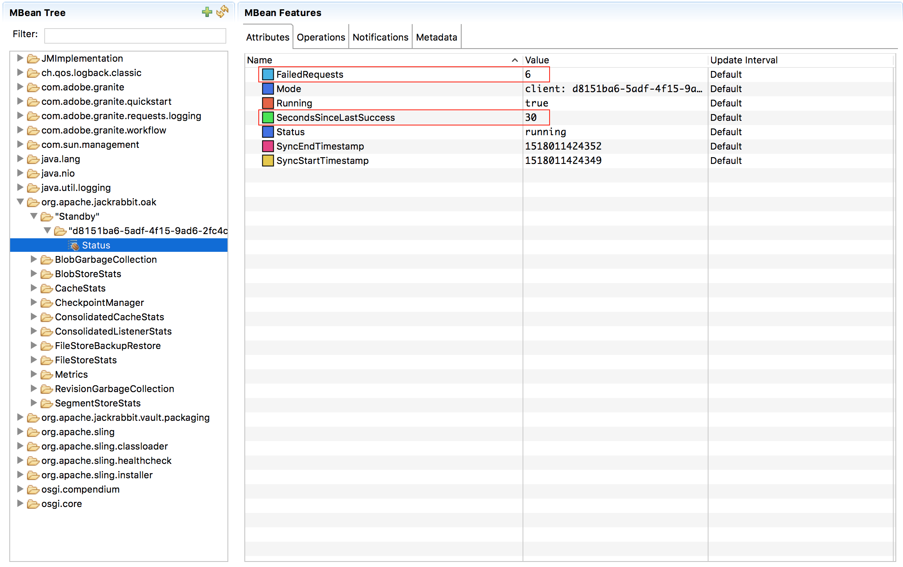
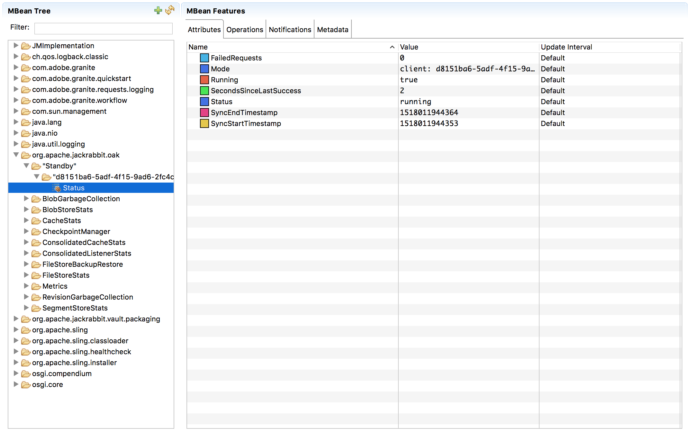
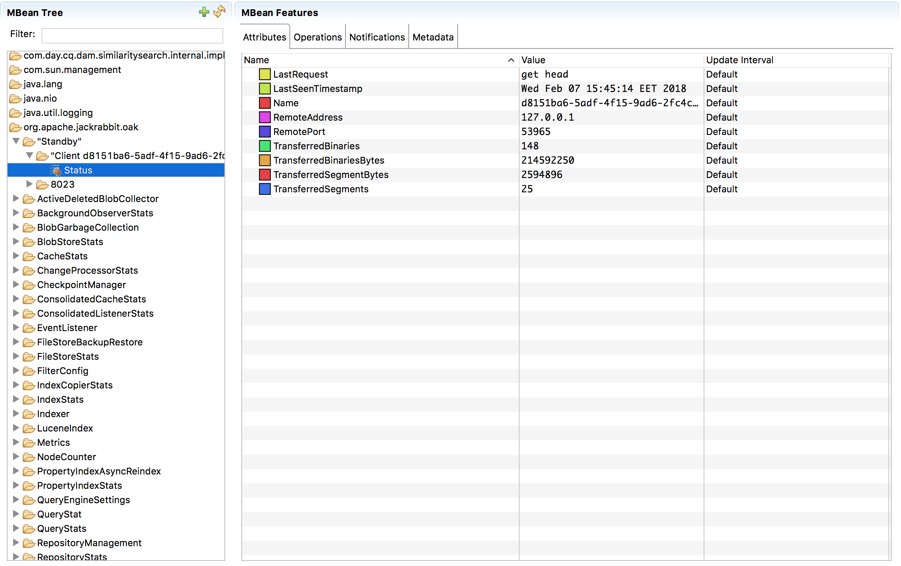

<!--
   Licensed to the Apache Software Foundation (ASF) under one or more
   contributor license agreements.  See the NOTICE file distributed with
   this work for additional information regarding copyright ownership.
   The ASF licenses this file to You under the Apache License, Version 2.0
   (the "License"); you may not use this file except in compliance with
   the License.  You may obtain a copy of the License at

       http://www.apache.org/licenses/LICENSE-2.0

   Unless required by applicable law or agreed to in writing, software
   distributed under the License is distributed on an "AS IS" BASIS,
   WITHOUT WARRANTIES OR CONDITIONS OF ANY KIND, either express or implied.
   See the License for the specific language governing permissions and
   limitations under the License.
  -->

#Cold Standby

### What is it?

The *Cold Standby* feature allows one or more clients to connect to a primary instance and ensure automatic on-the-fly synchronization of the repository state from the master to the client(s). The sync process is one-way only. Data stored on the master is never changed. The only purpose of this client installation(s) is to guarantee an (almost live) data copy and enable a quick switch from the master to a client installation without data loss.

### What is isn't

The *Cold Standby* feature does not guarantee file, filesystem or even repository **integrity**! If the content of a tar file is corrupted, a file is missing or anything similar happens to the locally stored files the installation will break because these situation or not checked, detected or treated!

### How it works

On the master a TCP port is opened and listening to incoming messages. Currently there a two messages implemented:

* give me the segment id of the current head
* give me a segment data with a specified id

The clients periodically request the segment id of the current head of the master. If the segment is locally unknown it will be retrieved. If it's already present the segments are compared and referenced segments (if necessary) will be requested, too.

### Prerequisites

An Oak installation using the SegmentNodeStore

### Setup

1. Perform a filesystem based copy of the master repository.
2. on the master activate the feature by specifying the runmode `primary`.
3. on the client(s) activate the feature by specifying the runmode `standby` (add additional parameters if desired) and specify the path to the repository
4. start the master and the client(s).

You can add the additional configuration option `secure=true` if you like a SSL secured connection between the client and the master. It must be garantueed that **all** clients and the master either use secure or standard connections! A mixed configuration will definitely fail.

The clients specify the master host using the `host` (default is `localhost`) and `port` (default is `8023`) configuration options. For monitoring reasons (see below) the client(s) must be distinctable. Therefore a generic UUID is automatically created for each running client and this UUID is used to identify the client on the master. If you want to specify the name of the client you can set a system property `standbyID`.

<!-- TODO: add the master specific arguments (like the accepted incoming IP ranges) -->
The master can define the TCP port the feature is listening (default is `8023`) using the `port` configuration option. If you want to restrict the communication you can specify a list of allowed IPs or IP ranges....

### Robustness

The data flow is designed to detect and handle connection and network related problems automatically. All packets are bundled with checksums and as soon as problems with the connection or damaged packets occur retry mechanisms are triggered.

### Monitoring

The *Cold Standby* feature exposes informations using JMX/MBeans. Doing so you can inspect the current state of the client(s) and the master using standard tools like `jconsole` or `jmc` (if running JDK 1.7 or higher). The information can be found if you look for a `org.apache.jackrabbit.oak:type="Standby"` MBean named `Status`.

#####Client
Observing a client you will notice exactly one node (the id is either a generic UUID or the name specified by the `standbyID` system property). This node has five readonly attributes:

* `Running`: boolean indicating whether the sync process is running
* `Mode`: always `Client: ` followed by the ID described above
* `Status`: a textual representation of the current state (like `running`, `stopped` and others)
* `FailedRequests`: the number of consecutive errors
* `SecondsSinceLastSuccess`: the number of seconds since the last successful communication with the server or -1 if there is none

There are also two invokable methods:

* `start()`: start the sync process
* `stop()`: stop the sync process

######Examples

A typical communication with the server can look like this (the server is contacted every five seconds and there is no error at all): 

The server can not be contacted anyore:

The server is live and reachable again and after some errors everythings is up and running again:

    
#####Master
Observing the master exposes some general (non client-specific) informations via a MBean whose id value is the port number the `Cold Standby` service is using (usually `8023`). There are almost the same attributes and methods as described above but the values differ:

* `Mode`: always the constant value `master`
* `Status`: has more values like `got message`
* `FailedRequests`: not available in master mode
* `SecondsSinceLastSuccess`: not available in master mode

Furthermore informations for each (up to 10) clients can be retrieved. The MBean id is the name of the client (see above). There are no invokable methods for these MBeans but some very useful readonly attributes:

* `Name`: the id of the client
* `LastSeenTimestamp`: the timestamp of the last request in a textual representation
* `LastRequest`: the last request of the client
* `RemoteAddress`: the IP address of the client
* `RemotePort`: the (generic) port the client used for the last request
* `TransferredSegments`: the total number of segments transferred to this client
* `TransferredSegmentBytes`: the total number of bytes transferred to this client

A typical state might look like this:

### Performance

##### Master
Running on the master enabling the *Cold Standby* feature has almost no measurable impact on the performance. The additional CPU consumption is very low and the extra harddisk and network IO shouldn't have any drawbacks.

##### Client
Things look differently on the client! During a sync process you can expect at least one CPU core running close to 100% for all the time. Due to the fact that the procedure is not multithreaded you can't speed up the process by using multiple cores. If no data is changed/transferred there will be no measurable activity. The expected throughput is about 700 KB / sec. Obviously this number will vary depending on the hardware and network environment but it does not depend on the size of the repository or whether you use SSL encryption or not. You should keep this in mind when estimating the time needed for an initial sync or when much data was changed in the meantime on the master node.

### One word about security

Assuming that the client(s) and the master run in the same intranet security zone there **should** be no security issue enabling the *Cold Standby* feature. Nevertheless you can add extra security by enabling SSL connections between the client(s) and the master (see above). Doing so reduces the possibility that the data is compromised by a man-in-the-middle. Furthermore you can specify the allowed client(s) by restricting the IP-address of incoming requests. This should help to garantuee that no one in the intranet can copy the repository (by accident).

