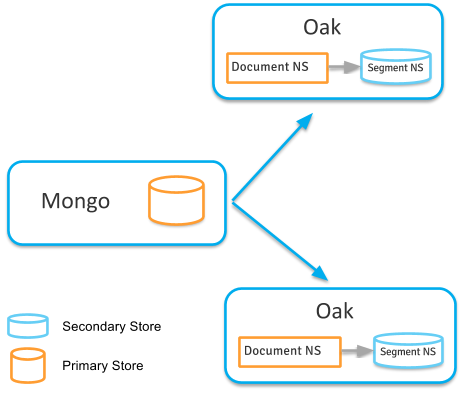
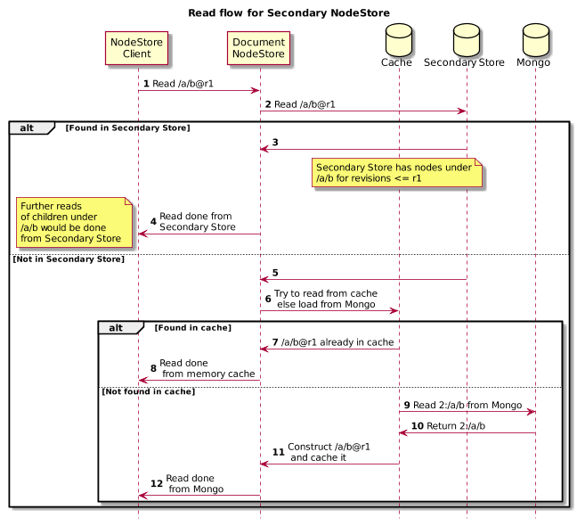
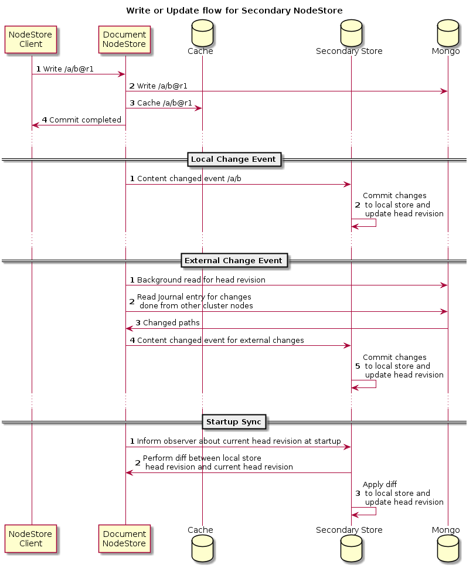

<!--
   Licensed to the Apache Software Foundation (ASF) under one or more
   contributor license agreements.  See the NOTICE file distributed with
   this work for additional information regarding copyright ownership.
   The ASF licenses this file to You under the Apache License, Version 2.0
   (the "License"); you may not use this file except in compliance with
   the License.  You may obtain a copy of the License at

       http://www.apache.org/licenses/LICENSE-2.0

   Unless required by applicable law or agreed to in writing, software
   distributed under the License is distributed on an "AS IS" BASIS,
   WITHOUT WARRANTIES OR CONDITIONS OF ANY KIND, either express or implied.
   See the License for the specific language governing permissions and
   limitations under the License.
  -->
# Secondary NodeStore
 
* [Secondary NodeStore](#secondary-node-store)
   * [Read Flow](#read-flow)
   * [Write Flow](#write-flow)
       * [Local Changes](#write-flow-local-changes)
       * [External Changes](#write-flow-external-changes)
       * [Startup Sync](#write-flow-startup-sync)
   * [Setup ](#usage)
   * [Setup Considerations](#setup-considerations)
   * [Administration](#administration)
       * [Maintenance](#secondary-store-maintenance)
       * [New Cluster Member](#secondary-store-cluster)
         
`@since Oak 1.6`
`Experimental Feature`
 
Compared to SegmentNodeStore DocumentNodeStore has higher latency for reads for the data not present in the cache. 
This happens due to multiple round trips required to serve a hierarchical read access over remote storage. 
For e.g. reading content of path _/content/assets/nature/sunrise.jpg_ would require around 4 remote calls if the path 
content is not present in local cache. 
[Persistent Cache](../persistent-cache.html) helped in improving this by enabling caching lot more content off heap 
compared to limited inmemory cache. 
 
With new [Secondary NodeStore][OAK-1312] support its now possible to configure a SegmentNodeStore as a secondary store to 
store content under certain set of paths locally. 
SegmentNodeStore act a local copy of remote repository (secondary store) more like a local git repo which gets updated 
from primary store (remote Mongo storage) via observation. 
Writes are still routed to primary store but reads can be served from local secondary store.
  

In above setup 2 Oak Cluser nodes connect to same Mongo server. In each Oak instance a SegmentNodeStore is configured
as secondary store. This store gets updated by observer.

**Experimental Feature**

This feature is currently experimental. Following feature item is currently pending

* [OAK-5352][OAK-5352] - Support for maintenance task for secondary NodeStore

##  Read Flow

Reading /a/b at revision r1 would happen like below

  

Key points here

* Secondary NodeStore can be configured to only stored content under certain paths
* Read would be first attempted from any configured secondary NodeStore. 
    1. Secondary NodeStore would check if it stores content for that path. Note that it can be configured with path 
       inclusions
    2. It then checks whether its root revision is later than revision at which read is being requested
    3. If NodeState at given path and revision is found then its returned 
* If read is not possible from secondary NodeStore then read is done from in memory which may in turn read from remote
   Mongo in case of cache miss
* If read is successful from Secondary NodeStore which is based on SegmentNodeStore then further child read from 
   that path would be directly handled by SegmentNodeStore by passing DocumentNodeStore altogether. So if /a/b@r1 is 
   found in secondary then read for /a/b/c@r1 would be directly handled by secondary store
    
Note that even if root revision of secondary store is lagging behind current head its possible that read for /a/b can
be handled by secondary store if /a has not been modified recently. So those parts of repo which have not been recently 
modified would most likely be served from Secondary NodeStore and avoid remote calls to Mongo.
 
##  Write Flow

Updates to secondary store happen in 3 ways

  

Key points here

* Writes done by NodeStore caller i.e. JCR layer are always done on primary store i.e. Mongo
* Secondary NodeStore is updated via Oak Observation support and NodeState diff
* Secondary NodeStore can be configured with path filter and then it would only be interested in 
  changes for configured paths

###  Local Changes

For local changes done on that cluster nodes the writes are applied as part of Observation call where DocumentNodeStore
send content change callback to all registered observers. Here Secondary NodeStore registers itself as an Observer
and listed for such callback.

So upon any local change it gets a callback with latest state of root paths. There it performs a diff between local 
head revision and new head revision and applies the changes onto local store

###  External Changes

DocumentNodeStore periodically performs [background reads](../documentmk.html#bg-read) to pickup changes from other
cluster node. Such a change is then pushed to registered observer as an external change. Secondary NodeStore uses 
same flow as for local changes to update its state.

This diff based update mechanism would then only read content from remote for the changed paths and further only for
paths in which secondary NodeStore is interested

###  Startup Sync

If the cluster node is shutdown and later started then at time of start the secondary NodeStore would try to synchronize
its state with remote storage again by performing diff between local head revision and remote head revision. This
is done asynchronously and does not block the startup

##  Setup 

For enabling this feature following OSGi configurations have to be done

**1. Configure SegmentNodeStore in secondary role**

Create an OSGi config file `org.apache.jackrabbit.oak.segment.SegmentNodeStoreFactory-secondary.config` with following
content

    role="secondary"
    
This would create a SegmentNodeStore in secondary role and uses default `segmentstore-secondary` directory to store 
the segment files. Refer to [config options](../../osgi_config.html#config-SegmentNodeStoreService) for more details.
Note all the options for `SegmentNodeStoreService` are applicable for `SegmentNodeStoreFactory`

**2. Configure SecondaryStoreCacheService (optional)**

By default secondary NodeStore would be activated based on previous config only. However it can be tweaked further
by creating an OSGi config file `org.apache.jackrabbit.oak.plugins.document.secondary.SecondaryStoreCacheService.config`

    includedPaths=[ \
      "/libs", \
      "/apps", \
      "/content"
      ]

Above config would enable secondary NodeStore for paths '/libs, /apps and /content'

##  Setup Considerations

While enabling secondary NodeStore feature following aspects needs to be considered

* SegmentNodeStore used as secondary NodeStore would compete with system resource like memory along with 
  in memory caches of DocumentNodeStore and Lucene index files. So system must have sufficient memory to
  for all these 3 components
* SegmentNodeStore can be copied from any existing cluster node to a new node. 
* If this is being enabled for existing setup then initial sync would take some time. So take that into account
  while planning to enable this feature
* For best performance include those paths of the repository which are accessed by end user. Specially those
  content paths where read to write ratio is high.

##  Administration

###  Maintenance

Certain maintenance like [online RevisionGC](../segment/overview.html#garbage-collection) for secondary 
NodeStore i.e. SegmentNodeStore need to be enabled. (This feature is currently pending [OAK-5352][OAK-5352]).

This would ensure that older revision gets garbage collected

###  New Cluster Member

If a new Oak server is joined to cluster then it should be done by cloning the secondary NodeStore from some existing
cluster member otherwise the initial sync would take a long time to complete

[OAK-5352]: https://issues.apache.org/jira/browse/OAK-5352
[OAK-1312]: https://issues.apache.org/jira/browse/OAK-1312
