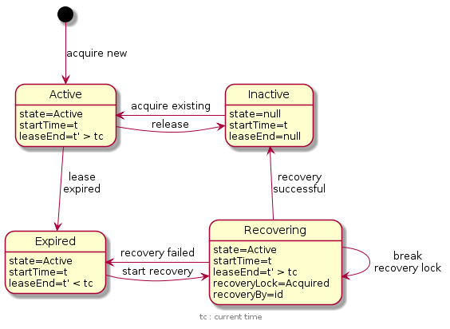

<!--
   Licensed to the Apache Software Foundation (ASF) under one or more
   contributor license agreements.  See the NOTICE file distributed with
   this work for additional information regarding copyright ownership.
   The ASF licenses this file to You under the Apache License, Version 2.0
   (the "License"); you may not use this file except in compliance with
   the License.  You may obtain a copy of the License at

       http://www.apache.org/licenses/LICENSE-2.0

   Unless required by applicable law or agreed to in writing, software
   distributed under the License is distributed on an "AS IS" BASIS,
   WITHOUT WARRANTIES OR CONDITIONS OF ANY KIND, either express or implied.
   See the License for the specific language governing permissions and
   limitations under the License.
  -->
# Oak Document Storage

* [Oak Document Storage](#oak-document-storage)
    * [New in 1.10](#new-1.10)
    * [New in 1.8](#new-1.8)
    * [New in 1.6](#new-1.6)
    * [Backend implementations](#backend-implementations)
    * [Content Model](#content-model)
    * [Node Content Model](#node-content-model)
    * [Revisions](#revisions)
    * [Clock requirements](#clock-requirements)
    * [Branches](#branches)
    * [Previous Documents](#previous-documents)
    * [Sweep Revision](#sweep-revision)
    * [Node Bundling](#node-bundling)
    * [Background Operations](#background-operations)
        * [Renew Cluster Id Lease](#renew-cluster-id-lease)
        * [Background Document Split](#background-document-split)
        * [Background Writes](#background-writes)
        * [Background Reads](#bg-read)
    * [Metrics and Monitoring](#metrics)
    * [Cluster Node Metadata](#cluster-node-metadata)
        * [Acquire a Cluster Node ID](#acquire-a-cluster-node-id)
        * [Update Lease for a Cluster Node ID](#update-lease-for-a-cluster-node-id)
        * [Recovery for a Cluster Node ID](#recovery-for-a-cluster-node-id)
        * [Specifying the Read Preference and Write Concern](#rw-preference)
    * [Caching](#cache)
        * [Cache Invalidation](#cache-invalidation)
        * [Cache Configuration](#cache-configuration)
    * [Unlock upgrade](#unlockUpgrade)
    * [Revision Garbage Collection](#revision-gc)
    * [Pending Topics](#pending-topics)
        * [Conflict Detection and Handling](#conflict-detection-and-handling)

One of the plugins in Oak stores data in a document oriented format. 
The plugin implements the low level `NodeStore` interface.

The document storage optionally uses the [persistent cache](persistent-cache.html)
to reduce read operations on the backend storage.

##  New in 1.10

* Use of MongoDB client sessions. See also [read preference](document/mongo-document-store.html#read-preference).
* [Greedy cluster node info][OAK-7316]. See also [Acquire a Cluster Node ID](#acquire-a-cluster-node-id).

##  New in 1.8

* [Sweep Revision](#sweep-revision)
* [Unlock upgrade](#unlockUpgrade)
* [Continuous and oak-run triggered Revision GC](#revision-gc)

##  New in 1.6

* [Node Bundling](#node-bundling)
* [Secondary Store](#secondary-store)

##  Backend implementations

The DocumentNodeStore supports a number of backends, with a storage abstraction
called `DocumentStore`:

* [`MongoDocumentStore`](document/mongo-document-store.html): stores documents in a MongoDB.
* [`RDBDocumentStore`](document/rdb-document-store.html): stores documents in a relational data base.
* `MemoryDocumentStore`: keeps documents in memory. This implementation should only be used for testing purposes.

The remaining part of the document will focus on the `MongoDocumentStore` to
explain and illustrate concepts of the DocumentNodeStore.

##  Content Model

The repository data is stored in two collections: the `nodes` collection for
node data, and the `blobs` collection for binaries. The `journal` collection
contains a log of changes applied to the repository. Entries older than 24 hours
are automatically purged by the repository.

The `clusterNodes` collection contains a document for each DocumentNodeStore
connected to MongoDB in read-write mode. A DocumentNodeStore uses the documents
in this collection to discover all other instances.

Cluster wide information is stored in the `settings` collection. This includes
checkpoints, journal and revision GC status, format version and the current
cluster view.

The data can be viewed using the MongoDB shell:

    > show collections
    blobs
    clusterNodes
    journal
    nodes
    settings

##  Node Content Model

The `DocumentNodeStore` stores each node in a separate MongoDB document and updates to
a node are stored by adding new revision/value pairs to the document. This way
the previous state of a node is preserved and can still be retrieved by a
session looking at a given snapshot (revision) of the repository.

The basic MongoDB document of a node in Oak looks like this:

    {
        "_id" : "1:/node",
        "_deleted" : {
            "r13f3875b5d1-0-1" : "false"
        },
        "_lastRev" : {
            "r0-0-1" : "r13f3875b5d1-0-1"
        },
        "_modified" : NumberLong(274208361),
        "_modCount" : NumberLong(1),
        "_children" : Boolean(true),
        "_revisions" : {
            "r13f3875b5d1-0-1" : "c"
        }
    }

All fields in the above document are metadata and are not exposed through the
Oak API. The DocumentNodeStore has two types of fields. Simple fields are key/value pairs
like the `_id` or `_modified` field. Versioned fields are kept in sub-documents
where the key is a revision paired with the value at this revision.

The `_id` field is used as the primary key and consists of a combination of the
depth of the path and the path itself. This is an optimization to align sibling
keys in the index.

The `_deleted` sub-document contains the revision this node was created in. In
the above example the root node was created in revision `r13f3875b5d1-0-1`. If
the node is later deleted, the `_deleted` sub-document will get a new field with
the revision the node was deleted in.

The sub-document `_lastRev` contains the last revision written to this node by
each cluster node. In the above example the DocumentNodeStore cluster node with id `1`
modified the node the last time in revision `r13f3875b5d1-0-1`, when it created
the node. The revision key in the `_lastRev` sub-document is synthetic and the
only information actually used by the DocumentNodeStore is the clusterId. The `_lastRev`
sub-document is only updated for non-branch commits or on merge, when changes
become visible to all readers. Starting with Oak 1.2 the `_lastRev` value for
a cluster node is only updated when there is no corresponding entry in `_revisions`
or `_commitRoot`. That is, when the node wasn't changed but a descendant node
was added, removed or modified.

The `_modified` field contains an indexed low-resolution timestamp when the node
was last modified. The time resolution is five seconds. This field is also updated
when a branch commit modifies a node.

The `_modCount` field contains a modification counter, which is incremented with
every change to the document. This field allows the DocumentNodeStore to perform
conditional updates without requesting the whole document.

The `_children` field is a boolean flag to indicate if this node has child nodes. By
default a node would not have this field. If any node gets added as child of this node
then it would be set to true. It is used to optimize access to child nodes and allows
the DocumentNodeStore to omit calls to fetch child nodes for leaf nodes.

Finally, the `_revisions` sub-document contains commit information about changes
marked with a revision. E.g. the single entry in the above document tells us
that everything marked with revision `r13f3875b5d1-0-1` is committed and
therefore valid. In case the change is done in a branch then the value would be the
base revision. It is only added for those nodes which happen to be the commit root
for any given commit.

Adding a property `prop` with value `foo` to the node in a next step will
result in the following document:

    {
        "_deleted" : {
            "r13f3875b5d1-0-1" : "false"
        },
        "_id" : "1:/node",
        "_lastRev" : {
            "r0-0-1" : "r13f38818ab6-0-1"
        },
        "_modified" : NumberLong(274208516),
        "_modCount" : NumberLong(2),
        "_revisions" : {
            "r13f3875b5d1-0-1" : "c",
            "r13f38818ab6-0-1" : "c"
        },
        "prop" : {
            "r13f38818ab6-0-1" : "\"foo\""
        }
    }

Now the document contains a new sub-document with the name of the new property.
The value of the property is annotated with the revision the property was set.
With each successful commit to this node, a new field is added to the
`_revisions` sub-document. Similarly the `_lastRev` sub-document and `_modified`
field are updated.

After the node is deleted the document looks like this:

    {
        "_deleted" : {
            "r13f3875b5d1-0-1" : "false",
            "r13f38835063-2-1" : "true"
        },
        "_id" : "1:/node",
        "_lastRev" : {
            "r0-0-1" : "r13f38835063-2-1"
        },
        "_modified" : NumberLong(274208539),
        "_modCount" : NumberLong(3),
        "_revisions" : {
            "r13f3875b5d1-0-1" : "c",
            "r13f38818ab6-0-1" : "c",
            "r13f38835063-2-1" : "c"
        },
        "prop" : {
            "r13f38818ab6-0-1" : "\"foo\""
            "r13f38835063-2-1" : null
        }
    }

The `_deleted` sub-document now contains a `r13f38835063-2-1` field marking the
node as deleted in this revision.

Reading the node in previous revisions is still possible, even if it is now
marked as deleted as of revision `r13f38835063-2-1`.

##  Revisions

As seen in the examples above, a revision is a String and may look like this:
`r13f38835063-2-1`. It consists of three parts:

* A timestamp derived from the system time of the machine it was generated on: `13f38835063`
* A counter to distinguish revisions created with the same timestamp: `-2`
* The cluster node id where this revision was created: `-1`

##  Clock requirements

Revisions are used by the DocumentNodeStore to identify the sequence of changes done
on items in the repository. This is also done across cluster nodes for revisions
with different cluster node ids. This requires the system clocks on the machines
running Oak and the backend system to approximately in sync. It is recommended
to run an NTP daemon or some similar service to keep the clock synchronized.
Oak allows clock differences up to 2 seconds between the machine where Oak is
running and the machine where the backend store (MongoDB or RDBMS) is running.
Oak may refuse to start if it detects a larger clock difference. Clock
differences between the machines running in an Oak cluster will result in
delayed propagation of changes between cluster nodes and warnings in the log
files.

##  Branches

The DocumentNodeStore implementation support branches, which allows a client to
stage multiple commits and make them visible with a single merge call. A branch
commit looks very similar to a regular commit, but instead of setting
the value of an entry in `_revisions` to `c` (committed), it marks it with
the base revision of the branch commit. In contrast to regular commits where
the commit root is the common ancestor of all nodes modified in a commit, the
commit root of a branch commit is always the root node. This is because a
branch will likely have multiple commits and a commit root must already be
known when the first commit happens on a branch. To make sure the following
branch commits can use the same commit root, the DocumentNodeStore simply picks
the root node, which always works in this case.

A root node may look like this:

    {
        "_deleted" : {
            "r13fcda88ac0-0-1" : "false",
        },
        "_id" : "0:/",
        "_lastRev" : {
            "r0-0-1" : "r13fcda91720-0-1"
        },
        "_modified" : NumberLong(274708995),
        "_modCount" : NumberLong(2),
        "_revisions" : {
            "r13fcda88ac0-0-1" : "c",
            "r13fcda91720-0-1" : "c"
        },
        "prop" : {
            "r13fcda91720-0-1" : "\"foo\""
        }
    }

The root node was created in revision `r13fcda88ac0-0-1` and later
in revision `r13fcda91720-0-1` property `prop` was set to `foo`.
To keep the example simple, we now assume a branch is created based
on the revision the root node was last modified and a branch commit
is done to modify the existing property. After the branch commit
the root node looks like this:

    {
        "_deleted" : {
            "r13fcda88ac0-0-1" : "false",
        },
        "_id" : "0:/",
        "_lastRev" : {
            "r0-0-1" : "r13fcda91720-0-1"
        },
        "_modified" : NumberLong(274708995),
        "_modCount" : NumberLong(3),
        "_revisions" : {
            "r13fcda88ac0-0-1" : "c",
            "r13fcda91720-0-1" : "c",
            "r13fcda919eb-0-1" : "r13fcda91720-0-1"
        },
        "_bc" : {
            "r13fcda919eb-0-1" : "true"
        },
        "prop" : {
            "r13fcda91720-0-1" : "\"foo\"",
            "r13fcda919eb-0-1" : "\"bar\"",
        }
    }

Note, the `_bc` sub-document was introduced with Oak 1.8 and is not present in
older versions. The branch commit revision is added to `_bc` whenever a change
is done on a document with a branch commit. This helps the DocumentNodeStore to
more easily identify branch commit changes.

At this point the modified property is only visible to a reader
when it reads with the branch revision `r13fcda919eb-0-1` because
the revision is marked with the base version of this commit in
the `_revisions` sub-document. Note, the `_lastRev` is not updated
for branch commits but only when a branch is merged.

When the branch is later merged, the root node will look like this:

    {
        "_deleted" : {
            "r13fcda88ac0-0-1" : "false",
        },
        "_id" : "0:/",
        "_lastRev" : {
            "r0-0-1" : "r13fcda91b12-0-1"
        },
        "_modified" : NumberLong(274708995),
        "_modCount" : NumberLong(4),
        "_revisions" : {
            "r13fcda88ac0-0-1" : "c",
            "r13fcda91720-0-1" : "c",
            "r13fcda919eb-0-1" : "c-r13fcda91b12-0-1"
        },
        "_bc" : {
            "r13fcda919eb-0-1" : "true"
        },
        "prop" : {
            "r13fcda91720-0-1" : "\"foo\"",
            "r13fcda919eb-0-1" : "\"bar\"",
        }
    }

Now, the changed property is visible to readers with a revision equal or
newer than `r13fcda91b12-0-1`.

The same logic is used for changes to other nodes that belong to a branch
commit. The DocumentNodeStore internally resolves the commit revision for a modification
before it decides whether a reader is able to see a given change.

##  Previous Documents

Over time the size of a document grows because the DocumentNodeStore adds data to the document
with every modification, but never deletes anything to keep the history. Old data
is moved when there are 100 commits to be moved or the document is bigger than
1 MB. A document with a reference to old data looks like this:

    {
        "_deleted" : {
            "r13fcda88ac0-0-1" : "false",
        },
        "_id" : "0:/",
        "_lastRev" : {
            "r0-0-1" : "r13fcda91b12-0-1"
        },
        "_modified" : NumberLong(274708995),
        "_modCount" : NumberLong(1004),
        "_revisions" : {
            "r13fcda88ac0-0-1" : "c",
            "r13fcda91720-0-1" : "c",
            "r13fcda919eb-0-1" : "c-r13fcda91b12-0-1"
        },
        "_bc" : {
            "r13fcda919eb-0-1" : "true"
        },
        "_prev" : {
            "r13fcda88ae0-0-1" : "r13fcda91710-0-1"
        },
        "prop" : {
            "r13fcda91720-0-1" : "\"foo\"",
            "r13fcda919eb-0-1" : "\"bar\"",
        }
    }

The optional sub-document `_prev` contains a list of revision pairs, each
indicating the range of commit revisions a previous document contains. In
the above example there is one document with previous commits from
`r13fcda88ae0-0-1` to `r13fcda91710-0-1`. The id of the previous document
is derived from the upper bound of the range and the id/path of the current
document. The id of the previous document for `r13fcda88ae0-0-1` and `0:/`
is `1:p/r13fcda88ae0-0-1` and may looks like this:

    {
        "_id" : "1:p/r13fcda88ae0-0-1",
        "_modCount" : NumberLong(1),
        "_revisions" : {
            "r13fcda88ae0-0-1" : "c",
            "r13fcda88af0-0-1" : "c",
            ...  
            "r13fcda91710-0-1" : "c"
        },
        "prop" : {
            "r13fcda88ae0-0-1" : "\"foo\"",
            "r13fcda88af0-0-1" : "\"bar\"",
            ...
            "r13fcda91710-0-1" : "\"baz\""
        }
    }

Previous documents only contain immutable data, which means it only contains
committed and merged `_revisions`. This also means the previous ranges of
committed data may overlap because branch commits are not moved to previous
documents until the branch is merged.

##  Sweep Revision

`@since Oak 1.8`

With Oak 1.8 the concept of a sweep revision was introduced in the
DocumentNodeStore. The sweep revision of a DocumentNodeStore indicates up to
which revision non-branch changes are guaranteed to be committed. This allows
to optimize read operations because a lookup of the commit root document can
be avoided in most cases. It also means the Revision Garbage Collector can
remove previous documents that contain `_revisions` entries if they are all
older than the sweep revision.

The sweep revision is maintained per DocumentNodeStore instance on the root
document. Below is the root document already presented above, amended with the
sweep revision.

    {
        "_deleted" : {
            "r13fcda88ac0-0-1" : "false",
        },
        "_id" : "0:/",
        "_lastRev" : {
            "r0-0-1" : "r13fcda91720-0-1"
        },
        "_modified" : NumberLong(274708995),
        "_modCount" : NumberLong(2),
        "_revisions" : {
            "r13fcda88ac0-0-1" : "c",
            "r13fcda91720-0-1" : "c"
        },
        "_sweepRev" : {
            "r0-0-1" : "r13fcda91720-0-1",
        },
        "prop" : {
            "r13fcda91720-0-1" : "\"foo\""
        }
    }

##  node-bundling

`@since Oak 1.6`

Refer to [Node Bundling](document/node-bundling.html)

##  Background Operations

Each DocumentNodeStore instance connecting to same database in Mongo server
performs certain background task.

###  Renew Cluster Id Lease

Each cluster node uses a unique cluster node id, which is the last part of the revision id.
Each cluster node has a lease on the cluster node id, as described in the section
[Cluster Node Metadata](#Cluster_Node_Metadata).

###  Background Document Split

The DocumentNodeStore periodically checks documents for their size and if
necessary splits them up and moves old data to a previous document. This is done
in the background by each DocumentNodeStore instance for the data it created.

###  Background Writes

While performing commits there are certain nodes which are modified but do not become part
of commit. For example when a node under /a/b/c is updated then the `_lastRev` property
of all ancestors also need to be updated to the commit revision. Such changes are accumulated
and flushed periodically through a asynchronous job.

###  Background Reads

The DocumentNodeStore periodically picks up changes from other DocumentNodeStore
instances by polling the root node for changes of `_lastRev`. This happens once
every second.

##  Metrics and Monitoring

See [DocumentNodeStore and DocumentStore metrics](document/metrics.html).

##  Cluster Node Metadata

Cluster node metadata is stored in the `clusterNodes` collection. There is one
entry for each cluster node that is running, and there may be entries for
cluster nodes that were running in the past. Old entries are kept so that if a
cluster node is started again, it gets the same cluster node ID as before (which
is not strictly needed for consistency, but nice for support, if one would want
to find out which change originated from which cluster node). Starting with Oak
1.10, acquiring a cluster node ID changed slightly. A cluster node may now also
acquire an inactive cluster node ID created by another cluster node.

The entries of a `clusterNodes` collection may look like this:

    > db.clusterNodes.find().pretty()
    
    {
		"_id" : "1",
		"_modCount" : NumberLong(490),
		"state" : "ACTIVE",
		"leaseEnd" : NumberLong("1390465250135"),
		"instance" : "/home/oak",
		"machine" : "mac:20c9d043f141",
		"info" : "...pid: 983, uuid: 6b6e8e4f-8322-4b19-a2b2-de0c573620b9 ..."
	}
	{
		"_id" : "2",
		"_modCount" : NumberLong(492),
		"state" : "ACTIVE",
		"leaseEnd" : NumberLong("1390465255192"),
		"instance" : "/home/oak",
		"machine" : "mac:30c3d053f247",
		"info" : "...pid: 843, uuid: 28ada13d-ec9c-4d48-aeb9-cef53aa4bb9e ..."
	}

In the above example, there are two active cluster nodes running with IDs `1`
and `2`. The `_id` corresponds to the last part of the revisions generated by a
cluster node. Please note, the `_id` representation is base 10, while the
ID part of a revision is base 16! The `instance` is the current working
directory and the `machine` is the lowest number of an active network adapter's
MAC address. If no active network adapter is available, then the value for the
`machine` field will be a random UUID. The `info` field contains the same info
as a string, plus additional information like the process ID.

The diagram shows the different states a cluster node entry can be in.

###  Acquire a cluster node ID

There are different ways how a cluster node acquires an ID.

In the most simple case there are no existing entries in the `clusterNodes`
collection and the cluster node will create a new active entry with `_id="1"`.
The `leaseEnd` will already be set to a value higher than the current time. This
entry is now considered active and in use. Similarly, when a second cluster node
starts up, then it will create a new active entry with `_id="2"` and so on for
more cluster nodes.

When a cluster node is shut down, the cluster node ID is released and put into
the inactive state. This is reflected in the entry with a `state` and `leaseEnd`
field set to `null`. On startup, the cluster node will re-acquire the same entry
because the `machine` and `instance` field match its environment.

Immediately restarting a crashed cluster node will lead to a somewhat delayed
startup, because the cluster node will find a matching and active cluster node
ID. In this case, the cluster node will wait until the lease expires (up to two
minutes if the process crashed right after the lease was extended) and then run
the recovery process for the cluster node ID. Depending on timing, the recovery
may also be started by another active cluster node. In this case, the starting
cluster node would wait up to one minute for the recovery to finish. Either way,
if the recovery was successful, the cluster node ID will have transitioned to
the inactive state and can be acquired again as described before.

When a new cluster node is started and there is an inactive entry, then the
cluster node will try to acquire it, even when its environment does not match
the `machine` and `instance` fields. This behaviour is new and was introduced
with Oak 1.10. Previous versions ignore entries that do not match the
environment and would create a new entry.

###  Update lease for a cluster node ID

Each running cluster node updates the `leaseEnd` time of the cluster node ID
every ten seconds, to ensure each cluster node uses a different cluster node ID.
The time is the number of milliseconds since 1970 and with every update the 
`leaseEnd` is set two minutes ahead of the current time. This lease mechanism
allows other cluster nodes to identify active, inactive and crashed cluster nodes.

Starting with Oak 1.4 the DocumentNodeStore will invoke a lease failure handler
when it was unable to renew the lease in time. When deployed in an OSGi
container, the `DocumentNodeStoreService` implements a lease failure handler
that will stop the bundle with the DocumentNodeStore implementation. At this
point appropriate monitoring of the system should detect this situation and
restart the process. In addition to calling the lease failure handler, the
DocumentNodeStore will also reject all future access to the underlying
`DocumentStore` with a `DocumentStoreException`.

The initial lease update mechanism implemented with Oak 1.4 is somewhat lenient.
The implementation allows a lease update when it actually knows the lease
expired. The reason for this decision was developer friendliness. Debugging a
system often means the JVM is suspended for a while, which may result in an
expired lease. In this situation, the DocumentNodeStore gives the background
lease update thread a chance to still update the lease.

With Oak 1.10 a new lease update mode was introduced: `STRICT`. This is the
new default and immediately rejects access to the DocumentStore and calls the
failure handler, when it detects an expired lease. The previous behaviour is
still available with the `LENIENT` mode.
See also OSGi [configuration](../osgi_config.html#document-node-store) for the
`DocumentNodeStoreService`.

For testing purposes is it also possible to disable the lease check entirely
with a system property: `-Doak.documentMK.disableLeaseCheck=true`.

###  Recovery for a cluster node ID

Recovery becomes necessary when the lease on a cluster node ID entry expires.
This usually happens when the process that acquired the cluster node ID crashes,
but the lease may also expire if the cluster node fails to extend the lease in
time. In the latter case, the cluster node is obligated to stop any further
operations on the document store. The current implementation does this by
blocking operations on the document store level and stopping the
oak-store-document bundle when it detects an outdated lease. Other active
cluster nodes or the restarted cluster node are then responsible for running
recovery for the relevant cluster node ID and setting the state back to
inactive.

Before a cluster node can run the recovery process, the recovery lock on the
cluster node ID entry must be acquired. This lock again is protected with a
lease to detect a crashed cluster node that was performing recovery and left
behind a recovery lock. Other cluster nodes will therefore check whether the
cluster node ID identified by `recoveryBy` is still active and try to break
the recovery lock if the recovering cluster node is considered inactive or
expired.

There is a special case when a starting cluster node performs the recovery for
itself. That is, for the cluster node ID it wants to acquire but first has to
run recovery for it. In this case the lease is only updated once for the cluster
node entry ID entry that needs recovery. This happens when the recovery lock is
set on the entry. The starting cluster node then must finish the recovery within
this initial lease deadline, otherwise the recovery will be considered failed
and the starting cluster node will acquire a different (potentially new) ID. The
failed recovery will then be performed later by a background job of one of the
active cluster nodes.

###  Specifying the Read Preference and Write Concern

See [configuration](document/mongo-document-store.html#configuration) of a `MongoDocumentStore`.

##  Caching

`DocumentNodeStore` maintains multiple caches to provide an optimum performance. 
By default the cached instances are kept in heap memory but some of the caches 
can be backed by [persistent cache](persistent-cache.html).

1. `documentCache` - Document cache is used for caching the `NodeDocument` 
    instance. These are in memory representation of the persistent state. For 
    example in case of Mongo it maps to the Mongo document in `nodes` collection 
    and for RDB its maps to the row in `NODES` table. There is a class of `NodeDocument`
    (leaf level split documents) which, since `1.3.15` are cached under
    `prevDocCache` (see below)
    
    Depending on the `DocumentStore` implementation different heuristics are 
    applied for invalidating the cache entries based on changes in backend  
    
2. `prevDocCache` - Previous document cache is used for caching the `NodeDocument` 
    instance representing leaf level split documents. Unlike other type of
    `NodeDocument`, these are immutable and hence don't require invalidation.
    If configured, this cache can exploit persistent cache as well.
    Similar to other `NodeDocument` these are also in memory representation of
    the persistent state. (since `1.3.15`)
    
    Depending on the `DocumentStore` implementation different heuristics are 
    applied for invalidating the cache entries based on changes in backend  
    
3. `docChildrenCache` - Document Children cache is used to cache the children 
    state for a given parent node. This is invalidated completely upon every 
    background read. This cache was removed in 1.5.6.
    
4. `nodeCache` - Node cache is used to cache the `DocumentNodeState` instances.
    These are **immutable** view of `NodeDocument` as seen at a given revision
    hence no consistency checks are to be performed for them
     
5. `childrenCache` - Children cache is used to cache the children for a given
    node. These are also **immutable** and represent the state of children for
    a given parent at certain revision
    
5. `diffCache` - Caches the diff for the changes done between successive revision.
   For local changes done the diff is add to the cache upon commit while for 
   external changes the diff entries are added upon computation of diff as part 
   of observation call
   
All the above caches are managed on heap. For the last 3 `nodeCache`, 
`childrenCache` and `diffCache` Oak provides support for [persistent cache]
(persistent-cache.html). By enabling the persistent cache feature Oak can manage
a much larger cache off heap and thus avoid freeing up heap memory for application
usage.

###  Cache Invalidation

`documentCache` and `docChildrenCache` are containing mutable state which requires
consistency checks to be performed to keep them in sync with the backend persisted
state. Oak uses a MVCC model under which it maintains a consistent view of a given
Node at a given revision. This allows using local cache instead of using a global
clustered cache where changes made by any other cluster node need not be instantly
reflected on all other nodes. 

Each cluster node periodically performs [background reads](#bg-read) to pickup 
changes done by other cluster nodes. At that time it performs [consistency check]
[OAK-1156] to ensure that cached instance state reflect the state in the backend 
persisted state. Performing the check would take some time would be proportional 
number of entries present in the cache. 
    
For repository to work properly its important to ensure that such background reads 
do not consume much time and [work is underway][OAK-2646] to improve current 
approach. _To ensure that such background operation (which include the cache 
invalidation checks) perform quickly one should not set a large size for 
these caches_.

All other caches consist of immutable state and hence no cache invalidation needs
to be performed for them. For that reason those caches can be backed by persistent
cache and even having large number of entries in such caches would not be a matter
of concern. 

###  Cache Configuration

In a default setup the [DocumentNodeStoreService][osgi-config]
takes a single config for `cache` which is internally distributed among the 
various caches above in following way

1. `nodeCache` - 35% (was 25% until 1.5.14)
2. `prevDocCache` - 4%
3. `childrenCache` - 15% (was 10% until 1.5.14)
4. `diffCache` - 30% (was 4% until 1.5.14)
5. `documentCache` - Is given the rest i.e. 16%
6. `docChildrenCache` - 0% (removed in 1.5.6, default was 3%)

Lately [options are provided][OAK-2546] to have a fine grained control over the 
distribution. See [Cache Allocation][cache-allocation]

While distributing ensure that cache left for `documentCache` is not very large
i.e. prefer to keep that ~500 MB max or lower. As a large `documentCache` can 
lead to increase in the time taken to perform cache invalidation.

Further make use of the persistent cache. This reduces pressure on GC by keeping
instances off heap with slight decrease in performance compared to keeping them
on heap.

##  Unlock upgrade 

On startup the DocumentNodeStore checks if its version is compatible with the
format version currently in use. A read-only DocumentNodeStore can read the 
current version as well as older versions. A read-write DocumentNodeStore on the
other hand can only write to the DocumentStore when the format version matches 
its own version. The DocumentNodeStore maintains this format version in the
`settings` collection accessible to all cluster nodes.

Upgrading to a newer Oak version may therefore first require an update of the
format version before a newer version of a DocumentNodeStore can be started on
existing data. The oak-run tools contains an `unlockUpgrade` mode to perform
this operation. Use the oak-run tool with the version matching the target 
upgrade version to unlock an upgrade with the following command. The below
example unlocks an upgrade to 1.8 with a DocumentNodeStore on MongoDB:

    > java -jar oak-run-1.8.0.jar unlockUpgrade mongodb://example.com:27017/oak

Please note that unlocking an upgrade is only possible when all cluster nodes
are inactive, otherwise the command will refuse to change the format version.

See also detailed instructions for various [upgrade](document/upgrade.html)
paths.

##  Secondary Store

`@since Oak 1.6`

Refer to [Secondary Store](document/secondary-store.html)

##  Revision Garbage Collection 

As described in the section [Node Content Model](#node-content-model), the
DocumentNodeStore does not overwrite existing data but adds it to an existing
document when a property is updated. Cleaning up old data, which is not needed
anymore is done with a process called `Revision Garbage Collection`. Depending
on deployment this process does not run automatically and must be triggered
periodically by the application. The garbage collection process adds some 
pressure on the system, so the application should trigger it when it is most 
convenient. E.g. at night, when systems are usually not that busy. It is usually
sufficient to run it once a day. There are several ways how the revision garbage
collection can be triggered:

* Call `startRevisionGC()` on the [RepositoryManagementMBean](http://jackrabbit.apache.org/oak/docs/apidocs/org/apache/jackrabbit/oak/api/jmx/RepositoryManagementMBean.html)
* Call [gc()](http://jackrabbit.apache.org/oak/docs/apidocs/org/apache/jackrabbit/oak/plugins/document/VersionGarbageCollector.html#gc-long-java.util.concurrent.TimeUnit-) on the `VersionGarbageCollector` obtained from the `DocumentNodeStore` instance
* Use the oak-run runnable jar file with the `revisions` run mode (`@since Oak 1.8`).

The first two options are not described in more detail, because both of them
are simple method calls. The third option comes with some sub commands as
described below when oak-run with the `revisions` run mode is invoked without
parameters or options:

    revisions mongodb://host:port/database <sub-command> [options]
    where sub-command is one of
      info     give information about the revisions state without performing
               any modifications
      collect  perform garbage collection
      reset    clear all persisted metadata
      sweep    clean up uncommitted changes

    Option                 Description
    ------                 -----------
    -?, -h, --help         show help
    --cacheSize <Integer>  cache size (default: 0)
    --clusterId <Integer>  MongoMK clusterId (default: 0)
    --continuous           run continuously (collect only)
    --delay <Double>       introduce delays to reduce impact on
                             system (default: 0.0)
    --disableBranches      disable branches
    --limit <Integer>      collect at most limit documents
                             (default: -1)
    --olderThan <Long>     collect only docs older than n seconds
                             (default: 86400)
    --once                 only 1 iteration
    --rdbjdbcpasswd        RDB JDBC password (default: )
    --rdbjdbcuser          RDB JDBC user (default: )
    --timeLimit <Long>     cancel garbage collection after n
                             seconds (default: -1)
    --verbose              print INFO messages to the console

A revision garbage collection can be invoked while the system is online and
running. Using the oak-run runnable jar, a revision GC on a system using the
MongoDB backend can be initiated with:

    java -jar oak-run-1.8.0.jar revisions mongodb://localhost:27017/oak collect
    
This will collect changes identified as garbage, which is older than 24 hours.

Starting with Oak 1.8 the DocumentNodeStoreService can trigger Revision Garbage
Collection (RGC) automatically. The default schedule depends on the type of
backend. On RDB the service will not schedule a RGC, which is the same behavior
as in previous Oak versions. Whereas on MongoDB the RGC runs every five seconds.
The latter is also known as `Continuous Revision Garbage Collection`. In this
mode, the RGC will not log every run but only write an INFO message every hour
summarizing the GC cycles for the past hour.
For more details, see also the [OSGi configuration][osgi-config] page. 

##  Pending Topics

###  Conflict Detection and Handling

[OAK-1156]: https://issues.apache.org/jira/browse/OAK-1156
[OAK-2646]: https://issues.apache.org/jira/browse/OAK-2646
[OAK-2546]: https://issues.apache.org/jira/browse/OAK-2546
[OAK-7316]: https://issues.apache.org/jira/browse/OAK-7316
[osgi-config]: ../osgi_config.html#document-node-store
[cache-allocation]: ../osgi_config.html#cache-allocation
