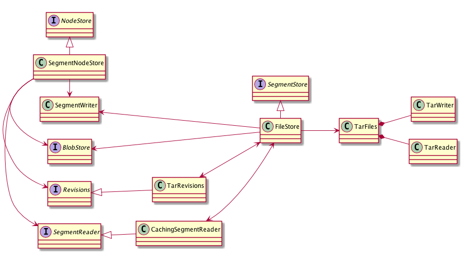

<!--
  Licensed to the Apache Software Foundation (ASF) under one or more
  contributor license agreements.  See the NOTICE file distributed with
  this work for additional information regarding copyright ownership.
  The ASF licenses this file to You under the Apache License, Version 2.0
  (the "License"); you may not use this file except in compliance with
  the License.  You may obtain a copy of the License at

    http://www.apache.org/licenses/LICENSE-2.0

  Unless required by applicable law or agreed to in writing, software
  distributed under the License is distributed on an "AS IS" BASIS,
  WITHOUT WARRANTIES OR CONDITIONS OF ANY KIND, either express or implied.
  See the License for the specific language governing permissions and
  limitations under the License.
-->
# Design of Oak Segment Tar
 
This section gives a high level overview of the design of Oak Segment Tar, its most important classes, their purpose and relationship. More in depth information is available from the Javadoc of the individual classes.   

## Overview

The `SegmentNodeStore` is Oak Segment Tar's implementation of the [NodeStore API](../overview.html). It uses a `Revisions` instance for accessing and setting the current head state, a `SegmentReader` for reading records from segments, a `SegmentWriter` for writing records to segments and a `BlobStore` for reading and writing binaries. 

The `SegmentStore` serves as a persistence backend for the `SegmentNodeStore`. It is responsible for providing concrete implementations of `Revisions`, `SegmentReader` and `BlobStore` to the former.  

The `FileStore` is the implementation the `SegmentStore` that persists segments in tar files. The `MemoryStore` (not shown above) is an alternative implementation, which stores the segments in memory only. It is used for testing. 