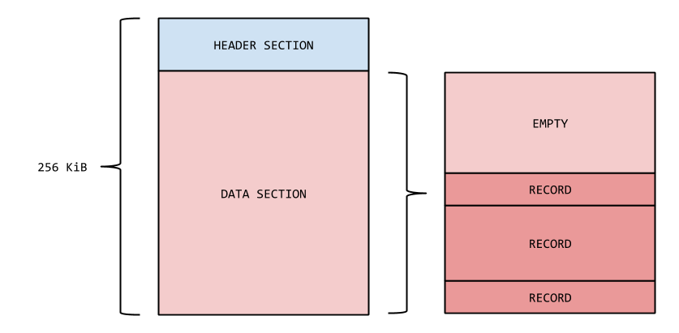

<!--
  Licensed to the Apache Software Foundation (ASF) under one or more
  contributor license agreements.  See the NOTICE file distributed with
  this work for additional information regarding copyright ownership.
  The ASF licenses this file to You under the Apache License, Version 2.0
  (the "License"); you may not use this file except in compliance with
  the License.  You may obtain a copy of the License at

    http://www.apache.org/licenses/LICENSE-2.0

  Unless required by applicable law or agreed to in writing, software
  distributed under the License is distributed on an "AS IS" BASIS,
  WITHOUT WARRANTIES OR CONDITIONS OF ANY KIND, either express or implied.
  See the License for the specific language governing permissions and
  limitations under the License.
-->

# Segments and records

While [TAR files](tar.html) and segments are a coarse-grained mechanism to
divide the repository content in more manageable pieces, the real information
is stored inside the segments as finer-grained records. This page details the
structure of segments and show the binary representation of data stored by Oak.

## Segments

Segments are not created equal. Oak, in fact, distinguishes data and bulk
segments, where the former is used to store structured data (e.g. information
about node and properties), while the latter contains unstructured data (e.g.
the value of binary properties or of very long strings).

It is possible to tell apart a bulk segment from a data segment by just looking
at its identifier. A segment identifier is a randomly generated UUID. Segment
identifiers are 16 bytes long, but Oak uses 4 bits to set apart bulk segments
from data segments. The following bit patterns are used (each `x` represents
four random bits):

  * `xxxxxxxx-xxxx-4xxx-axxx-xxxxxxxxxxxx` data segment UUID
  * `xxxxxxxx-xxxx-4xxx-bxxx-xxxxxxxxxxxx` bulk segment UUID

(This encoding makes segment UUIDs appear as syntactically valid version 4
random UUIDs specified in RFC 4122.)

## Bulk segments

Bulk segments contain raw binary data, interpreted simply as a sequence
of block records with no headers or other extra metadata:

    [block 1] [block 2] ... [block N]

A bulk segment whose length is `n` bytes consists of `n div 4096` block
records of 4KiB each followed possibly a block record of `n mod 4096` bytes,
if there still are remaining bytes in the segment. The structure of a
bulk segment can thus be determined based only on the segment length.

## Data segments

A data segment can be roughly divided in two parts, a header and a data section.
The header contains management information about the segment itself, while the
data section stores the actual repository data.

Repository data is split into records of different types. Every type is specialized
for storing a specific piece of information: node records, template records, map
records, list records, etc.

A record is a contiguous sequence of bytes stored at a specific offset inside a
segment. A record can have references to other records, where the referenced records
can be stored in the same segment or not. Since records can reference each other, a
segment actually stores a graph of records.

The segment header also maintains a set of references to *root records*: those
records that are not referenced from any other records in the segment.

The overall structure of a data segment is:

    [segment header] [record 1] [record 2] ... [record N]

The segment header and each record is zero-padded to make their size a multiple of
four bytes and to align the next record at a four-byte boundary.

The segment header consists of the following fields. All integers are stored in big
endian format.

    +---------+---------+---------+---------+---------+---------+---------+---------+
    | magic bytes: "0aK"          | version | reserved                               
    +---------+---------+---------+---------+---------+---------+---------+---------+
      reserved          | generation                            | segrefcount            
    +---------+---------+---------+---------+---------+---------+---------+---------+
      segrefcount       | reccount                              | reserved           
    +---------+---------+---------+---------+---------+---------+---------+---------+
      reserved                                                                      |
    +---------+---------+---------+---------+---------+---------+---------+---------+
    | Referenced segment identifiers  (segrefcount x 16 bytes)                      |
    |                                                                               |
    |                                ......                                         |
    |                                                                               |
    +---------+---------+---------+---------+---------+---------+---------+---------+
    | Record headers  (reccount x 9 bytes)                                          |
    |                                                                               |
    |                                ......           +---------+---------+---------+
    |                                                 | padding (set to 0)          |
    +---------+---------+---------+---------+---------+---------+---------+---------+

The first three bytes of a segment always contain the ASCII string "0aK",
which is intended to make the binary segment data format easily detectable.
The next byte indicates the version of the segment format and is currently set
to 12.

The `generation` field indicates the segment's generation wrt. to garbage
collection. This field is used by the garbage collector to determine whether
a segment needs to be retained or can be collected.

The `segrefcount` field indicates how many other segments are referenced by
records within this segment. The identifiers of those segments are listed
starting at offset 32 of the segment header. This lookup table is used to
optimize garbage collection and to avoid having to repeat the 16-byte
UUIDs whenever references to records in other segments are made.

The `reccount` field indicates the number of records in this segment. Record
headers for each record follow after the segment identifier lookup table.
Each header consists of a record number (4 bytes), a record type (1 byte)
and a record offset (4 bytes) from the end of the segment.

## Record numbers and offsets

Records need a mechanism to reference each other, both from inside the same segment and across different segments. 
The mechanism used to reference a record is (unsurprisingly) a record identifier.

A record identifier is composed of a *segment field* and a *record number field*. 
The segment field is two-bytes short integer that identifies the segment where the referenced record is stored. 
The record number field is the number of the record inside the segment identified by the segment field. 
There are some peculiarities in both the segment and the position field that may not be immediately obvious. 
The picture below shows how a segment looks like.



The segment field is two bytes long, but a segment identifier is 16 bytes long. 
To bridge the gap, the segment header contains an array of segment identifiers that is used as a look-up table. 
The array can store up to `Integer.MAX_VALUE` entries, but two bytes are enough to access every element in the array in practice.
In fact, the segment field in a record identifier is just an index in the array of segment identifiers that is used as a look-up table.
The segment field can have the special value of `0`.
If the segment field is `0`, the referenced record is stored in the current segment.

The record number field is a logical identifier for the record.
The logical identifier is used as a lookup key in the record references table in the segment identified by the segment field.
Once the correct row in the record references table is found, the record offset can be used to locate the position of the record in the segment.

The offset is relative to the beginning of a theoretical segment which is defined to be 256 KiB.
Since records are added from the bottom of a segment to the top (i.e. from higher to lower offsets), and since segments could be shrunk down to be smaller than 256 KiB, the offset has to be normalized with to the following formula.

```
SIZE - 256 KiB + OFFSET
```

`SIZE` is the actual size of the segment under inspection, and `OFFSET` is the offset looked up from the record references table.
The normalized offset can be used to locate the position of the record in the current segment.

## Records

The content inside a segment is divided in records of different types:
blocks, lists, maps, values, templates and nodes. These record types
and their internal structures are described in subsections below.

### Block records

A block record is the simplest form of record, because it is just a plain
sequence of bytes up to 4kB. It doesn't even contain a length: it is up to
the writer of this record to store the length elsewhere. The only adjustment
performed to the data is the alignment. The implementation makes sure that
the written sequence of bytes is stored at a position that is a multiple of
four.

Block records are used as building blocks of large binary and string values.
They are the only record type that can't contain references to other records.
Block records are typically stored in *bulk segments* that consist only of
block records and are thus easily identifiable as containing zero references
to other segments.

### Value records

Value records have more structure than block records and store data with an
additional length and optional references to other records.

The implementation represents value records in different ways depending on the
length of the data to be written. If the data is short enough, the record can be
written in the simplest way possible: a length field and the data inlined directly
in the record.

When the data is too big, instead, it is split into block records written into
block segments. The reference to these block records are stored into a list
record (see next section), whose identifier is stored inside the value record.

This means that value record represent a good compromise when writing binary or
string data. If the data is short enough, it is written in such a way that can
be used straight away without further reads in the segment. If the data is too
long, instead, it is stored separated from the repository content not to impact
the performance of the readers of the segment.

Value records are used for storing names and values of the content tree. Since
item names can be thought of as name values and since all JCR and Oak values can
be expressed in binary form (strings encoded in UTF-8), it is easiest to simply
use that form for storing all values. The size overhead of such a form for small
value types like booleans or dates is amortized by the facts that those types are
used only for a minority of values in typical content trees and that repeating
copies of a value can be stored just once.

There are four types of value records: small, medium, long and external.
The small- and medium-sized values are stored in inline form, prepended
by one or two bytes that indicate the length of the value. Long values
of up to two exabytes (2^61) are stored as a list of block records. Finally
an external value record contains the length of the value and a string
reference (up to 4kB in length) to some external storage location.

The type of a value record is encoded in the high-order bits of the first
byte of the record. These bit patterns are:

  * `0xxxxxxx`: small value, length (0 - 127 bytes) encoded in 7 bits
  * `10xxxxxx`: medium value length (128 - 16511 bytes) encoded in 6 + 8 bits
  * `110xxxxx`: long value, length (up to 2^61 bytes) encoded in 5 + 7*8 bits
  * `1110xxxx`: external value, reference string length encoded in 4 + 8 bits


### List records

List records represent a general-purpose list of record identifiers. They are
used as building blocks for other types of records, as we saw for value records
and as we will see for template records and node records.

The list record is a logical record using two different types of physical
records to represent itself:

- bucket record: this is a recursive record representing a list of at most 255
  references. A bucket record can reference other bucket records,
  hierarchically, or the record identifiers of the elements to be stored in the
  list. A bucket record doesn't maintain any other information exception record
  identifiers.

- list record: this is a top-level record that maintains the size of the list in
  an integer field and a record identifier pointing to a bucket.


    +--------+--------+--------+-----+
    | sub-list ID 1            | ... |
    +--------+--------+--------+-----+
      |
      v
    +--------+--------+--------+-----+--------+--------+--------+
    | record ID 1              | ... | record ID 255            |
    +--------+--------+--------+-----+--------+--------+--------+

The result is a hierarchically stored immutable list where each element
can be accessed in O(log N) time and the size overhead of updating or
appending list elements (and thus creating a new immutable list) is
also O(log N).

List records are useful to store a list of references to other records. If the
list is too big, it is split into different bucket records that may be  stored
in the same segment or across segments. This guarantees good performance for
small lists, without loosing the capability to store lists with a big number of
elements.

### Map records

Map records implement a general-purpose unordered map of strings to record
identifiers. They are used for nodes with a large number of properties or
child nodes. As lists they are represented using two types of physical record:

- leaf record: if the number of elements in the map is small, they are all
  stored in a leaf record. This covers the simplest case for small maps.

- branch record: if the number of elements in the map is too big, the original
  map is split into smaller maps based on a hash function applied to the keys of
  the map. A branch record is recursive, because it can reference other branch
  records if the sub-maps are too big and need to be split again.

Maps are stored using the hash array mapped trie (HAMT) data structure.
The hash code of each key is split into pieces of 5 bits each and the
keys are sorted into 32 (2^5) buckets based on the first 5 bits. If a bucket
contains less than 32 entries, then it is stored directly as a list of
key-value pairs. Otherwise the keys are split into sub-buckets based on the
next 5 bits of their hash codes. When all buckets are stored, the list of
top-level bucket references gets stored along with the total number of
entries in the map.

The result is a hierarchically stored immutable map where each element
can be accessed in O(log N) time and the size overhead of updating or
inserting list elements is also O(log N).

Map records are also optimized for small changes. In example, if only one
element of a previously stored map is modified, and the map is stored again,
only a "diff" of the map is stored. This prevents the full storage of the
modified map, which can save a considerable amount of space if the original map
was big.

### Template records

A template record stores metadata about nodes that, on average, don't change so
often. A template record stores information like the primary type, the mixin
types, the property names and the property types of a node. Having this
information stored away from the node itself prevents to write them over and
over again if they don't change when the node changes.

In example, on average, a node is created with a certain primary type and,
optionally, with some mixin types. Usually, because of its primary type, a node
is already created with a set of initial properties. After that, only the value
of the properties change, but not the structure of the node itself.

The template record allows Oak to handle simple modifications to nodes in the
most efficient way possible.

As such a template record describes the common structure of a family of related
nodes. Since the structures of most nodes in a typical content tree fall
into a small set of common templates, it makes sense to store such templates
separately instead of repeating that information separately for each node.
For example, the property names and types as well as child node names of all
nt:file nodes are typically the same. The presence of mixins and different
subtypes increases the number of different templates, but they're typically
still far fewer than nodes in the repository.

A template record consists of a set of up to N (exact size TBD, N ~ 256)
property name and type pairs. Additionally, since nodes that are empty or
contain just a single child node are most common, a template record also
contains information whether the node has zero, one or many child nodes.
In case of a single child node, the template also contains the name of
that node. For example, the template for typical mix:versionable nt:file
nodes would be (using CND-like notation):

    - jcr:primaryType (NAME)
    - jcr:mixinTypes (NAME) multiple
    - jcr:created (DATE)
    - jcr:uuid (STRING)
    - jcr:versionHistory (REFERENCE)
    - jcr:predecessors (REFERENCE) multiple
    - jcr:baseVersion (REFERENCE)
    + jcr:content

The names used in a template are stored as separate value records and
included by reference. This way multiple templates that for example all
contain the "jcr:primaryType" property name don't need to repeatedly
store it.


### Node records

The node record is the single most important type of record, capable of storing
both the data associated to the node and the structure of the content tree.

A node record always maintains a reference to a template record. As stated
before, a template record defines the overall structure of the node, while the
variable part of it is maintained in the node record itself.

The variable part of the node is represented by a list of property values and a
map of child nodes.

The list of property values is implemented as a list of record identifiers. For
each property in the node, its value is written in the segment. The record
identifiers referencing the values of the properties are then packed together in
a list record. The identifier of the list record is stored as part of the node
record. If the value of some properties didn't change, the previous record
identifier is just reused.

The map of child nodes is implemented as a map of record identifiers. For every
child node, its node record identifier is stored in a map indexed by name. The
map is persisted in a map record, and its identifier is stored in the node
record. Thanks to the optimizations implemented by the map record, small changes
to the map of children node don't create a lot of overhead in the segment.
