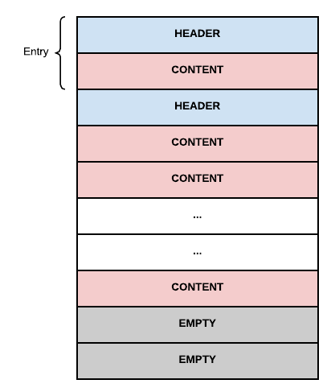
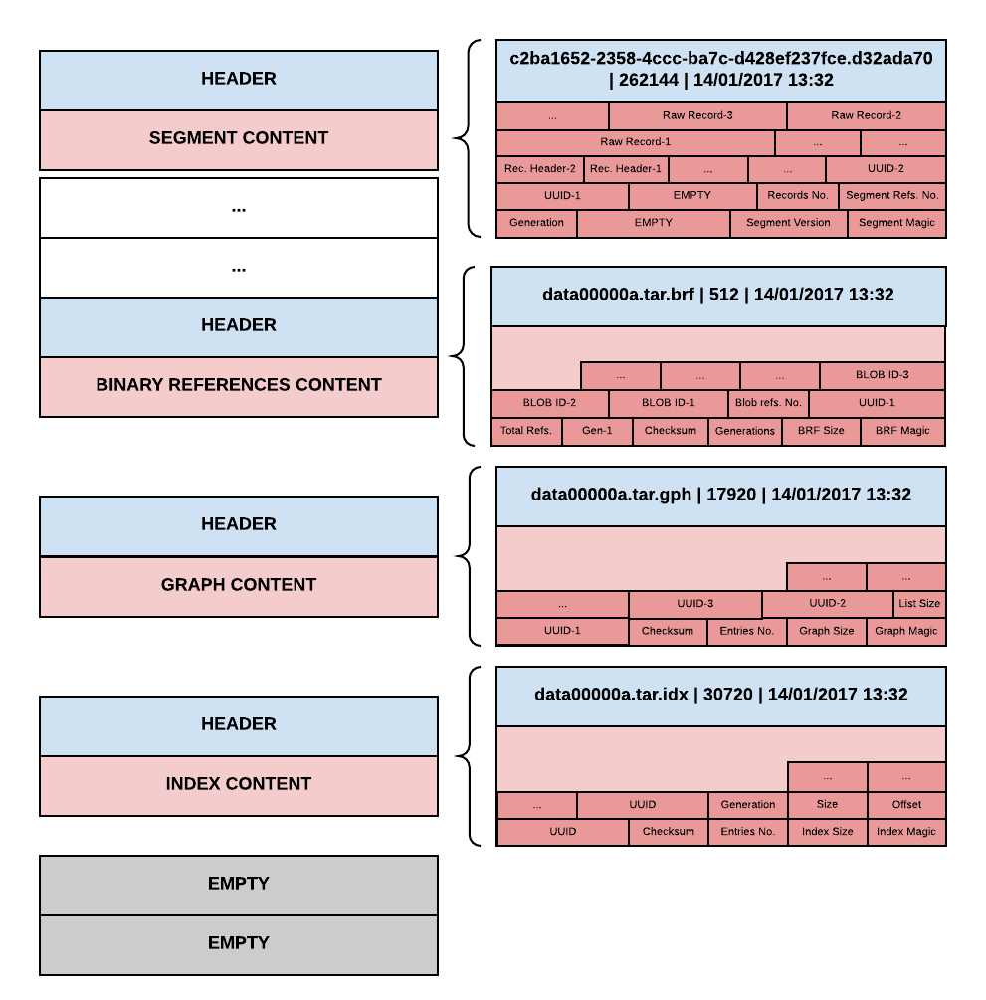

<!--
  Licensed to the Apache Software Foundation (ASF) under one or more
  contributor license agreements.  See the NOTICE file distributed with
  this work for additional information regarding copyright ownership.
  The ASF licenses this file to You under the Apache License, Version 2.0
  (the "License"); you may not use this file except in compliance with
  the License.  You may obtain a copy of the License at

    http://www.apache.org/licenses/LICENSE-2.0

  Unless required by applicable law or agreed to in writing, software
  distributed under the License is distributed on an "AS IS" BASIS,
  WITHOUT WARRANTIES OR CONDITIONS OF ANY KIND, either express or implied.
  See the License for the specific language governing permissions and
  limitations under the License.
-->

# Structure of TAR files

Here is described the physical layout of a TAR file as used by Apache Oak.
First, a brief introduction of the TAR format is given. Next, more details are
provided about the low level information that is written in TAR entries.
Finally, it's described how Oak saves a graph data structure inside the TAR file
and how this representation is optimized for fast retrieval.

## Organization of a TAR file

Physically speaking, a TAR file is a linear sequence of blocks. A TAR file is
terminated by two blocks containing zero bytes. Every block has a size of 512
bytes.

Logically speaking, a TAR file is a linear sequence of entries. Every entry is
represented by two or more blocks. The first block always contains the entry
header. Subsequent blocks store the content of the file.

The entry header is composed of the following fields:

- file name (100 bytes) - name of the file stored in this entry.

- file mode (8 bytes) - string representation of the octal file mode.

- owner's numeric ID (8 bytes) - string representation of the user ID of the
  owner of the file.

- group's numeric ID (8 bytes) - string representation of the group ID of the
  owner of the file.

- file size (12 bytes) - string representation of the octal size of the file.

- last modification time (12 bytes) - string representation of the octal time
  stamp when the file was last modified.

- checksum (8 bytes) - checksum for the header data.

- file type (1 byte) - type of the file stored in the entry. This field
  specifies if the file is a regular file, a hard link or a symbolic link.

- name of linked file (1 byte) - in case the file stored in the entry is a link,
  this field stores the name of the file pointed to by the link.

## The TAR file as used by Oak

Some fields are not used by Oak. In particular, Oak sets the file mode, the
owner's numeric ID, the group's numeric ID, the checksum, and the name of linked
file to uninteresting values. The only meaningful values assigned to the fields
of the entry header are:

- file name: the name of the data file. There are different data files used by
  Oak. They are described below.

- file size: the size of the data file. The value assigned to this field is
  trivially computed from the amount of information stored in the data file.

- last modification time: the time stamp when the entry was written.

There are four kinds of files stored in a TAR file:

- segments: this type of file contains data about a segment in the segment
  store. This kind of file has a file name in the form `UUID.CRC2`, where `UUID`
  is a 128 bit UUID represented as an hexadecimal string and `CRC2` is a zero-
  padded numeric string representing the CRC2 checksum of the raw segment data.

- binary references: this file has a name ending in `.brf` and represents a
  catalog of blobs (i.e. value records) referenced by segments in this TAR file.
  This catalog is indexed by the generation of the segments it contains.

- graph: this file has a name ending in `.gph` and contains the segment graph 
  of all the segments in this tar file. The graph is represented as an adjacency 
  list of UUIDs.

- index: this file has a name ending in `.idx` and contains a sorted list of
  every segment contained in the TAR file.

## Oak TAR file layout

Before delving into further details, a few words on how Oak names TAR files. The
convention is to always start with a `data00000a.tar` file. As data is written
to the repository, new TAR files are added with increasing numbers, thus ending 
up with `data00001a.tar`, `data00002a.tar` and so on.

Each time a compaction cycle ends, there is a cleanup phase in which segments
from an old generation are purged. Those tar files that shrink by at least 25%
are rewritten to a new tar generation, skipping the reclaimed segments. A shrunk
TAR file increases its tail generation character, e.g. from `data00000a.tar` to
`data00000b.tar`.

The layout of the TAR file used by Oak is engineered for performance of read
operations. In particular, the most important information is stored in the
bottom entries. Reading the entries from the bottom of the file, you encounter
first the index, then the graph, then the binary references and finally the
segment files. The idea is that the index must be read first, because it provides
a fast tool to locate segments in the rest of the file. Next comes the graph,
that describes how segments relate to each other. Then the binary references 
index is stored. Last come the segments, whose relative order can be ignored.

At the same time, the layout of the TAR file allows fast append-only operations
when writing. Since the relative order of segment files is not important,
segment entries can be written in a first come, first served basis. The index at
the end of the file will provide a fast way to access them even if they are
scattered around the file.

The picture below presents the building blocks of a TAR file as used by Oak. For
illustration purposes, an hypothetical TAR file called `data00000a.tar` is
dissected.

## Segment files

Segment files contain raw data about a segment. Even if there are multiple kinds
of segments, a TAR file only distinguishes between data and bulk segments. A
bulk segment is always saved as-is in the TAR file, without further
processing. A data segment, instead, is inspected to extract references to other
segments or to binary content.

A data segment can contain references to other segments. These references are
simply stored as a list of UUIDs. The referenced segments can be stored inside
the current TAR file or outside of it. In the first case, the referenced segment
can be found by inspecting the index. In the second case, an external agent is
responsible to find the segment in another TAR file.

The list of segments referenced by a data segment will end up in the graph file.
To speed up the process of locating a segment in the list of referenced segment,
this list is maintained ordered.

The data segment file is divided in two parts. The first is the header and the
second contains the actual records contained in this segment.

The data segment header is divided in three parts:

- a fixed part (32 bytes) containing:

    - a magic number (3 bytes): identifies the beginning of a data segment.

    - version (1 byte): the segment version.

    - empty bytes (6 bytes): reserved for future use.

    - generation (4 bytes): generation of the segment, serialized as a big endian
      integer.

    - number of references (4 bytes): number of references to external segments,
      serialized as a big endian integer.

    - number of records (4 bytes): number of records in this segment, serialized
      as a big endian integer.

    - empty bytes (10 bytes): reserved for future use.

- second part of the header is a variable list of references to external segments.
  Here there will be a list of UUIDs - one per referenced segment - matching the 
  number of references specified in the first part of the header.

- the third and last part of the header consists of a list of record header
  entries, matching the number of records specified in the first part of the
  header. Each record header consists of:

    - record number (4 bytes), serialized as a big endian integer.

    - record type (1 byte): can be one of *LEAF*, *BRANCH*, *BUCKET*, *LIST*,
      *VALUE*, *BLOCK*, *TEMPLATE*, *NODE* or *BLOB_ID*.

    - record offset (4 bytes), serialized as a big endian integer: offset of the
      record counting from the end of the segment. The actual position of the
      record can be obtained by computing `(segment size - offset)`.

After the segment header, the actual records are stored, at the offsets
advertised in the corresponding record header stored in the last part of the
segment header.

See [Segments and records](records.html) for description of the various record types
and their format.

## Binary references files

The binary references file represents an index of binary references (blobs) in a
TAR file. This index groups the references by generation first and segment ID 
next.

The format of the binary references file is optimized for reading. The file is
stored in reverse order to maintain the most important information at the end of
the file. This strategy is inline with the overall layout of the entries in the
TAR file.

The binary references file is divided in two parts. The first is a header and the
second contains the real data in the catalog.

The binary references header contains the following fields:

- a magic number (4 bytes): identifies the beginning of a binary references file.

- size of the whole binary references mapping (4 bytes): number of bytes occupied
  by the entire structure holding binary references (per generation, per segment).

- number of generations (4 bytes): number of different generations of the segments
  which refer blobs.

- checksum (4 bytes): a CRC2 checksum of the content of the binary references
  file.

Immediately after the graph header, the index data is stored. The storage scheme 
used is the following:

- generation of all the following segments.

- number of segment to binary references mappings for the current generation.

- for each mapping we have:

    - UUID of the referencing segment.

    - number of referenced blobs.

    - an unordered enumeration of blob ids representing blobs referenced by the
      current segment.

## Graph files

The graph file represents the relationships between segments stored inside or
outside the TAR file. The graph is stored as an adjacency list of UUIDs, where
each UUID represents a segment. Like the binary references file, the graph
file is also stored backwards.

The content of the graph file is divided in two parts: a graph header and a
graph adjacency list.

The graph header contains the following fields:

- a magic number (4 bytes): identifies the beginning of a graph file.

- size of the graph adjacency list (4 bytes): number of bytes occupied by the
  graph adjacency list.

- number of entries (4 bytes): how many adjacency lists are stored.

- checksum (4 bytes): a CRC2 checksum of the content of the graph file.

Immediately after the graph header, the graph adjacency list is stored. The
storage scheme used is the following:

- UUID of the source segment.

- size of the adjacency list of the source segment.

- an unordered enumeration of UUIDs representing target segments referenced by
  the source segment.

## Index files

The index file is an ordered list of references to the entries contained in the
TAR file. The references are ordered by UUID and they point to the position in
the file where the entry is stored. Like the graph file, the index file is also
stored backwards.

The index file is divided in two parts. The first is an index header, the second
contains the real data about the index.

The index header contains the following fields:

- a magic number (4 bytes): identifies the beginning of an index file.

- size for the index (4 bytes): number of bytes occupied by the index data. This
  size also contains padding bytes that are added to the index to make it align
  with the TAR block boundary.

- number of entries (4 bytes): how many entries the index contains.

- checksum (4 bytes): a CRC32 checksum of the content of the index file.

After the header, the content of the index starts. For every entry contained in
the index, the following information is stored:

- the most significant bits of the UUID (8 bytes).

- the least significant bits of the UUID (8 bytes).

- the offset in the TAR file where the TAR entry containing the segment is
  located.

- the size of the entry in the TAR file.

- the generation of the entry.

Since the entries in the index are sorted by UUID, and since the UUIDs assigned
to the entries are uniformly distributed, when searching an entry by its UUID an
efficient algorithm called interpolation search can be used. This algorithm is a
variation of binary search. While in binary search the search space (in this
case, the array of entry) is halved at every iteration, interpolation search
exploits the distribution of the keys to remove a portion of the search space
that is potentially bigger than the half of it. Interpolation search is a more
natural approximation of the way a person searches in a phone book. If the name
to search begins with the letter T, in example, it makes no sense to open the
phone book at the half. It is way more efficient, instead, to open the phone
book close to the bottom quarter, since names starting with the letter T are
more likely to be distributed in that part of the phone book.
