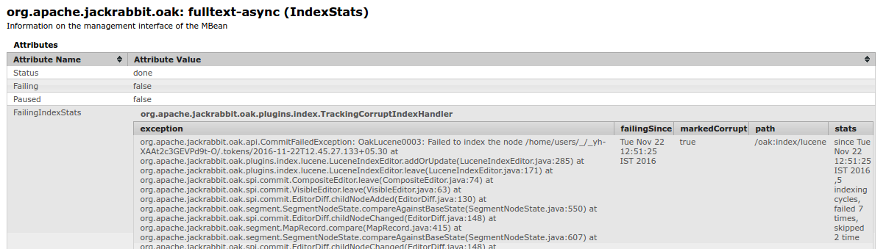
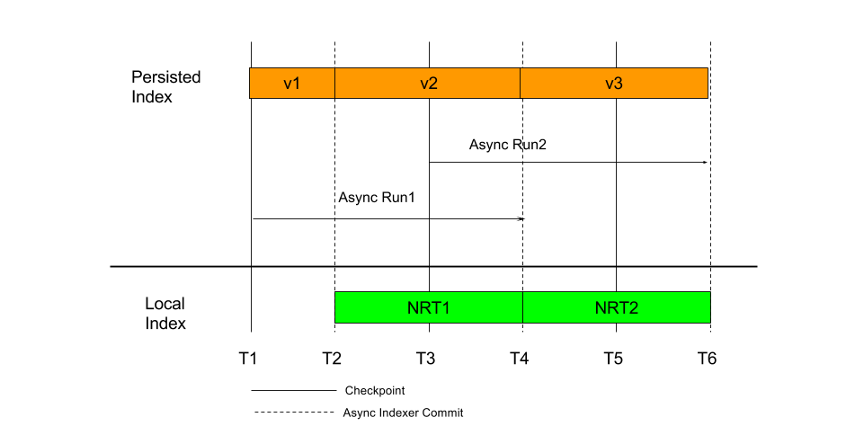

<!--
   Licensed to the Apache Software Foundation (ASF) under one or more
   contributor license agreements.  See the NOTICE file distributed with
   this work for additional information regarding copyright ownership.
   The ASF licenses this file to You under the Apache License, Version 2.0
   (the "License"); you may not use this file except in compliance with
   the License.  You may obtain a copy of the License at

       http://www.apache.org/licenses/LICENSE-2.0

   Unless required by applicable law or agreed to in writing, software
   distributed under the License is distributed on an "AS IS" BASIS,
   WITHOUT WARRANTIES OR CONDITIONS OF ANY KIND, either express or implied.
   See the License for the specific language governing permissions and
   limitations under the License.
  -->
# Indexing

* [Indexing](#indexing)
    * [Overview](#overview)
        * [New in 1.6](#new-1.6)
    * [Indexing Flow](#indexing-flow)
        * [Index Definitions](#index-defnitions)
            * [Index Definition Location](#oak-index-nodes)
        * [Synchronous Indexing](#sync-indexing)
        * [Asynchronous Indexing](#async-indexing)
            * [Checkpoint](#checkpoint)
            * [Indexing Lane](#indexing-lane)
            * [Clustered Setup](#cluster)
                * [Indexing Lease](#async-index-lease)
            * [Indexing Lag](#async-index-lag)
            * [Setup](#async-index-setup)
            * [Async Indexing MBean](#async-index-mbean)
            * [Isolating Corrupt Indexes](#corrupt-index-handling)
        * [Near Real Time Indexing](#nrt-indexing)
            * [Usage](#nrt-indexing-usage)
                * [NRT Indexing Mode - nrt](#nrt-indexing-mode-nrt)
                * [NRT Indexing Mode - sync](#nrt-indexing-mode-sync)
            * [Cluster Setup](#nrt-indexing-cluster-setup)
            * [Configuration](#nrt-indexing-config)
    * [Reindexing](#reindexing)            
        * [Reducing reindexing times](#reduce-reindexing-times)            
        * [How to Abort Reindexing](#abort-reindex)            
  
##  Overview
  
For queries to perform well, Oak supports indexing of content that is stored in the repository. 
Indexing works by comparing different versions of the node data
(technically, "diff" between the base `NodeState` and the modified `NodeState`). 
The indexing mode defines how comparing is performed, and when the index content gets updated:

1. Synchronous Indexing
2. Asynchronous Indexing
3. Near Real Time (NRT) Indexing

Indexing uses [Commit Editors](../architecture/nodestate.html#commit-editors). 
Some of the editors are of type `IndexEditor`, which are responsible for updating index content 
based on changes in main content. 
Currently, Oak has following in built editors:

1. PropertyIndexEditor
2. ReferenceEditor
3. LuceneIndexEditor
4. SolrIndexEditor

###  New in 1.6

* [Near Real Time (NRT) Indexing](#nrt-indexing)
* [Multiple Async indexers setup via OSGi config](#async-index-setup)
* [Isolating Corrupt Indexes](#corrupt-index-handling)

##  Indexing Flow

The `IndexEditor` is invoked as part of a commit (`Session.save()`), 
or as part of the asynchronous "diff" process. 
For both cases, at some stage "diff" is performed between the _before_ and the _after_ state, 
and passed to `IndexUpdate`, which is responsible for invoking the `IndexEditor`
based on the _discovered_ index definitions.

###  Index Definitions

Index definitions are nodes of type `oak:QueryIndexDefinition`,
which are stored under a special node named `oak:index`.
As part of diff traversal, at each level, `IndexUpdate` looks for `oak:index` nodes. 
Below is the canonical index definition structure:

    /oak:index/indexName
      - jcr:primaryType = "oak:QueryIndexDefinition"
      - type (string) mandatory
      - async (string) multiple
      - reindex (boolean)
      
The index definitions nodes have the following properties:

1. `type` - It determines the _type_ of index.
    `IndexUpdate` looks for an `IndexEditor` of the given 
    type from the registered `IndexEditorProvider`. 
    For an out-of-the-box Oak setup, it can have one of the following values:
    * `reference` -  Configured with the out-of-the-box setup
    * `counter` - Configured with the out-of-the-box setup
    * `property`
    * `lucene`
    * `solr`
2. `async` - This determines if the index is to be updated synchronously or asynchronously. 
    It can have following values:
    * `sync` - The default value. It indicates that index is meant to be updated as part of each commit.
    * `nrt`  - Indicates that index is a [near real time](#nrt-indexing) index. 
    * `async` - Indicates that index is to be updated asynchronously. 
       In such a case, this value is used to determine
       the [indexing lane](#indexing-lane)
    * Any other value which ends in `async`. 
3. `reindex` - If set to `true`, reindexing is performed for that index. 
    After reindexing is done, the property value is set to `false`.
    See [reindexing](#reindexing) for more details.
    
Based on the above two properties, the `IndexUpdate` creates an `IndexEditor` instances 
as it traverses the "diff", and registers them with itself, passing on the callbacks for changes.

####  Index Definition Location

Indexing logic supports placing `oak:index` nodes at any path. 
Depending on the location, such indexes only index content which are present under those paths. 
So, for example if 'oak:index' is present at _'/content/oak:index'_, then indexes
defined under that node only index repository data present under _'/content'_.

Depending on the type of the index, one can create these index definitions under the root path ('/'), 
or non-root paths. 
Currently only `lucene` indexes support creating index definitions at non-root paths. 
`property` indexes can only be created under the root path, that is, under '/'.

###  Synchronous Indexing

Under synchronous indexing, the index content gets updates as part of the commit itself. 
Changes to both the main content, as well as the index content, are done atomically in a single commit. 

This mode is currently supported by `property` and `reference` indexes.

###  Asynchronous Indexing

Asynchronous indexing (also called async indexing) is performed using periodic scheduled jobs. 
As part of the setup, Oak schedules certain periodic jobs which perform 
diff of the repository content, and update the index content based on that. 

Each periodic `AsyncIndexUpdate` job is assigned to an [indexing lane](#indexing-lane), 
and is scheduled to run at a certain interval. 
At time of execution, the job performs its work:

1. Look for the last indexed state via stored checkpoint data. 
   If such a checkpoint exists, then read the `NodeState` for that checkpoint. 
   If no such state exists, or no such checkpoint is present, 
   then it treats it as initial indexing, in which case the base state is empty. 
   This state is considered the `before` state.
2. Check if there has been any change in repository from the `before` state. 
   If no change is detected then current indexing cycle is considered completed and
   `IndexStatsMBean#done` time is set to current time. `LastIndexedTime` is not updated
3. Create a checkpoint for _current_ state and refer to this as `after` state.
4. Create an `IndexUpdate` instance bound to the current _indexing lane_, 
   and trigger a diff between the `before` and the `after` state.
5. `IndexUpdate` will then pick up index definitions that are bound to the current indexing lane, 
   will create `IndexEditor` instances for them, 
   and pass them the diff callbacks.
6. The diff traverses in a depth-first manner, 
   and at the end of diff, the `IndexEditor` will do final changes for the current indexing run. 
   Depending on the index implementation, the index data can be either stored in the NodeStore itself
   (for indexes of type `lucene`, `property`, and so on), or in any remote store (for type `solr`).
7. `AsyncIndexUpdate` will then update the last indexed checkpoint to the current checkpoint 
   and do a commit. 

Such async indexes are _eventually consistent_ with the repository state, 
and lag behind the latest repository state by some time. 
However, the index content is eventually consistent, and never ends up in wrong state with respect
to repository state.

####  Checkpoint

A checkpoint is a mechanism, whereby a client of the `NodeStore` can request Oak to ensure 
that the repository state (snapshot) at that time can be preserved, and not removed 
by the revision garbage collection process. 
Later, that state can be retrieved from the NodeStore by passing the checkpoint. 
You can think of a checkpoint as a tag in a git repository, or as a named revision. 

Async indexing makes use of checkpoint support to access older repository state. 

####  Indexing Lane

The term "indexing lane" refers to a set of indexes which are to be updated by a given async indexer.
Each index definition meant for async indexing defines an `async` property, 
whose value is the name of the indexing lane. 
For example, consider following two index definitions:

    /oak:index/userIndex
      - jcr:primaryType = "oak:QueryIndexDefinition"
      - async = "async"
      
    /oak:index/assetIndex
      - jcr:primaryType = "oak:QueryIndexDefinition"
      - async = "fulltext-async"
      
Here, _userIndex_ is bound to the "async" indexing lane, 
while _assetIndex_ is bound to  the "fulltext-async" lane. 
Oak [setup](#async-index-setup) configures two `AsyncIndexUpdate` jobs: 
one for "async", and one for "fulltext-async".
When the job for "async" is run, 
it only processes index definition where the `async` value is `async`, 
while when the job for "fulltext-async" is run,
it only pick up index definitions where the `async` value is `fulltext-async`.

These jobs can be scheduled to run at different intervals, and also on different cluster nodes. 
Each job keeps its own bookkeeping of checkpoint state, 
and can be [paused and resumed](#async-index-mbean) separately.

Prior to Oak 1.4, there was only one indexing lane: `async`. 
In Oak 1.4, support was added to create two lanes: `async` and `fulltext-async`. 
With 1.6, it is possible to [create multiple lanes](#async-index-setup). 

####  Clustered Setup

In a clustered setup, one needs to ensure in the host application that 
the async indexing jobs for all lanes are run as singleton in the cluster. 
If `AsyncIndexUpdate` for the same lane is executed concurrently on different cluster nodes,
it leads to race conditions, where an old checkpoint gets lost, 
leading to reindexing.

See also [clustering](../clustering.html#scheduled-jobs) 
for more details on how the host application should schedule such indexing jobs.

#####  Indexing Lease

`AsyncIndexUpdate` has an in-built "lease" logic to ensure that 
even if the jobs gets scheduled to run on different cluster nodes, only one of them runs. 
This is done by keeping a lease property, which gets periodically updated as 
indexing progresses. 

An `AsyncIndexUpdate` run skips indexing if the current lease has not expired.
If the last update of the lease was done too long ago (default: more than 15 minutes), 
it is assumed that cluster node that is supposed to index is not available, 
and some other node will take over.

The lease logic can delay the start of indexing if the system is not stopped cleanly. 
As of Oak 1.6, this does not affect non-clustered setups like those based on SegmentNodeStore,
but only [affects DocumentNodeStore][OAK-5159] based setups.

####  Indexing Lag

Async indexing jobs are by default configured to run at an interval of 5 seconds. 
Depending on the system load and diff size of content to be indexed, 
the indexing may start lagging by a longer time interval. 
Due to this, the indexing results can lag behind the repository state, 
and may become stale, that means new content added will only show up in query results after a longer time.

The `IndexStats` MBean keeps a time series and metrics stats for the indexing frequency. 
This can be used to track the indexing state.

[NRT Indexing](#nrt-indexing) introduced in Oak 1.6 helps in such situations, 
and can keep the results more up to date.

####  Setup

`@since Oak 1.6`

Async indexers can be configure via the OSGi config for `org.apache.jackrabbit.oak.plugins.index.AsyncIndexerService`.

Different lanes can be configured by adding more rows of _Async Indexer Configs_. 
Prior to 1.6, the indexers were created programatically while constructing Oak.

####  Async Indexing MBean

For each configured async indexer in the setup, the indexer exposes a `IndexStatsMBean`, 
which provides various stats around the current indexing state:

    org.apache.jackrabbit.oak: async (IndexStats)
    org.apache.jackrabbit.oak: fulltext-async (IndexStats)

It provide the following details:

* FailingIndexStats - Stats around indexes which are [failing and marked as corrupt](#corrupt-index-handling).
* LastIndexedTime - Time up to which the repository state has been indexed.
* Status - running, done, failing etc.
* Failing - boolean flag indicating that indexing has been failing due to some issue. 
  This can be monitored for detecting if indexer is healthy or not.
* ExecutionCount - Time series data around the number of runs for various time intervals.

Further it provides the following operations:

* pause - Pauses the indexer.
* abortAndPause - Aborts any running indexing cycle and pauses the indexer. 
  Invoke 'resume' once you are ready to resume indexing again.
* resume - Resume indexing.

####  Isolating Corrupt Indexes

`Since 1.6`

The `AsyncIndexerService` marks any index which fails to update for 30 minutes
(configurable) as `corrupt`, and ignore such indexes from further indexing. 

When any index is marked as corrupt, the following log entry is made:

    2016-11-22 12:52:35,484 INFO  NA [async-index-update-fulltext-async] o.a.j.o.p.i.AsyncIndexUpdate - 
    Marking [/oak:index/lucene] as corrupt. The index is failing since Tue Nov 22 12:51:25 IST 2016, 
    1 indexing cycles, failed 7 times, skipped 0 time 

Post this, when any new content gets indexed and any such corrupt index is skipped, 
the following warn entry is made:

    2016-11-22 12:52:35,485 WARN  NA [async-index-update-fulltext-async] o.a.j.o.p.index.IndexUpdate - 
    Ignoring corrupt index [/oak:index/lucene] which has been marked as corrupt since 
    [2016-11-22T12:51:25.492+05:30]. This index MUST be reindexed for indexing to work properly 
    
This info is also seen in the MBean

    
Later, once the index is reindexed, the following log entry is made

    2016-11-22 12:56:25,486 INFO  NA [async-index-update-fulltext-async] o.a.j.o.p.index.IndexUpdate - 
    Removing corrupt flag from index [/oak:index/lucene] which has been marked as corrupt since 
    [corrupt = 2016-11-22T12:51:25.492+05:30] 

This feature can be disabled by setting `failingIndexTimeoutSeconds` to 0 in the `AsyncIndexService` config. 
See also [OAK-4939][OAK-4939] for more details.

###  Near Real Time Indexing

`@since Oak 1.6`

_This mode is only supported for `lucene` indexes_

Lucene indexes perform well for evaluating complex queries, 
and have the benefit of being evaluated locally with copy-on-read support. 
However, they are `async`, and depending on system load can lag behind the repository state.
For cases where such lag (which can be in the order of minutes) is not acceptable, 
one must use `property` indexes. 
To avoid that, Oak 1.6 has [added support for near real time indexing][OAK-4412]

In this mode, the indexing happen in two modes, and a query will consult multiple indexes. 
The diagram above shows the indexing flow with time. In the above flow:

* T1, T3 and T5 - Time instances at which checkpoints are created.
* T2 and T4 - Time instance when async indexer runs completed and indexes were updated.
* Persisted Index:
    * v2 - Index version v2, which has repository state indexed up to T1.
    * v3 - Index version v2, which has repository state indexed up to T3.
* Local Index:
    * NRT1 - Local index, which has repository state indexed between T2 and T4.
    * NRT2 - Local index, which has repository state indexed between T4 and T6.
    
As the repository state changes with time, the Async indexer will run and index the 
changes between the last known checkpoint and current state when that run started. 
So when async run 1 completed, the persisted index has the repository state indexed up to T3.

Now without NRT index support, if any query is performed between T2 and T4, 
it can only see index results for the repository state at T1, 
as that is the state where the persisted indexes have data for. 
Any change after that cannot be seen until the next async indexing cycle is complete (at T4). 

With NRT indexing support, indexing will happen at two places:

* Persisted Index - This is the index which is updated via the async indexer run. 
  This flow remains the same, it will be periodically updated by the indexer run.
* Local Index - In addition to persisted index, each cluster node will also maintain a local index. 
  This index only keeps data between two async indexer runs. 
  Post each run, the previous index is discarded, and a new index is built 
  (actually, the previous index is retained for one cycle).
  
Any query making use of such an index will automatically make use of both the persisted and the local indexes. 
With this, new content added in the repository after the last async index run will also show up quickly.

####  Usage

NRT (Near real time) indexing can be enabled for an index by configuring the `async` property:

    /oak:index/assetIndex
      - jcr:primaryType = "oak:QueryIndexDefinition"
      - async = ['fulltext-async', 'nrt']
      
Here, `async` has been set to a multi-valued property, with the

* Indexing lane - For example `async` or `fulltext-async`,
* NRT Indexing Mode - `nrt` or `sync`.

#####  NRT Indexing Mode - nrt

In this mode, the local index is updated asynchronously on that cluster nodes post each commit, 
and the index reader is refreshed each second. 
So, any change done should show up on that cluster node within 1 to 2 seconds.

    /oak:index/userIndex
      - jcr:primaryType = "oak:QueryIndexDefinition"
      - async = ['async', 'nrt']

#####  NRT Indexing Mode - sync

In this mode, the local index is updated synchronously on that cluster nodes post each commit,
and the index reader is refreshed immediately. 
This mode indexes more slowly compared to the "nrt" mode.

    /oak:index/userIndex
      - jcr:primaryType = "oak:QueryIndexDefinition"
      - async = ['async', 'sync']
      
For a single node setup (for example with the `SegmentNodeStore`), 
this mode effectively makes async lucene index perform same as synchronous property indexes. 
However, the 'nrt' mode performs better, so using that is preferable.

####  Cluster Setup

In cluster setup, each cluster node maintains its own local index for changes happening in that cluster node.
In addition to that, it also indexes changes from other cluster nodes by relying on 
[Oak observation for external changes][OAK-4808]. 
This depends on how frequently external changes are delivered. 
Due to this, even with NRT indexing changes from other cluster nodes will take some more time 
to be reflected in query results compared to local changes.

####  Configuration

NRT indexing expose a few configuration options as part of the [LuceneIndexProviderService](lucene.html#osgi-config):

* `enableHybridIndexing` - Boolean property, defaults to `true`. 
  Can be set to `false` to disable the NRT indexing feature completely.
* `hybridQueueSize` - The size of the in-memory queue used 
  to hold Lucene documents for indexing in the `nrt` mode. 
  The default size is 10000.

##  Reindexing

Reindexing rarely solves problems. 
Specially, it does not typically make queries return the expected result. 
For such cases, it is _not_ recommended to reindex,
also because reindex can be very slow (sometimes multiple days), 
and use a lot of temporary disk space.
Note that removing checkpoints, and removing the hidden `:async` node
will  cause a full reindex, so doing this is not recommended either.
If queries don't return the right data, then possibly the index is [not yet up-to-date][OAK-5159],
or the query is incorrect, or included/excluded path settings are wrong (for Lucene indexes). 
Instead of reindexing, it is suggested to first check the log file, 
modify the query so it uses a different index or traversal, and run the query again.

Reindexing of existing indexes is required in the following scenarios:

* A: In case a _property_ index configuration was changed,
  such that the index is used for queries, but doesn't contain some of the nodes.
  Nodes that existed _before_ the index configuration was changed, are not indexed.
  A workaround is to change ('touch') the affected nodes.
* B: Prior to Oak 1.6, in case a _Lucene_ index definition was changed (same as A).
  In Oak 1.6 and newer, queries will use the old index definition
  until the index is [reindexed](lucene.html#stored-index-definition).
* C: Prior to Oak 1.2.15 / 1.4.2, in case the query engine picks a very slow index 
  for some queries because the counter index (`/oak:index/counter`)
  [got out of sync after adding and removing lots of nodes many times][OAK-4065].
  For this case, it is recommended to verify the contents of the counter index first,
  and upgrade Oak before reindexing.
  To view the content, use the NodeCounter JMX bean and
  run `getEstimatedChildNodeCounts` with p1 = `/` and p2 = `2`.
  If there is a problem, then the estimated node count of root node typically is very low,
  more than 10 times lower than the sum of its children.
  Only the `counter` index needs to be reindexed in this case.
  The workaround (to avoid reindexing) is to manually tweak index configurations
  using manually set `entryCount` of the index that should be used to a low value
  (as high as possible so that the index is still needed), for example to 100 or 1000.
* D: In case a binary of a Lucene index (a Lucene index file) is missing, 
  for example because the binary is not available in the datastore.
  This can happen in case the datastore is misconfigured
  such that garbage collection removed a binary that is still required.
  In such cases, other binaries might be missing as well;
  it is best to traverse all nodes of the repository to ensure this is not the case.
* E: In case a binary of a Lucene index (a Lucene index file) is corrupt.
  If the index is corrupt, an `AsyncIndexUpdate` run will fail 
  with an exception saying a Lucene index file is corrupt.
  In such a case, first verify that the following procedure doesn't resolve
  the issue: stop Oak, remove the local copy of the Lucene index (directory `index`),
  and restart. If the index is still corrupt after this, then reindexing is needed.
  In such cases, please file an Oak issue.
* F: Prior to Oak 1.2.24 / 1.4.13 / 1.6.1, 
  when using the document store (MongoDB or RDBMK)
  in combination with a large transaction (a commit that changed or added many thousand nodes),
  and if one of the parent nodes had more than 100 child nodes,
  then indexes (all types) [did not see those changes in some cases][OAK-5557].
* G: Prior to Oak 1.4.7, when repository sidegrade was used to do _partial_ migrations,
  that is migrating data without migrating related indexes.
  In this case, the property indexes need to be either fully rebuilt,
  or (as an alternative) copy or migrate the content again using a newer version of Oak.
  See also [OAK-4684][OAK-4684].
* H: If a binary is missing after reindexing.
  This can happen in the following case:
  When reindexing or creating a new index takes multiple days, 
  and during that time, after one day or later, datastore garbage collection was run concurrently.
  Some binaries created during by reindexing can get missing because 
  datastore garbage collection removes unreferenced binaries older than one day.
  Indexing or reindexing using oak-run is not affected by this.  

New indexes are built automatically once the index definition is stored.
To reindex an _existing_ index (when needed), set the `reindex` property to `true` in the respective index definition:

    /oak:index/userIndex
      - reindex = true
      
Once changes are saved, the index is reindexed.
For asynchronous indexes, reindex starts with the next async indexing cycle.
For synchronous indexes, the reindexing is done as part of save (or commit) itself.
For a (synchronous) property index, 
as an alternative you can use the `PropertyIndexAsyncReindexMBean`; 
see the [reindeinxing property indexes](property-index.html#reindexing) section for more details on that.

Once reindexing starts, the following log entries can be seen in the log:

    [async-index-update-async] o.a.j.o.p.i.IndexUpdate Reindexing will be performed for following indexes: [/oak:index/userIndex]
    [async-index-update-async] o.a.j.o.p.i.IndexUpdate Reindexing Traversed #100000 /home/user/admin 
    [async-index-update-async] o.a.j.o.p.i.AsyncIndexUpdate [async] Reindexing completed for indexes: [/oak:index/userIndex*(4407016)] in 30 min 

Once reindexing is complete, the `reindex` flag is set to `false` automatically.

###  Reducing Reindexing Times

If the index being reindexed has full text extraction configured then reindexing can take long time as most of the 
time is spent in text extraction. 
For such cases its recommended to use text [pre-extraction support](pre-extract-text.html).
The text pre-extraction can be done before starting the actual reindexing. This would then ensure that during reindexing
time is not spent in performing text extraction and hence the actual time taken for reindexing such an index gets reduced
considerably.

###  How to Abort Reindexing

Building an index can be slow. It can be aborted (stopped before it is finished),
for example if you detect there is an error in the index definition.
Reindexing and building a new index can be aborted 
when using asynchronous indexes.
For synchronous indexes, it can be stopped if it was started using the `PropertyIndexAsyncReindexMBean`.
To do this, use the respective `IndexStats` JMX bean 
(for example, `async`, `fulltext-async`, or `async-reindex`), 
and call the operation `abortAndPause()`.
Then, either set the `reindex` flag to `false` (for an existing index), 
remove the index definition (for a new index),
or change the index type to `disabled`. Store the change. Finally, call the operation `resume()`
so that regular indexing operations can continue.

[OAK-4065]: https://issues.apache.org/jira/browse/OAK-4065
[OAK-4412]: https://issues.apache.org/jira/browse/OAK-4412
[OAK-4684]: https://issues.apache.org/jira/browse/OAK-4684
[OAK-4808]: https://issues.apache.org/jira/browse/OAK-4808
[OAK-4939]: https://issues.apache.org/jira/browse/OAK-4939
[OAK-5159]: https://issues.apache.org/jira/browse/OAK-5159
[OAK-5557]: https://issues.apache.org/jira/browse/OAK-5557

  