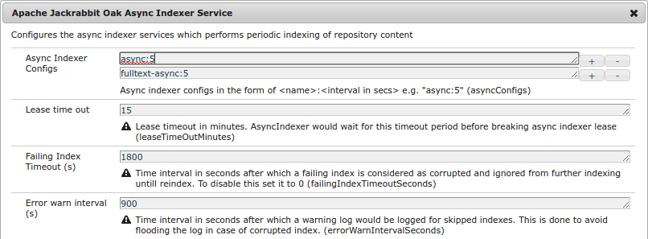

<!--
   Licensed to the Apache Software Foundation (ASF) under one or more
   contributor license agreements.  See the NOTICE file distributed with
   this work for additional information regarding copyright ownership.
   The ASF licenses this file to You under the Apache License, Version 2.0
   (the "License"); you may not use this file except in compliance with
   the License.  You may obtain a copy of the License at

       http://www.apache.org/licenses/LICENSE-2.0

   Unless required by applicable law or agreed to in writing, software
   distributed under the License is distributed on an "AS IS" BASIS,
   WITHOUT WARRANTIES OR CONDITIONS OF ANY KIND, either express or implied.
   See the License for the specific language governing permissions and
   limitations under the License.
  -->
  
#  Indexing

* [Indexing](#indexing)
    * [Overview](#overview)
        * [New in 1.6](#new-1.6)
    * [Indexing Flow](#indexing-flow)
        * [Index Definitions](#index-defnitions)
            * [oak:index node ](#oak-index-nodes)
        * [Synchronous Indexing](#sync-indexing)
        * [Asynchronous Indexing](#async-indexing)
            * [Checkpoint](#checkpoint)
            * [Indexing Lane](#indexing-lane)
            * [Clustered Setup](#cluster)
                * [Indexing Lease](#async-index-lease)
            * [Indexing Lag](#async-index-lag)
            * [Setup](#async-index-setup)
            * [Async Indexing MBean](#async-index-mbean)
            * [Isolating Corrupt Indexes](#corrupt-index-handling)
        * [Near Real Time Indexing](#nrt-indexing)
            * [NRT Indexing Modes](#nrt-indexing-modes)
                * [nrt](#nrt-indexing-mode-nrt)
                * [sync](#nrt-indexing-mode-sync)
            * [Cluster Setup](#nrt-indexing-cluster-setup)
            * [Configuration](#nrt-indexing-config)
  
##  Overview
  
For queries to perform well Oak supports indexing content stored in repository. Indexing works
on diff between the base NodeState and modified NodeState. Depending on how diff is performed and
when the index content gets updated there are 3 types of indexing modes
  
1. Synchronous Indexing
2. Asynchronous Indexing
3. Near real time indexing

Indexing makes use of [Commit Editors](../architecture/nodestate.html#commit-editors). Some of the editors
are `IndexEditor` which are responsible for updating index content based on changes in main content. Currently
Oak has following in built `IndexEditor`s

1. PropertyIndexEditor
2. ReferenceEditor
3. LuceneIndexEditor
4. SolrIndexEditor

###  New in 1.6

* [Near Real Time Indexing](#nrt-indexing)
* [Multiple Async indexers setup via OSGi config](#async-index-setup)
* [Isolating Corrupt Indexes](#corrupt-index-handling)

##  Indexing Flow

`IndexEditor` are invoked as part of commit or as part of asynchronous diff process. For both cases at some stage
diff is performed between _before_ and _after_ state and passed to `IndexUpdate` which is responsible for invoking
`IndexEditor` based on _discovered_ index definitions.

###  Index Definitions

Index definitions are nodes of type `oak:QueryIndexDefinition` which are stored under a special node named `oak:index`.
As part of diff traversal at each level `IndexUpdate` would look for `oak:index` nodes. The index definitions nodes have 
following properties

1. `type` - It determines the _type_ of index. Based on the `type` `IndexUpdate` would look for `IndexEditor` of given 
    type from registered `IndexEditorProvider`. For out of the box Oak setup it can have one of the following value
    * `reference` -  Configured with out of box setup
    * `counter` - Configured with out of box setup
    * `property`
    * `lucene`
    * `solr`
2. `async` - It determines if the index is to be updated synchronously or asynchronously. It can have following values
    * `sync` - Also the default value. It indicates that index is meant to be updated as part of commit
    * `nrt`  - Indicates that index is a [near real time](#nrt-indexing) index. 
    * `async` - Indicates that index is to be updated asynchronously. In such a case this value is used to determine
       the [indexing lane](#indexing-lane)
    * Any other value which ends in `async`. 
    
Based on above 2 properties `IndexUpdate` creates `IndexEditor` instances as it traverses the diff and registers them
with itself passing on the callbacks for various changes

#### oak:index node 

Indexing logic supports placing `oak:index` nodes at any path. Depending on the location such indexes would only index
content which are present under those paths. So for e.g. if 'oak:index' is present at _'/content/oak:index'_ then indexes
defined under that node would only index repository state present under _'/content'_

Depending on type of index one can create these index definitions under root path ('/') or non root paths. Currently 
only `lucene` indexes support creating index definitions at non root paths. `property` indexes can only be created 
under root path i.e. under '/'

###  Synchronous Indexing

Under synchronous indexing the index content gets updates as part of commit itself. Changes to both index content
and main content are done atomically in single commit. 

This mode is currently supported by `property` and `reference` indexes

###  Asynchronous Indexing

Asynchronous Indexing (also referred as async indexing) is performed using periodic scheduled jobs. As part of setup
Oak would schedule certain periodic jobs which would perform diff of the repository content and update the index content
based on that diff. 

Each periodic job i.e. `AsyncIndexUpdate` is assigned to an [indexing lane](#indexing-lane) and is scheduled to run at 
certain interval. At time of execution the job would perform work

1. Look for last indexed state via stored checkpoint data. If such a checkpoint exist then resolve the `NodeState` for 
   that checkpoint. If no such state exist or no such checkpoint is present then it treats it as initial indexing case where 
   base state is set to empty. This state is considered as `before` state
2. Create a checkpoint for _current_ state and refer to this as `after` state
3. Create an `IndexUpdate` instance bound to current _indexing lane_ and trigger a diff between the `before` and
   `after` state
4. `IndexUpdate` would then pick up index definitions which are bound to current indexing lane and would create 
   `IndexEditor` instances for them and pass them the diff callbacks
5. The diff traverses in a depth first manner and at the end of diff the `IndexEditor` would do final changes for 
   current indexing run. Depending on index implementation the index data can be either stored in NodeStore itself 
   (e.g. lucene) or in any remote store (e.g. solr)
6. `AsyncIndexUpdate` would then update the last indexed checkpoint to current checkpoint and do a commit. 

Such async indexes are _eventually consistent_ with the repository state and lag behind the latest repository state
by some time. However the index content would be eventually consistent and never end up in wrong state with respect
to repository state.

####  Checkpoint

Checkpoint is a mechanism whereby a client of NodeStore can request it to ensure that repository state at that time
can be preserved and not garbage collected by revision garbage collection process. Later that state can be retrieved
back from NodeStore by passing the checkpoint back. You can treat checkpoint like a named revision or a tag in git 
repo.  

Async indexing makes use of checkpoint support to access older repository state. 

####  Indexing Lane

Indexing lane refers to a set of indexes which are to be indexed by given async indexer. Each index definition meant for
async indexing defines an `async` property whose value is the name of indexing lane. For e.g. consider following 2 index
definitions

    /oak:index/userIndex
      - jcr:primaryType = "oak:QueryIndexDefinition"
      - async = "async"
      
    /oak:index/assetIndex
      - jcr:primaryType = "oak:QueryIndexDefinition"
      - async = "fulltext-async"
      
Here _userIndex_ is bound to "async" indexing lane while _assetIndex_ is bound to  "fulltext-async" lane. Oak 
[setup](#async-index-setup) would configure 2 `AsyncIndexUpdate` jobs one for "async" and one for "fulltext-async".
When job for "async" would run it would only process index definition where `async` value is `async` while when job
for "fulltext-async" would run it would pick up index definitions where `async` value is `fulltext-async`.

These jobs can be scheduled to run at different intervals and also on different cluster nodes. Each job would keep its
own bookkeeping of checkpoint state and can be [paused and resumed](#async-index-mbean) separately.

Prior to Oak 1.4 there was only one indexing lane `async`. In Oak 1.4 support was added to create 2 lanes `async` and 
`fulltext-async`. With 1.6 its possible to [create multiple lanes](#async-index-setup). 

####  Clustered Setup

In a clustered setup it needs to be ensured by the host application that async indexing jobs for specific lanes are to 
be run as singleton in the cluster. If `AsyncIndexUpdate` for same lane gets executed concurrently on different cluster
nodes then it can lead to race conditions where old checkpoint gets lost leading to reindexing of the indexes.

Refer to [clustering](../clustering.html#scheduled-jobs) for more details on how the host application should schedule
such indexing jobs

#####  Indexing Lease

`AsyncIndexUpdate` has an inbuilt lease logic to ensure that even if the jobs gets scheduled to run on different cluster
nodes then also only one of them runs. This is done by keeping a lease property which gets periodically updated as 
indexing progresses. 

An `AsyncIndexUpdate` run would skip indexing if current lease has not expired i.e. if the last 
update of lease was done long ago (default 15 mins) then it would be assumed that cluster node doing indexing is not 
available and some other node would take over.

The lease logic can delay start of indexing if the system is not stopped cleanly. As of Oak 1.6 this does not affect
non clustered setup like those based on SegmentNodeStore but only [affects DocumentNodeStore][OAK-5159] based setups 

####  Indexing Lag

Async indexing jobs are by default configured to run at interval of 5 secs. Depending on the system load and diff size
of content to be indexed the indexing may start lagging by longer time intervals. Due to this the indexing results would
lag behind the repository state and may become stale i.e. new content added would show up in result after some time.

`IndexStats` MBean keeps a time series and metrics stats for the indexing frequency. This can be used to track the 
indexing state

[NRT Indexing](#nrt-indexing) introduced in Oak 1.6 would help in such situations and can keep the results more upto 
date

####  Setup

`@since Oak 1.6`

Async indexers can be configure via OSGi config for `org.apache.jackrabbit.oak.plugins.index.AsyncIndexerService`

Different lanes can be configured by adding more rows of _Async Indexer Configs_. Prior to 1.6 the indexers were
created programatically while constructing Oak.

####  Async Indexing MBean

For each configured async indexer in the setup the indexer exposes a `IndexStatsMBean` which provides various
stats around current indexing state. 

    org.apache.jackrabbit.oak: async (IndexStats)
    org.apache.jackrabbit.oak: fulltext-async (IndexStats)

It provide details like

* FailingIndexStats - Stats around indexes which are [failing and marked as corrupt](#corrupt-index-handling)
* LastIndexedTime - Time upto which repository state has been indexed
* Status - running, done, failing etc
* Failing - boolean flag indicating that indexing has been failing due to some issue. This can be monitored
  for detecting if indexer is healthy or not
* ExecutionCount - Time series data around when number of execution for various time intervals

Further it provides operations like

* pause - Pauses the indexer
* abortAndPause - Aborts any running indexing cycle and pauses the indexer. Invoke 'resume' once you are ready 
  to resume indexing again
* resume - Resume the indexing

####  Isolating Corrupt Indexes

`Since 1.6`

AsyncIndexerService would now mark any index which fails to update for 30 mins (configurable) as `corrupt` and 
ignore such indexes from further indexing. 

When any index is marked as corrupt following log entry would be made

    2016-11-22 12:52:35,484 INFO  NA [async-index-update-fulltext-async] o.a.j.o.p.i.AsyncIndexUpdate - Marking 
    [/oak:index/lucene] as corrupt. The index is failing since Tue Nov 22 12:51:25 IST 2016 ,1 indexing cycles, failed 
    7 times, skipped 0 time 

Post this when any new content gets indexed and any such corrupt index is skipped then following warn entry would be made

    2016-11-22 12:52:35,485 WARN  NA [async-index-update-fulltext-async] o.a.j.o.p.index.IndexUpdate - Ignoring corrupt 
    index [/oak:index/lucene] which has been marked as corrupt since [2016-11-22T12:51:25.492+05:30]. This index MUST be 
    reindexed for indexing to work properly 
    
This info would also be seen in MBean

    
Later once the index is reindexed following log entry would be made

    2016-11-22 12:56:25,486 INFO  NA [async-index-update-fulltext-async] o.a.j.o.p.index.IndexUpdate - Removing corrupt 
    flag from index [/oak:index/lucene] which has been marked as corrupt since [corrupt = 2016-11-22T12:51:25.492+05:30] 

This feature can be disabled by setting `failingIndexTimeoutSeconds` to 0 in AsyncIndexService config. Refer to 
[OAK-4939][OAK-4939] for more details

###  Near Real Time Indexing

`@since Oak 1.6`

_This mode is only supported for `lucene` indexes_

Lucene indexes perform well for evaluating complex queries and also have the benefit of being evaluated locally with
copy-on-read support. However they are `async` index and depending on system load can lag behind the repository state.
For cases where such lag (of order of minutes) is not acceptable one has to use `property` indexes. For such cases
Oak 1.6 has [added support for near real time indexing][OAK-4412]

In this mode the indexing would happen in 2 modes and query would consult multiple indexes. The diagram above shows
indexing flow with time. In above flow

* T1, T3 and T5 - Time instances at which checkpoint is created
* T2 and T4 - Time instance when async indexer run completed and indexes were updated
* Persisted Index 
    * v2 - Index version v2 which has repository state upto time T1 indexed
    * v3 - Index version v2 which has repository state upto time T3 indexed
* Local Index
    * NRT1 - Local index which repository state between time T2 and T4 indexed
    * NRT2 - Local index which repository state between time T4 and T6 indexed
    
As repository state changes with time Async indexer would run and index state between last known checkpoint and 
current state when that run started. So when asyn run 1 completed the persisted index has repository state indexed
upto time T3.

Now without NRT index support if any query is performed between time T2 and T4 it would only see index result for
repository state at time T1 as thats state which the persisted indexes have data for. Any change after that would not be
seen untill next async indexing cycle complete (by time T4). 

With NRT indexing support indexing would happen at 2 places

* Persisted Index - This is the index which is updated via async indexer run. This flow would remain same i.e. it 
  would be periodically updated by the indexer run
* Local Index - In addition to persisted index each cluster node would also maintain a local index. This index would 
  only keep data between 2 async indexer run. Post each run the previous index would be discarded and a new index would
  be built (actually previous index is retained for one cycle)
  
Any query making use of such an index would make use of both indexes. With this new content added in repository
after the last async index run would also show up quickly. 

####  NRT Indexing Modes

NRT indexing can be enabled for any index by configuring the `async` property

    /oak:index/assetIndex
      - jcr:primaryType = "oak:QueryIndexDefinition"
      - async = ['fulltext-async', 'nrt']
      
Here `async` value has been set to a multi value property where 

* Indexing lane - Like `async` or `fulltext-async`
* NRT Indexing Mode - `nrt` or `sync`

#####  nrt

In this mode the local index would be updated asynchronously on that cluster nodes post commit and the index reader 
would be refreshed after 1 sec. So any change done should should show up on that cluster node in 1-2 secs

    /oak:index/userIndex
      - jcr:primaryType = "oak:QueryIndexDefinition"
      - async = ['async', 'nrt']

#####  sync

In this mode the local index would be updated synchronously on that cluster nodes post commit and the index reader 
would be refreshed immediately. This mode performs slowly compared to the "nrt" mode

    /oak:index/userIndex
      - jcr:primaryType = "oak:QueryIndexDefinition"
      - async = ['async', 'sync']
      
For a single node setup (like with SegmentNodeStore) this mode effectively makes async lucene index perform same as 
synchronous property indexes. However 'nrt' mode performs better so using that would be preferable
      
####  Cluster Setup

In cluster setup each cluster node would maintain its own local index for changes happening in that cluster node.
In addition to that it would also index changes from other cluster node by relying on [Oak observation for external 
changes][OAK-4808]. This depends on how frequently external changes are delivered. Due to this even with NRT indexing
changes from other cluster node would take some more time to reflect in query result compared to local changes.

####  Configuration

NRT indexing expose few configuration options as part of [LuceneIndexProviderService](lucene.html#osgi-config)

* `enableHybridIndexing` - Boolean property defaults to `true`. Can be set to `false` to disable NRT indexing feature 
  completely
* `hybridQueueSize` - Size of in memory queue used to hold Lucene documents for indexing in `nrt` mode. Default size is
  10000

[OAK-5159]: https://issues.apache.org/jira/browse/OAK-5159
[OAK-4939]: https://issues.apache.org/jira/browse/OAK-4939
[OAK-4808]: https://issues.apache.org/jira/browse/OAK-4808
[OAK-4412]: https://issues.apache.org/jira/browse/OAK-4412

  
  