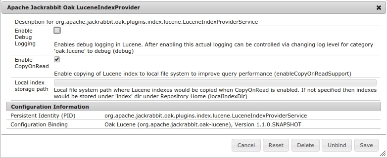
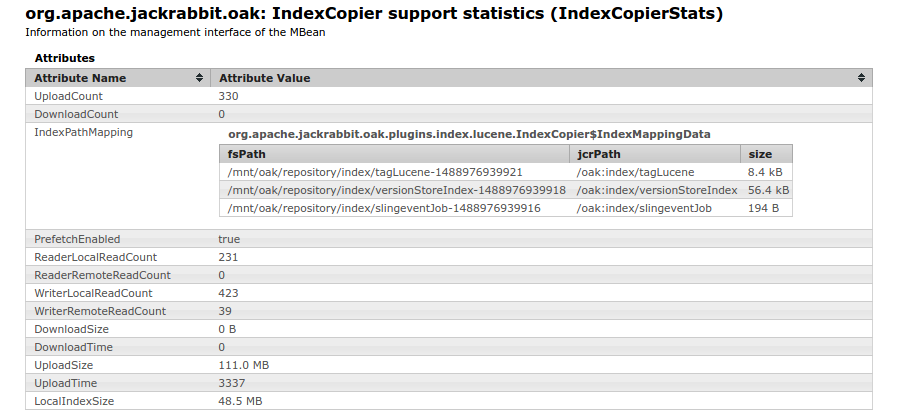
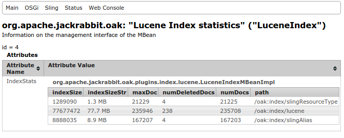

<!--
   Licensed to the Apache Software Foundation (ASF) under one or more
   contributor license agreements.  See the NOTICE file distributed with
   this work for additional information regarding copyright ownership.
   The ASF licenses this file to You under the Apache License, Version 2.0
   (the "License"); you may not use this file except in compliance with
   the License.  You may obtain a copy of the License at

       http://www.apache.org/licenses/LICENSE-2.0

   Unless required by applicable law or agreed to in writing, software
   distributed under the License is distributed on an "AS IS" BASIS,
   WITHOUT WARRANTIES OR CONDITIONS OF ANY KIND, either express or implied.
   See the License for the specific language governing permissions and
   limitations under the License.
  -->

## Lucene Index

* [New in 1.6](#new-1.6)
* [Index Definition](#index-definition)
    * [Indexing Rules](#indexing-rules)
        * [Cost Overrides](#cost-overrides)
        * [Indexing Rule inheritance](#indexing-rule-inheritence)
        * [Property Definitions](#property-definitions)
        * [Evaluate Path Restrictions](#path-restrictions)
        * [Include and Exclude paths from indexing](#include-exclude)
    * [Aggregation](#aggregation)
    * [Analyzers](#analyzers)
        * [Specify analyzer class directly](#analyzer-classes)
        * [Create analyzer via composition](#analyzer-composition)
    * [Codec](#codec)
    * [Boost and Search Relevancy](#boost)
    * [Effective Index Definition](#stored-index-definition)
    * [Generating Index Definition](#generate-index-definition)
* [Near Real Time Indexing](#nrt-indexing)
* [LuceneIndexProvider Configuration](#osgi-config)
* [Tika Config](#tika-config)
    * [Mime type usage](#mime-type-usage)
    * [Mime type mapping](#mime-type-mapping)
* [Non Root Index Definitions](#non-root-index)
* [Native Query and Index Selection](#native-query)
* [CopyOnRead](#copy-on-read)
* [CopyOnWrite](#copy-on-write)
* [Lucene Index MBeans](#mbeans)
* [Active Index Files Collection](#active-blob-collection)
* [Analyzing created Lucene Index](#luke)
* [Pre-Extracting Text from Binaries](#text-extraction)
* [Advanced search features](#advanced-search-features)
    * [Suggestions](#suggestions)
    * [Spellchecking](#spellchecking)
    * [Facets](#facets)
    * [Score Explanation](#score-explanation)
    * [Custom hooks](#custom-hooks)
* [Design Considerations](#design-considerations)
* [Lucene Index vs Property Index](#lucene-vs-property)
* [Examples](#examples)
    * [A - Simple queries](#simple-queries)
    * [B - Queries for structured content](#queries-structured-content)
        * [UC1 - Find all assets which are having `status` as `published`](#uc1)
        * [UC2 - Find all assets which are having `status` as `published` sorted by last modified date](#uc2)
        * [UC3 - Find all assets where comment contains _december_](#uc3)
        * [UC4 - Find all assets which are created by David and refer to december](#uc4)

Oak supports Lucene based indexes to support both property constraint and full
text constraints. Depending on the configuration a Lucene index can be used
to evaluate property constraints, full text constraints, path restrictions
and sorting.

    SELECT * FROM [nt:base] WHERE [assetType] = 'image'

Following index definition would allow using Lucene index for above query

```
/oak:index/assetType
  - jcr:primaryType = "oak:QueryIndexDefinition"
  - compatVersion = 2
  - type = "lucene"
  - async = "async"
  + indexRules
    - jcr:primaryType = "nt:unstructured"
    + nt:base
      + properties
        - jcr:primaryType = "nt:unstructured"
        + assetType
          - propertyIndex = true
          - name = "assetType"
```

The index definition node for a lucene-based index

* must be of type `oak:QueryIndexDefinition`
* must have the `type` property set to __`lucene`__
* must contain the `async` property set to the value `async`, this is what
  sends the index update process to a background thread

_Note that compared to [Property Index](query.html#property-index) Lucene
Property Index is always configured in Async mode hence it might lag behind
in reflecting the current repository state while performing the query_

Taking another example. To support following query

    //*[jcr:contains(., 'text')]

The Lucene index needs to be configured to index all properties

    /oak:index/assetType
      - jcr:primaryType = "oak:QueryIndexDefinition"
      - compatVersion = 2
      - type = "lucene"
      - async = "async"
      + indexRules
        - jcr:primaryType = "nt:unstructured"
        + nt:base
          + properties
            - jcr:primaryType = "nt:unstructured"
            + allProps
              - name = ".*"
              - isRegexp = true
              - nodeScopeIndex = true

### <a name="new-1.6"></a> New in 1.6

Following are the new features in 1.6 release

* [Near Real Time Indexing](#nrt-indexing)
* [Effective Index Definition](#stored-index-definition)

### <a name="index-definition"></a> Index Definition

Lucene index definition consist of `indexingRules`, `analyzers` ,
`aggregates` etc which determine which node and properties are to be indexed
and how they are indexed.

Below is the canonical index definition structure

    luceneIndex (oak:QueryIndexDefinition)
      - type (string) = 'lucene' mandatory
      - async (string) = 'async' mandatory
      - blobSize (long) = 32768
      - maxFieldLength (long) = 10000
      - evaluatePathRestrictions (boolean) = false
      - name (string)
      - compatVersion (long) = 2
      - includedPaths (string) multiple
      - excludedPaths (string) multiple
      - queryPaths (string) multiple = ['/']
      - indexPath (string)
      - codec (string)
      - refresh (boolean)
      + indexRules (nt:unstructured)
      + aggregates (nt:unstructured)
      + analyzers (nt:unstructured)
      + tika (nt:unstructured)

Following are the config options which can be defined at the index definition
level

type
: Required and should always be `lucene`

async
: Required and should always be `async`

[blobSize][OAK-2201]
: Default value 32768 (32kb)
: Size in bytes used for splitting the index files when storing them in NodeStore

functionName
: Name to be used to enable index usage with [native query support](#native-query)

evaluatePathRestrictions
: Optional boolean property defaults to `false`
: If enabled the index can evaluate [path restrictions](#path-restrictions)

includedPaths
: Optional multi value property. Defaults to '/'
: List of paths which should be [included](#include-exclude) in indexing. 

excludedPaths
: Optional multi value property. Defaults to empty
: List of paths which should be [excluded](#include-exclude) from indexing. 

queryPaths
: Optional multi value property. Defaults to '/'
: List of paths for which the index can be used to perform queries. Refer to
[Path Includes/Excludes](#include-exclude) for more details

indexPath
: Optional string property to specify [index path](#copy-on-write)
: Path of the index definition in the repository. For e.g. if the index
  definition is specified at `/oak:index/lucene` then set this path in `indexPath` 

codec
: Optional string property
: Name of the [Lucene codec](#codec) to use

name
: Optional property
: Captures the name of the index which is used while logging

compatVersion
: Required integer property and should be set to 2
: By default Oak uses older Lucene index implementation which does not
  supports property restrictions, index time aggregation etc. 
  To make use of this feature set it to 2.
  Please note for full text indexing with compatVersion 2, 
  at query time, only the access right of the parent (aggregate) node is checked, 
  and the access right of the child nodes is not checked.
  If this is a security concern, then compatVersion should not be set,
  so that query time aggregation is used, in which case the access right
  of the relevant child is also checked.
  A compatVersion 2 full text index is usually faster to run queries.

[maxFieldLength][OAK-2469]
: Numbers of terms indexed per field. Defaults to 10000

refresh
: Optional boolean property
: Used to refresh the stored index definition. See [Effective Index Definition](#stored-index-definition)

#### <a name="indexing-rules"></a> Indexing Rules

Indexing rules defines which types of node and properties are indexed. An
index configuration can define one or more `indexingRules` for different
nodeTypes.

    fulltextIndex
      - jcr:primaryType = "oak:QueryIndexDefinition"
      - compatVersion = 2
      - type = "lucene"
      - async = "async"
      + indexRules
        - jcr:primaryType = "nt:unstructured"
        + app:Page
          + properties
            - jcr:primaryType = "nt:unstructured"
            + publishedDate
              - propertyIndex = true
              - name = "jcr:content/publishedDate"
        + app:Asset
          + properties
            - jcr:primaryType = "nt:unstructured"
            + imageType
              - propertyIndex = true
              - name = "jcr:content/metadata/imageType"

Rules are defined per nodeType and each rule has one or more property
definitions determine which properties are indexed. Below is the canonical index
definition structure

    ruleName (nt:unstructured)
      - inherited (boolean) = true
      - indexNodeName (boolean) = false
      - includePropertyTypes (string) multiple
      + properties (nt:unstructured)

Following are the config options which can be defined at the index rule
level

inherited
: Optional boolean property defaults to true
: Determines if the rule is applicable on exact match or can be applied if
  match is done on basis of nodeType inheritance

includePropertyTypes
: Applicable when index is enabled for fulltext indexing
: For full text index defaults to include all types
: String array of property types which should be indexed. The values can be one
  specified in [PropertyType Names][1]
  
<a name="index-node-name"></a>  
indexNodeName
: `@since Oak 1.0.20, 1.2.5`
: Default to false. If set to true then index would also be created for node name.
  This would enable faster evaluation of queries involving constraints on Node 
  name. For example
    * _select [jcr:path] from [nt:base] where NAME() = 'kite'_
    * _select [jcr:path] from [nt:base] where NAME() LIKE 'kite%'_
    * //kite
    * //*[jcr:like(fn:name(), 'kite%')]
    * //element(*, app:Asset)[fn:name() = 'kite'] 
    * //element(kite, app:Asset)

##### <a name="cost-overrides"></a> Cost Overrides

By default, the cost of using this index is calculated follows: For each query,
the overhead is one operation. For each entry in the index, the cost is one.
The following only applies to `compatVersion` 2 only:
To use use a lower or higher cost, you can set the following optional properties
in the index definition:

    - costPerExecution (Double) = 1.0
    - costPerEntry (Double) = 1.0

Please note that typically, those settings don't need to be explicitly set.
Cost per execution is the overhead of one query. 
Cost per entry is the cost per node in the index. 
Using 0.5 means the cost is half, which means the index would be used used more often 
(that is, even if there is a different index with similar cost).

##### <a name="indexing-rule-inheritence"></a>Indexing Rule inheritance

`indexRules` are defined per nodeType and support nodeType inheritance. For
example while indexing any node the indexer would lookup for applicable
indexRule for that node based on its _primaryType_. If a direct match is
found then that rule would be used otherwise it would look for rule for any
of the parent types. The rules are looked up in the order of there entry
under `indexRules` node (indexRule node itself is of type `nt:unstructured`
which has `orderable` child nodes)

If `inherited` is set to false on any rule then that rule would only be
applicable if exact match is found

##### <a name="property-definitions"></a>Property Definitions

Each index rule consist of one ore more property definition defined under
`properties`. Order of property definition node is important as some properties
are based on regular expressions. Below is the canonical property definition
structure

    propNode (nt:unstructured)
      - name (string)
      - boost (double) = '1.0'
      - index (boolean) = true
      - useInExcerpt (boolean) = false
      - analyzed (boolean) = false
      - nodeScopeIndex (boolean) = false
      - ordered (boolean) = false
      - isRegexp (boolean) = false
      - type (string) = 'undefined'
      - propertyIndex (boolean) = false
      - notNullCheckEnabled (boolean) = false
      - nullCheckEnabled (boolean) = false
      - excludeFromAggregation (boolean) = false
      - weight (long) = -1

Following are the details about the above mentioned config options which can be
defined at the property definition level

name
: Property name. If not defined then property name is set to the node name.
  If `isRegexp` is true then it defines the regular expression. Can also be set
  to a relative property.

isRegexp
: If set to true then property name would be interpreted as a regular
  expression and the given definition would be applicable for matching property
  names. Note that expression should be structured such that it does not
  match '/'.
    * `.*` - This property definition is applicable for all properties of given
      node
    * `jcr:content/metadata/.*` - This property definition is
      applicable for all properties of child node _jcr:content/metadata_

boost
: If the property is included in `nodeScopeIndex` then it defines the boost
  done for the index value against the given property name. See 
  [Boost and Search Relevancy](#boost) for more details

index
: Determines if this property should be indexed. Mostly useful for fulltext
  index where some properties need to be _excluded_ from getting indexed.

useInExcerpt
: Controls whether the value of a property should be used to create an excerpt.
  The value of the property is still full-text indexed when set to false, but it
  will never show up in an excerpt for its parent node. If set to true then
  property value would be stored separately within index causing the index
  size to increase. So set it to true only if you make use of excerpt feature

nodeScopeIndex
: Control whether the value of a property should be part of fulltext index. That
  is, you can do a _jcr:contains(., 'foo')_ and it will return nodes that have a
  string property that contains the word foo. Example
    * _//element(*, app:Asset)[jcr:contains(., 'image')]_

  In case of aggregation all properties would be indexed at node level by default
  if the property type is part of `includePropertyTypes`. However if there is an
  explicit property definition provided then it would only be included if
  `nodeScopeIndex` is set to true.
  
analyzed
: Set this to true if the property is used as part of `contains`. Example
    * _//element(*, app:Asset)[jcr:contains(type, 'image')]_
    * _//element(*, app:Asset)[jcr:contains(jcr:content/metadata/@format, 'image')]_

<a name="ordered"></a>
ordered
: If the property is to be used in _order by_ clause to perform sorting then
  this should be set to true. This should be set to true only if the property
  is to be used to perform sorting as it increases the index size. Example
    * _//element(*, app:Asset)[jcr:contains(type, 'image')] order by @size_
    * _//element(*, app:Asset)[jcr:contains(type, 'image')] order by
    jcr:content/@jcr:lastModified_

  Refer to [Lucene based Sorting][OAK-2196] for more details. Note that this is 
  only supported for single value property. Enabling this on multi value property
  would cause indexing to fail.

type
: JCR Property type. Can be one of `Date`, `Boolean`, `Double` , `String` or `Long`. Mostly
  inferred from the indexed value. However in some cases where same property
  type is not used consistently across various nodes then it would recommended
   to specify the type explicitly.
   
propertyIndex
: Whether the index for this property is used for equality conditions, ordering, 
  and is not null conditions.

notNullCheckEnabled
: Since 1.1.8
: If the property is checked for _is not null_ then this should be set to true. 
  To reduce the index size, 
  this should only be enabled for nodeTypes that are not generic.
    * _//element(*, app:Asset)[jcr:content/@excludeFromSearch]

  For details, see [IS NOT NULL support][OAK-2234].
  
nullCheckEnabled
: Since 1.0.12
: If the property is checked for _is null_ then this should be set to true. This
  should only be enabled for nodeTypes that are not generic as it leads to index
  entry for all nodes of that type where this property is not set.
    * _//element(*, app:Asset)[not(jcr:content/@excludeFromSearch)]

  It would be better to use a query which checks for property existence or property
  being set to specific values as such queries can make use of index without any
  extra storage cost.

  For details, see [IS NULL support][OAK-2517].
  
excludeFromAggregation
: Since 1.0.27, 1.2.11
: if set to true the property would be excluded from aggregation [OAK-3981][OAK-3981]

<a name="weight"></a>
weight
: Since 1.6.3
: At times, we have property definitions which are added to support for dense results right out of 
  the index (e.g. `contains(*, 'foo') AND [bar]='baz'`). In such cases, the added property definition "might" 
  not be the best one to answer queries which only have the property restriction (eg only `[bar]='baz'`). This 
  can happen when that index specifies some exclude paths and hence does not index all `bar` properties.
  
  For such cases set `weight` to `0` for such properties. In such a case IndexPlanner would not use those property
  definitions to determine if that index can answer the query but it would still use them if some other index entry
  causes that index to be selected for evaluating such a query.
  
  Refer [OAK-5899][OAK-5899] for more details

<a name="property-names"></a>**Property Names**

Property name can be one of following

1. Simple name - Like _assetType_ etc. These are used for properties which are
   defined directly on the indexed node
2. Relative name - Like _jcr:content/metadata/title_. These are used for
   properties which are defined relative to the node being indexed.
3. Regular Expression - Like _.*_. Used when only property whose name
   match given pattern are to be indexed.
   They can also be used for relative properties like
   _jcr:content/metadata/dc:.*$_
   which indexes all property names starting with _dc_ from node with
   relative path _jcr:content/metadata_
4. The string `:nodeName` - this special case indexes node name as if it's a
   virtual property of the node being indexed. Setting this along with
   `nodeScopeIndex=true` is akin to setting `indexNodeName=true` on indexing
   rule. (`@since Oak 1.3.15, 1.2.14`)

##### <a name="path-restrictions"></a> Evaluate Path Restrictions

Lucene index provides support for evaluating path restrictions natively.
Consider a query like

    select * from [app:Asset] as a where isdescendantnode(a, [/content/app/old]) AND contains(*, 'white')

By default the index would return all node which _contain white_ and Query
engine would filter out nodes which are not under _/content/app/old_. This
can perform slow if lots of nodes are not under that path. To speed up such
queries one can enable `evaluatePathRestrictions` in Lucene index and index
would only return nodes which are under _/content/app/old_.

Enabling this feature would incur cost in terms of slight increase in index
size. Refer to [OAK-2306][OAK-2306] for more details.

##### <a name="include-exclude"></a> Include and Exclude paths from indexing

`@since Oak 1.0.14, 1.2.3`

By default the indexer would index all the nodes under the subtree where the 
index  definition is defined as per the indexingRule. In some cases its required
to index nodes under certain path. For e.g. if index is defined for global
fulltext index which include the complete repository you might want to exclude
certain path which contains transient system data. 

For example if you application stores certain logs under `/var/log` and it is 
not supposed to be indexed as part of fulltext index then it can be excluded

    /oak:index/assetType
      - jcr:primaryType = "oak:QueryIndexDefinition"
      - compatVersion = 2
      - type = "lucene"
      - excludedPaths = ["/var/log"]
      
Above index definition would cause nodes under `/var/log` not to be indexed.
In majority of case `excludedPaths` only makes sense. However in some cases
it might be required to also specify explicit set of path which should be 
indexed. In that case make use of `includedPaths`

Note that `excludedPaths` and `includedPaths` *does not* affect the index
selection logic for a query i.e. if a query has any path restriction specified
then that would not be checked against the `excludedPaths` and `includedPaths`.

<a name="query-paths"></a>
**queryPaths**

If you need to ensure that a given index only gets used for query with specific
path restrictions then you need to specify those paths in `queryPaths`. 

For example if `includedPaths` and `queryPaths` are set to _[ "/content/a", "/content/b" ]_. 
The index would be used for queries below "/content/a" as well as for queries below 
"/content/b". But not for queries without path restriction, or for queries below 
"/content/c".

**Usage**

Key points to consider while using `excludedPaths`, `includedPaths` and `queryPaths`

1. Reduce what gets indexed in global fulltext index - For 
   setups where a global fulltext index is configured say at /oak:index/lucene which
   indexes everything then `excludedPaths` can be used to avoid indexing transient
   repository state like in '/var' or '/tmp'. This would help in improving indexing 
   rate. By far this is the primary usecase
   
2. Reduce reindexing time - If its known that certain type of data is stored under specific
   subtree only but the query is not specifying that path restriction then `includedPaths`
   can be used to reduce reindexing time for existing content by ensuring that indexing
   logic only traverses that path for building up the index
   
3. Use `excludedPaths`, `includedPaths` with caution - When paths are excluded or included
   then query engine is not aware of that. If wrong paths get excluded then its possible
   that nodes which should have been part of query result get excluded as they are not indexed.
   So only exclude those paths which do not have node matching given nodeType or nodes which
   are known to be not part of any query result

4. Sub-root index definitions (e.g. `/test/oak:index/index-def-node`) -
   `excludedPaths` and `includedPaths` need to be relative to the path that index is defined
    for. e.g. if the condition is supposed to be put for `/test/a` where the index definition
    is at `/test/oak:index/index-def-node` then `/a` needs to be put as value of `excludedPaths`
    or `includedPaths`. On the other hand, `queryPaths` remains to be an absolute path. So, for
    the example above, `queryPaths` would get the value `/test/a`.

In most cases use of `queryPaths` would not be required as index definition should not have
any overlap. 
    
Refer to [OAK-2599][OAK-2599] for more details.

#### <a name="aggregation"></a>Aggregation

Sometimes it is useful to include the contents of descendant nodes into a single
node to easier search on content that is scattered across multiple nodes.

Oak allows you to define index aggregates based on relative path patterns and
primary node types. Changes to aggregated items cause the main item to be
reindexed, even if it was not modified.

Aggregation configuration is defined under the `aggregates` node under index
configuration. The following example creates an index aggregate on nt:file that
includes the content of the jcr:content node:

    fulltextIndex
      - jcr:primaryType = "oak:QueryIndexDefinition"
      - compatVersion = 2
      - type = "lucene"
      - async = "async"
      + aggregates
        + nt:file
          + include0
            - path = "jcr:content"

By default all properties whose type matches `includePropertyTypes` and are 
part of child nodes as per the aggregation pattern are included for indexing.
For excluding certain properties define a property definition with relative
path and set `excludeFromAggregation` to `true`. Such properties would then be
excluded from fulltext index

For a given nodeType multiple includes can be defined. Below is the aggregate
definition structure for any specific include rule

    aggregateNodeInclude (nt:unstructured)
      - path (string) mandatory
      - primaryType (string)
      - relativeNode (boolean) = false

Following are the details about the above mentioned config options which can be
defined as part of aggregation include. (Refer to [OAK-2268][OAK-2268] for
implementation details)

path
: Path pattern to include. Example
    * `jcr:content` - Name explicitly specified
    * `*` - Any child node at depth 1
    * `*/*` - Any child node at depth 2

primaryType
: Restrict the included nodes to a certain type. The restriction would be
  applied on the last node in given path

        + aggregates
          + nt:file
            + include0
              - path = "jcr:content"
              - primaryType = "nt:resource"

relativeNode
: Boolean property indicates that query can be performed against specific node
  For example for following content

        + space.txt (app:Asset)
          + renditions (nt:folder)
            + original (nt:file)
              + jcr:content (nt:resource)
                - jcr:data

  And a query like

        select * from [app:Asset] where contains([renditions/original/*], "pluto")

  Following index configuration would be required

        fulltextIndex
          - jcr:primaryType = "oak:QueryIndexDefinition"
          - compatVersion = 2
          - type = "lucene"
          - async = "async"
          + aggregates
            + nt:file
              + include0
                - path = "jcr:content"
            + app:Asset
              + include0
                - path = "renditions/original"
                - relativeNode = true
          + indexRules
            - jcr:primaryType = "nt:unstructured"
            + app:Asset

**Aggregation and Recursion**

While performing aggregation the aggregation rules are again applied on node
being aggregated. For example while aggregating for _app:Asset_ above when
_renditions/original/*_ is being aggregated then aggregation rule would again
be applied. In this case as  _renditions/original_ is _nt:file_ then aggregation
rule applicable for _nt:file_ would be applied. Such a logic might result in
recursion. (See [JCR-2989][JCR-2989] for details).

For such case `reaggregateLimit` is set on aggregate definition node and
defaults to 5

      + aggregates
        + app:Asset
          - reaggregateLimit (long) = 5
          + include0
            - path = "renditions/original"
            - relativeNode = true

#### <a name="analyzers"></a>Analyzers

`@since Oak 1.5.5, 1.4.7`
Unless custom analyzer is configured (as documented below), in-built analyzer
can be configured to include original term as well to be indexed. This is
controlled by setting boolean property `indexOriginalTerm` on analyzers node.

    /oak:index/assetType
      - jcr:primaryType = "oak:QueryIndexDefinition"
      - compatVersion = 2
      - type = "lucene"
      + analyzers
        - indexOriginalTerm = true

(See [OAK-4516][OAK-4516] for details)

`@since Oak 1.2.0`

Analyzers can be configured as part of index definition via `analyzers` node.
The default analyzer can be configured via `analyzers/default` node

    + sampleIndex
        - jcr:primaryType = "oak:QueryIndexDefinition"
        + analyzers
            + default
            + pathText
            ...

##### <a name="analyzer-classes"></a>Specify analyzer class directly

If any of the out of the box analyzer is to be used then it can configured directly

    + analyzers
            + default
                - class = "org.apache.lucene.analysis.standard.StandardAnalyzer"
                - luceneMatchVersion = "LUCENE_47" (optional)

To confirm to specific version specify it via `luceneMatchVersion` otherwise Oak
would use a default version depending on version of Lucene it is shipped with.

One can also provide a stopword file via `stopwords` `nt:file` node under
the analyzer node

    + analyzers
            + default
                - class = "org.apache.lucene.analysis.standard.StandardAnalyzer"
                - luceneMatchVersion = "LUCENE_47" (optional)
                + stopwords (nt:file)

##### <a name="analyzer-composition"></a>Create analyzer via composition

Analyzers can also be composed based on `Tokenizers`, `TokenFilters` and
`CharFilters`. This is similar to the support provided in Solr where you can
[configure analyzers in xml][solr-analyzer]

    + analyzers
            + default
                + charFilters (nt:unstructured) //The filters needs to be ordered
                    + HTMLStrip
                    + Mapping
                + tokenizer
                    - name = "Standard"
                + filters (nt:unstructured) //The filters needs to be ordered
                    + LowerCase
                    + Stop
                        - words = "stop1.txt, stop2.txt"
                        + stop1.txt (nt:file)
                        + stop2.txt (nt:file)
                    + PorterStem
                    + Synonym
                        - synonyms = "synonym.txt"
                        + synonym.txt (nt:file)

Points to note

1. Name of filters, charFilters and tokenizer are formed by removing the
   factory suffixes. So
    * org.apache.lucene.analysis.standard.StandardTokenizerFactory -> `Standard`
    * org.apache.lucene.analysis.charfilter.MappingCharFilterFactory -> `Mapping`
    * org.apache.lucene.analysis.core.StopFilterFactory -> `Stop`
2. Any config parameter required for the factory is specified as property of
   that node
    * If the factory requires to load a file e.g. stop words from some file then
      file content can be provided via creating child `nt:file` node of the
      filename
    * The property value MUST be of type `String`. No other JCR type should be used
      for them like array or integer etc
3. The analyzer-chain processes text from nodes as well text passed in query. So,
   do take care that any mapping configuration (e.g. synonym mappings) factor in
   the chain of analyzers.
   E.g a common mistake for synonym mapping would be to have `domain => Range` while
   there's a lower case filter configured as well (see the example above). For such
   a setup an indexed value `domain` would actually get indexed as `Range` (mapped
   value doesn't have lower case filter below it) but a query for `Range` would actually
   query for `range` (due to lower case filter) and won't give the result (as might be
   expected). An easy work-around for this example could be to have lower case mappings
   i.e. just use `domain => range`.
4. Precedence: Specifying analyzer class directly has precedence over analyzer configuration
   by composition. If you want to configure analyzers by composition then analyzer class
   MUST NOT not be specified. In-build analyzer has least precedence and comes into play only
   if no custom analyzer has been configured. Similarly, setting `indexOriginalTerm` on
   analyzers node to modify behavior of in-built analyzer also works only when no custom
   analyzer has been configured.
5. To determine list of supported factories have a look at Lucene javadocs for 
    * [TokenizerFactory](https://lucene.apache.org/core/4_7_1/analyzers-common/org/apache/lucene/analysis/util/TokenizerFactory.html)
    * [CharFilterFactory](https://lucene.apache.org/core/4_7_1/analyzers-common/org/apache/lucene/analysis/util/CharFilterFactory.html)
    * [FilterFactory](https://lucene.apache.org/core/4_7_1/analyzers-common/org/apache/lucene/analysis/util/TokenFilterFactory.html)
6. Oak support for composing analyzer is based on Lucene. So some helpful docs around this
    * https://cwiki.apache.org/confluence/display/solr/Understanding+Analyzers%2C+Tokenizers%2C+and+Filters
    * https://cwiki.apache.org/confluence/display/solr/CharFilterFactories
    * https://wiki.apache.org/solr/AnalyzersTokenizersTokenFilters#Specifying_an_Analyzer_in_the_schema
7. When defining synonyms:
    * in the synonym file, lines like _plane, airplane, aircraft_ refer to tokens that are mutual synoyms whereas lines 
    like _plane => airplane_ refer to _one way_ synonyms, so that plane will be expanded to airplane but not vice versa
    * special characters have to be escaped
    * multi word synonyms need particular attention (see https://lucidworks.com/2014/07/12/solution-for-multi-term-synonyms-in-lucenesolr-using-the-auto-phrasing-tokenfilter)
    
Note that currently only one analyzer can be configured per index. Its not possible to specify separate
analyzer for query and index time currently. 

#### <a name="codec"></a>Codec

Name of [Lucene Codec][lucene-codec] to use. By default if the index involves 
fulltext indexing then Oak Lucene uses `OakCodec` which disables compression.
Due to this the index size may grow large. To enable compression you can set
the codec to `Lucene46`

    /oak:index/assetType
      - jcr:primaryType = "oak:QueryIndexDefinition"
      - compatVersion = 2
      - type = "lucene"
      - codec = "Lucene46"
      
Refer to [OAK-2853][OAK-2853] for details. Enabling the `Lucene46` codec
would lead to smaller and compact indexes.

#### <a name="boost"></a>Boost and Search Relevancy

`@since Oak 1.2.5`

When fulltext indexing is enabled then internally Oak would create a fulltext
field which consists of text extracted from various other fields i.e. fields 
for which `nodeScopeIndex` is `true`. This allows search like 
`//*[jcr:contains(., 'foo')]` to perform search across any indexable field 
containing foo (See [contains function][jcr-contains] for details)

In certain cases its desirable that those nodes where the searched term is present
in a specific property are ranked higher (come earlier in search result) compared
to those node where the searched term is found in some other property.

In such cases it should be possible to boost specific text contributed by 
individual property. Meaning that if a title field is boosted more than description, 
then search result would those node coming earlier where searched term is found
in title field

For that to work ensure that for each such property (which need to be preferred)
both `nodeScopeIndex` and `analyzed` are set to true. In addition you can specify 
`boost` property so give higher weightage to values found in specific property

Note that even without setting explicit `boost` and just setting `nodeScopeIndex` 
and `analyzed` to true would improve the search result due to the way 
[Lucene does scoring][boost-faq]. Internally Oak would create separate Lucene 
fields for those jcr properties and would perform a search across all such fields. 
For more details refer to [OAK-3367][OAK-3367]

```
  + indexRules
    - jcr:primaryType = "nt:unstructured"
    + app:Asset
      + properties
        - jcr:primaryType = "nt:unstructured"
        + description
          - nodeScopeIndex = true
          - analyzed = true
          - name = "jcr:content/metadata/jcr:description"
        + title
          - analyzed = true
          - nodeScopeIndex = true
          - name = "jcr:content/metadata/jcr:title"
          - boost = 2.0
```

With above index config a search like

```
SELECT
  *
FROM [app:Asset] 
WHERE 
  CONTAINS(., 'Batman')
```

Would have those node (of type app:Asset) come first where _Batman_ is found in
_jcr:title_. While those nodes where search text is found in other field
like aggregated content would come later

#### <a name="stored-index-definition"></a>Effective Index Definition 

`@since Oak 1.6`

Prior to Oak 1.6 index definition as defined in content was directly used for query
execution and indexing. It was possible that index definition is modified in incompatible
way and that would start affecting the query execution leading to inconsistent result.

Since Oak 1.6 the index definitions are cloned upon reindexing and stored in a hidden structure.
For further incremental indexing and for query plan calculation the stored index definition is used.
So any changes done post reindex to index definition would not be applicable untill a reindex is done.

There would be some cases where changes in index definition does not require a reindex. For e.g. if a new property
is being introduced in content model and no prior content exist with such a property then its safe to index such
a property without doing a reindex. For such cases user must follow below steps

1. Make the required changes
2. Set `refresh` property to `true` in index definition node
3. Save the changes

On next async indexing cycle this flag would be pickedup and stored index definition would be refreshed. 
_Post this the flag would be automatically removed and a log message would be logged_. You would also see a 
log message like below

```
LuceneIndexEditorContext - Refreshed the index definition for [/oak:index/fooLuceneIndex] 
```

To simplify troubleshooting the stored index definition can be accessed from `LuceneIndexMBean` via 
`getStoredIndexDefinition` operation. It would dump the string representation of stored NodeState


This feature can be disabled by setting OSGi property `disableStoredIndexDefinition` for `LuceneIndexProviderService`
to true. Once disable any change in index definition would start effecting the query plans

Refer to [OAK-4400][OAK-4400] for more details.

#### <a name="generate-index-definition"></a> Generating Index Definition 

To simplify generating index definition suitable for evaluating certain set of queries you can make use of 
http://oakutils.appspot.com/generate/index. Here you can provide a set of queries and then it would generate the
suitable index definitions for those queries.

Note that you would still need to tweak the definition for aggregation, path include exclude etc as that data cannot
be inferred from the query

### <a name="nrt-indexing"></a> Near Real Time Indexing

`@since Oak 1.6`

Refer to [Near realtime indexing](indexing.html#nrt-indexing) for more details

### <a name="osgi-config"></a>LuceneIndexProvider Configuration

Some of the runtime aspects of the Oak Lucene support can be configured via OSGi
configuration. The configuration needs to be done for PID `org.apache
.jackrabbit.oak.plugins.index.lucene.LuceneIndexProviderService`



enableCopyOnReadSupport
: Enable copying of Lucene index to local file system to improve query 
performance. See [Copy Indexes On Read](#copy-on-read)

enableCopyOnWriteSupport
: Enable copying of Lucene index to local file system to improve indexing 
performance. See [Copy Indexes On Write](#copy-on-write)

localIndexDir
: Directory to be used for when copy index files to local file system. To be 
specified when `enableCopyOnReadSupport` is enabled

prefetchIndexFiles
: Prefetch the index files when CopyOnRead is enabled. When enabled all new Lucene 
index files would be copied locally before the index is made available to 
QueryEngine (1.0.17,1.2.3)

debug
: Boolean value. Defaults to `false`
: If enabled then Lucene logging would be integrated with Slf4j

### <a name="tika-config"></a>Tika Config

`@since Oak 1.0.12, 1.2.3`

Oak Lucene uses [Apache Tika][tika] to extract the text from binary content

    + tika
        - maxExtractLength (long) = -10
        + config.xml  (nt:file)
          + jcr:content
            - jcr:data = //config xml binary content

Oak uses a [default config][default-config]. To use a custom config specify
the config file via `tika/config.xml` node in index config. 

[maxExtractLength][OAK-2470]
: Limits the number of characters that are extracted by the Tika parse. A negative
  value indicates a multiple of `maxFieldLength` and a positive value is used as is
    * maxExtractLength = -10, maxFieldLength = 10000 -> Actual value = 100000
    * maxExtractLength = 1000 -> Actual value = 1000

#### <a name="mime-type-usage"></a>Mime type usage

A binary would only be index if there is an associated property `jcr:mimeType` defined
and that is supported by Tika. By default indexer uses [TypeDetector][OAK-2895]
instead of default `DefaultDetector` which relies on the `jcr:mimeType` to pick up the
right parser. 

#### <a name="mime-type-mapping"></a>Mime type mapping

`@since Oak 1.7.7`

In certain circumstances, it may be desired to pass a value other than the `jcr:mimeType` property
into the Tika parser. For example, this would be necessary if a binary has an application-specific 
mime type, but is parsable by the standard Tika parser for some generic type. To support these cases,
create a node structure under the `tika/mimeTypes` node following the mime type structure, e.g.

    + tika
        + mimeTypes (nt:unstructured)
          + application (nt:unstructured)
            + vnd.mycompany-document (nt:unstructured)
              - mappedType = application/pdf

When this index is indexing a binary of type `application/vnd.mycompany-document` it will force Tika
to treat it as a binary of type `application/pdf`.

### <a name="non-root-index"></a>Non Root Index Definitions

Lucene index definition can be defined at any location in repository and need
not always be defined at root. For example if your query involves path 
restrictions like

    select * from [app:Asset] as a where ISDESCENDANTNODE(a, '/content/companya') and [format] = 'image'
    
Then you can create the required index definition say `assetIndex` at 
`/content/companya/oak:index/assetIndex`. In such a case that index would 
contain data for the subtree under `/content/companya`

### <a name="native-query"></a>Native Query and Index Selection

Oak query engine supports native queries like

    //*[rep:native('lucene', 'name:(Hello OR World)')]

If multiple Lucene based indexes are enabled on the system and you need to 
make use of specific Lucene index like `/oak:index/assetIndex` then you can 
specify the index name via `functionName` attribute on index definition. 

For example for assetIndex definition like 

    - jcr:primaryType = "oak:QueryIndexDefinition"
    - type = "lucene"
    ...
    - functionName = "lucene-assetIndex"

Executing following query would ensure that Lucene index from `assetIndex` 
should be used

    //*[rep:native('lucene-assetIndex', 'name:(Hello OR World)')]

### <a name="native-query"></a>Persisting indexes to FileSystem

By default Lucene indexes are stored in the `NodeStore`. If required they can
be stored on the file system directly

    - jcr:primaryType = "oak:QueryIndexDefinition"
    - type = "lucene"
    ...
    - persistence = "file"
    - path = "/path/to/store/index"

To store the Lucene index in the file system, in the Lucene index definition
node, set the property `persistence` to `file`, and set the property `path` 
to the directory where the index should be stored. Then start reindexing by 
setting `reindex` to `true`.

Note that this setup would only for those non cluster `NodeStore`. If the 
backend `NodeStore` supports clustering then index data would not be 
accessible on other cluster nodes


### <a name="copy-on-read"></a>CopyOnRead

Lucene indexes are stored in `NodeStore`. Oak Lucene provides a custom directory
implementation which enables Lucene to load index from `NodeStore`. This 
might cause performance degradation if the `NodeStore` storage is remote. For
such case Oak Lucene provide a `CopyOnReadDirectory` which copies the index 
content to a local directory and enables Lucene to make use of local 
directory based indexes while performing queries.

At runtime various details related to copy on read features are exposed via
`CopyOnReadStats` MBean. Indexes at JCR path e.g. `/oak:index/assetIndex` 
would be copied to `<index dir>/<hash of jcr path>`. To determine mapping 
between local index directory and JCR path refer to the MBean details


  
For more details refer to [OAK-1724][OAK-1724]. This feature can be enabled via
[Lucene Index provider service configuration](#osgi-config)

_With Oak 1.0.13 this feature is now enabled by default._

### <a name="copy-on-write"></a>CopyOnWrite

`@since Oak 1.0.15, 1.2.3`

Similar to _CopyOnRead_ feature Oak Lucene also supports _CopyOnWrite_ to enable
faster indexing by first buffering the writes to local filesystem and transferring
them to remote storage asynchronously as the indexing proceeds. This should
provide better performance and hence faster indexing times.

**indexPath**

_Not required from Oak 1.6 , 1.4.7+_ 

To speed up the indexing with CopyOnWrite you would also need to set `indexPath`
in index definition to the path of index in the repository. For e.g. if your
index is defined at `/oak:index/lucene` then value of `indexPath` should be set 
to `/oak:index/lucene`. This would enable the indexer to perform any read 
during the indexing process locally and thus avoid costly read from remote.

For more details refer to [OAK-2247][OAK-2247]. This feature can be enabled via
[Lucene Index provider service configuration](#osgi-config)

### <a name="mbeans"></a>Lucene Index MBeans

Oak Lucene registers a JMX bean `LuceneIndex` which provide details about the 
index content e.g. size of index, number of documents present in index etc



### <a name="active-blob-collection"></a>Active Index Files Collection

`@since Oak 1.7.1`

Lucene indexing for moderately active repository creates a lot of deleted files.
This creates excessive load for usual mark-sweep garbage collection. Since, blobs
related to indexed data are explicitly made unique, it's safe to delete them as
soon as index node referring that blob is deleted.

Such active deletion of index blobs was implemented in [OAK-2808][OAK-2808]. The
feature periodically deletes blobs which are deleted from the index. This 'period'
can be controlled by `deletedBlobsCollectionInterval` property in
[Lucene Index provider service configuration](#osgi-config).

The feature would only delete blobs which have been deleted before a certain time.
This is 24 hours by default and can be controlled by defining `oak.active.deletion.minAge`
as number of hours to not purge a blob after it's deleted from the repository.

### <a name="luke"></a>Analyzing created Lucene Index

[Luke]  is a handy development and diagnostic tool, which accesses already 
existing Lucene indexes and allows you to display index details. In Oak 
Lucene index files are stored in `NodeStore` and hence not directly 
accessible. To enable analyzing the index files via Luke follow below 
mentioned steps

1. Download the Luke version which includes the matching Lucene jars used by 
   Oak. As of Oak 1.0.8 release the Lucene version used is 4.7.1. So download
    the jar from [here](https://github.com/DmitryKey/luke/releases)
     
        $wget https://github.com/DmitryKey/luke/releases/download/4.7.0/luke-with-deps.jar
        
2. Use the [Oak Console][oak-console] to dump the Lucene index from `NodeStore`
   to filesystem directory. Use the `lc dump` command
   
        $ java -jar oak-run-*.jar console /path/to/oak/repository
        Apache Jackrabbit Oak 1.1-SNAPSHOT
        Jackrabbit Oak Shell (Apache Jackrabbit Oak 1.1-SNAPSHOT, JVM: 1.7.0_55)
        Type ':help' or ':h' for help.
        -------------------------------------------------------------------------
        /> lc info /oak:index/lucene
        Index size : 74.1 MB
        Number of documents : 235708
        Number of deleted documents : 231
        /> lc 
        dump   info   
        /> lc dump /path/to/dump/index/lucene /oak:index/lucene
        Copying Lucene indexes to [/path/to/dump/index/lucene]
        Copied 74.1 MB in 1.209 s
        /> lc dump /path/to/dump/index/slingAlias /oak:index/slingAlias
        Copying Lucene indexes to [/path/to/dump/index/lucene-index/slingAlias]
        Copied 8.5 MB in 218.7 ms
        />
       
3. Post dump open the index via Luke. Oak Lucene uses a [custom 
   Codec][OAK-1737]. So oak-lucene jar needs to be included in Luke classpath
   for it to display the index details

        $ java -XX:MaxPermSize=512m -cp luke-with-deps.jar:oak-lucene-1.0.8.jar org.getopt.luke.Luke
        
From the Luke UI shown you can access various details.

### <a name="text-extraction"></a>Pre-Extracting Text from Binaries

Refer to [pre-extraction via oak-run](pre-extract-text.html).

### <a name="advanced-search-features"></a>Advanced search features

#### <a name="suggestions"></a>Suggestions

`@since Oak 1.1.17, 1.0.15`

In order to use Lucene index to perform search suggestions, the index definition 
node (the one of type `oak:QueryIndexDefinition`) needs to have the `compatVersion` 
set to `2`, then one or more property nodes, depending on use case, need to have 
the property `useInSuggest` set to `true`, such setting controls from which 
properties terms to be used for suggestions will be taken.
 
Once the above configuration has been done, by default, the Lucene suggester is 
updated every 10 minutes but that can be changed by setting the property 
`suggestUpdateFrequencyMinutes` in `suggestion` node under the index definition
node to a different value.
_Note that up till Oak 1.3.14/1.2.14, `suggestUpdateFrequencyMinutes` was to be setup at
index definition node itself. That is is still supported for backward compatibility,
but having a separate `suggestion` node is preferred._

Sample configuration for suggestions based on terms contained in `jcr:description` 
property.

```
/oak:index/lucene-suggest
  - jcr:primaryType = "oak:QueryIndexDefinition"
  - compatVersion = 2
  - type = "lucene"
  - async = "async"
  + suggestion
    - suggestUpdateFrequencyMinutes = 20
  + indexRules
    - jcr:primaryType = "nt:unstructured"
    + nt:base
      + properties
        - jcr:primaryType = "nt:unstructured"
        + jcr:description
          - propertyIndex = true
          - analyzed = true
          - useInSuggest = true
```

`@since Oak 1.3.12, 1.2.14` the index Analyzer can be used to perform a have more fine grained suggestions, e.g. single words 
(whereas default suggest configuration returns entire property values, see [OAK-3407]: https://issues.apache.org/jira/browse/OAK-3407).
Analyzed suggestions can be enabled by setting "suggestAnalyzed" property to true, e.g.:

```
/oak:index/lucene-suggest
  - jcr:primaryType = "oak:QueryIndexDefinition"
  - compatVersion = 2
  - type = "lucene"
  - async = "async"
  + suggestion
    - suggestUpdateFrequencyMinutes = 20
    - suggestAnalyzed = true
```
_Note that up till Oak 1.3.14/1.2.14, `suggestAnalyzed` was to be setup at index definition node itself. That is is still
supported for backward compatibility, but having a separate `suggestion` node is preferred._

Setting up `useInSuggest=true` for a property definition having `name=:nodeName` would add node names to
suggestion dictionary (See [property name](#property-names) for node name indexing)

Since, Oak 1.3.16/1.2.14, very little support exists for queries with `ISDESCENDANTNODE` constraint to subset suggestions
on a sub-tree.  It requires `evaluatePathRestrictions=true` on index definition. e.g.
```
SELECT rep:suggest() FROM [nt:base] WHERE SUGGEST('test') AND ISDESCENDANTNODE('/a/b')
```
or
```
/jcr:root/a/b//[rep:suggest('in 201')]/(rep:suggest())
```
Note, the subset is done by filtering top 10 suggestions. So, it's possible to get no suggestions for a subtree query,
if top 10 suggestions are not part of that subtree. For details look at [OAK-3994] and related issues.

#### <a name="spellchecking"></a>Spellchecking

`@since Oak 1.1.17, 1.0.13`

In order to use Lucene index to perform spellchecking, the index definition node 
(the one of type `oak:QueryIndexDefinition`) needs to have the `compatVersion` 
set to `2`, then one or more property nodes, depending on use case, need to have 
the property `useInSpellcheck` set to `true`, such setting controls from which 
properties terms to be used for spellcheck corrections will be taken.
 
Sample configuration for spellchecking based on terms contained in `jcr:title` 
property.

Since Oak 1.3.11/1.2.14, the each suggestion would be returned per row.

```
/oak:index/lucene-spellcheck
  - jcr:primaryType = "oak:QueryIndexDefinition"
  - compatVersion = 2
  - type = "lucene"
  - async = "async"
  + indexRules
    - jcr:primaryType = "nt:unstructured"
    + nt:base
      + properties
        - jcr:primaryType = "nt:unstructured"
        + jcr:title
          - propertyIndex = true
          - analyzed = true
          - useInSpellcheck = true
```

Since, Oak 1.3.16/1.2.14, very little support exists for queries with `ISDESCENDANTNODE` constraint to subset suggestions
on a sub-tree. It requires `evaluatePathRestrictions=true` on index definition. e.g.
```
SELECT rep:suggest() FROM [nt:base] WHERE SUGGEST('test') AND ISDESCENDANTNODE('/a/b')
```
or
```
/jcr:root/a/b//[rep:suggest('in 201')]/(rep:suggest())
```
Note, the subset is done by filtering top 10 spellchecks. So, it's possible to get no results for a subtree query,
if top 10 spellchecks are not part of that subtree. For details look at [OAK-3994] and related issues.

#### <a name="facets"></a>Facets

`@since Oak 1.3.14`

Lucene property indexes can also be used for retrieving facets, in order to do so the property _facets_ must be set to 
 _true_ on the property definition.

```
/oak:index/lucene-with-facets
  - jcr:primaryType = "oak:QueryIndexDefinition"
  - compatVersion = 2
  - type = "lucene"
  - async = "async"
  + indexRules
    - jcr:primaryType = "nt:unstructured"
    + nt:base
      + properties
        - jcr:primaryType = "nt:unstructured"
        + jcr:title
          - facets = true
          - propertyIndex = true
``` 

Specific facet related features for Lucene property index can be configured in a separate _facets_ node below the
 index definition.
 By default ACL checks are always performed on facets by the Lucene property index however this can be avoided by setting
 the property _secure_ to _false_ in the _facets_ configuration node.
`@since Oak 1.5.15` The no. of facets to be retrieved is configurable via the _topChildren_ property, which defaults to 10.

```
/oak:index/lucene-with-unsecure-facets
  - jcr:primaryType = "oak:QueryIndexDefinition"
  - compatVersion = 2
  - type = "lucene"
  - async = "async"
  + facets
    - topChildren = 100
    - secure = false
  + indexRules
    - jcr:primaryType = "nt:unstructured"
    + nt:base
      + properties
        - jcr:primaryType = "nt:unstructured"
        + jcr:title
          - facets = true
          - propertyIndex = true
```

#### <a name="score-explanation"></a>Score Explanation

`@since Oak 1.3.12`

Lucene supports [explanation of scores][score-explanation] which can be selected in a query using a virtual column `oak:scoreExplanation`.
e.g. `select [oak:scoreExplanation], * from [nt:base] where foo='bar'`

_Note that showing explanation score is expensive. So, this feature should be used for debug purposes only_.


#### <a name="custom-hooks"></a>Custom hooks

`@since Oak 1.3.14`

In OSGi enviroment, implementations of `IndexFieldProvider` and `FulltextQueryTermsProvider` under
`org.apache.jackrabbit.oak.plugins.index.lucene.spi` (see javadoc [here][oak-lucene]) are called during indexing
and querying as documented in javadocs.

### <a name="design-considerations"></a>Design Considerations

Lucene index provides quite a few features to meet various query requirements. 
While defining the index definition do consider the following aspects

1.  If query uses different path restrictions keeping other restrictions 
    same then make use of `evaluatePathRestrictions`
   
2.  If query performs sorting then have an explicit property definition for
    the property on which sorting is being performed and set `ordered` to true 
    for that property
   
3.  If the query is based on specific nodeType then define `indexRules` for that
    nodeType
   
4.  Aim for a precise index configuration which indexes just the right amount of content
    based on your query requirement. An index which is precise would be smaller and 
    would perform better.
   
5.  **Make use of nodetype to achieve a _cohesive_ index**. This would allow multiple
    queries to make use of same index and also evaluation of multiple property 
    restrictions natively in Lucene

6.  **[Non root indexes](#non-root-index)** - If your query always
    perform search under certain paths then create index definition under those
    paths only. This might be helpful in multi tenant deployment where each tenant
    data is stored under specific repository path and all queries are made under
    those path.   

    In fact its recommended to use single index if all the properties being indexed
    are related. This would enable Lucene index to evaluate as much property
    restriction as possible  natively (which is faster) and also save on storage
    cost incurred in storing the node path.
   
7.  Use features when required - There are certain features provided by Lucene
    index  which incur extra cost in terms of storage space when enabled. For
    example enabling `evaluatePathRestrictions`, `ordering` etc. Enable such
    option only when you make use of those features and further enable them for
    only those properties. So `ordering`  should be enabled only when sorting is
    being performed for those properties and `evaluatePathRestrictions` should
    only be enabled if you are going to specify path restrictions.
    
8. **Avoid overlapping index definition** - Do not have overlapping index definition 
    indexing same nodetype but having different `includedPaths` and `excludedPaths`.
    Index selection logic does not make use of the `includedPaths` and `excludedPaths` 
    for index selection. Index selection is done only on cost basis and `queryPaths`. 
    Having multiple definition for same type would cause ambiguity in index selection 
    and may lead to unexpected results. Instead have a single index definition for same 
    type.
   
Following analogy might be helpful to people coming from RDBMS world. Treat your
nodetype as Table in your DB and all the direct or relative properties as columns
in that table. Various property definitions can then be considered as index for 
those columns. 

### <a name="lucene-vs-property"></a>Lucene Index vs Property Index

Lucene based index can be restricted to index only specific properties and in that
case it is similar to [Property Index](query.html#property-index). However it differs
from property index in following aspects

1.  Lucene index is Asynchronous - Lucene indexing is done asynchronously with a default
    interval of 5 secs. If there are lots of writes and those writes are related to what
    is being indexed then it might cause further delay. Compared to this the property index
    are always synchronous and upto date.

    So if in your usecase you need the latest result then prefer _Property Indexes_ over
    _Lucene Index_. Oak 1.6 supports [Near Realtime Indexing](indexing.html#nrt-indexing)
    which reduce the lag considerably. With this you should be able to use lucene indexing
    for most cases

2.  Lucene index cannot enforce uniqueness constraint - By virtue of it being asynchronous
    it cannot enforce uniqueness constraint.

### <a name="examples"></a>Examples

Have a look at [generating index definition](#generate-index-definition) for some tooling details 
which simplify generating index definition for given set of queries

#### <a name="simple-queries"></a>A - Simple queries

In many cases the query is purely based on some specific property and is not 
restricted to any specific nodeType

```
SELECT
  *
FROM [nt:base] AS s
WHERE ISDESCENDANTNODE([/content/public/platform])
AND s.code = 'DRAFT'
```

Following index definition would allow using Lucene index for above query

```
/oak:index/assetType
  - jcr:primaryType = "oak:QueryIndexDefinition"
  - compatVersion = 2
  - type = "lucene"
  - async = "async"
  - evaluatePathRestrictions = true
  + indexRules
    - jcr:primaryType = "nt:unstructured"
    + nt:base
      + properties
        - jcr:primaryType = "nt:unstructured"
        + code
          - propertyIndex = true
          - name = "code"
```

Above definition

* Indexes `code` property present on any node
* Supports evaluation of path restriction i.e. `ISDESCENDANTNODE([/content/public/platform])`
  via `evaluatePathRestrictions`
* Has a single indexRule for `nt:base` as queries do not specify any explicit
  nodeType restriction
  
Now you have another query like 
```
SELECT
  *
FROM [nt:base] AS s
WHERE 
  s.status = 'DONE'
```

Here we can either add another property to the above definition or create a new 
index definition altogether. By default prefer to club such indexes together

```
/oak:index/assetType
  - jcr:primaryType = "oak:QueryIndexDefinition"
  - compatVersion = 2
  - type = "lucene"
  - async = "async"
  - evaluatePathRestrictions = true
  + indexRules
    - jcr:primaryType = "nt:unstructured"
    + nt:base
      + properties
        - jcr:primaryType = "nt:unstructured"
        + code
          - propertyIndex = true
          - name = "code"
        + status
          - propertyIndex = true
          - name = "status"
```

Taking another example. Lets say you perform a range query like

```
SELECT
  [jcr:path],
  [jcr:score],
  *
FROM [nt:base] AS a
WHERE isdescendantnode(a, '/content')
AND [offTime] > CAST('2015-04-06T02:28:33.032-05:00' AS date)
```

This can also be clubbed in same index definition above

```
/oak:index/assetType
  - jcr:primaryType = "oak:QueryIndexDefinition"
  - compatVersion = 2
  - type = "lucene"
  - async = "async"
  - evaluatePathRestrictions = true
  + indexRules
    - jcr:primaryType = "nt:unstructured"
    + nt:base
      + properties
        - jcr:primaryType = "nt:unstructured"
        + code
          - propertyIndex = true
          - name = "code"
        + status
          - propertyIndex = true
          - name = "status"
        + offTime
          - propertyIndex = true
          - name = "offTime"
```

#### <a name="queries-structured-content"></a>B - Queries for structured content

Queries in previous examples were based on mostly unstructured content where no
nodeType restrictions were applied. However in many cases the nodes being queried
confirm to certain structure. For example you have following content

```
/content/dam/assets/december/banner.png
  - jcr:primaryType = "app:Asset"
  + jcr:content
    - jcr:primaryType = "app:AssetContent"
    + metadata
      - dc:format = "image/png"
      - status = "published"
      - jcr:lastModified = "2009-10-9T21:52:31"
      - app:tags = ["properties:orientation/landscape", "marketing:interest/product"]
      - size = 450
      - comment = "Image for december launch"
      - jcr:title = "December Banner"
      + xmpMM:History
        + 1
          - softwareAgent = "Adobe Photoshop"
          - author = "David"
    + renditions (nt:folder)
      + original (nt:file)
        + jcr:content
          - jcr:data = ...
```

Content like above is then queried in multiple ways. So lets take first query

<a name="uc1"></a>
**UC1 - Find all assets which are having `status` as `published`**

```
SELECT
  *
FROM [app:Asset] AS a
WHERE 
  a.[jcr:content/metadata/status] = 'published'
```

For this following index definition would be have to be created

```
/oak:index/assetType
  - jcr:primaryType = "oak:QueryIndexDefinition"
  - compatVersion = 2
  - type = "lucene"
  - async = "async"
  + indexRules
    - jcr:primaryType = "nt:unstructured"
    + app:Asset
      + properties
        - jcr:primaryType = "nt:unstructured"
        + status
          - propertyIndex = true
          - name = "jcr:content/metadata/status"
```

Above index definition

* Indexes all nodes of type `app:Asset` **only**
* Indexes relative property `jcr:content/metadata/status` for all such nodes

<a name="uc2"></a>
**UC2 - Find all assets which are having `status` as `published` sorted by last 
modified date**

```
SELECT
  *
FROM [app:Asset] AS a
WHERE 
  a.[jcr:content/metadata/status] = 'published'
ORDER BY
  a.[jcr:content/metadata/jcr:lastModified] DESC
```

To enable above query the index definition needs to be updated to following

```
    + app:Asset
      + properties
        - jcr:primaryType = "nt:unstructured"
        + status
          - propertyIndex = true
          - name = "jcr:content/metadata/status"        
        + lastModified
          - propertyIndex = true
          - name = "jcr:content/metadata/jcr:lastModified"
          - ordered = true
          - type = Date
```

Above index definition

* `jcr:content/metadata/jcr:lastModified` is marked as **`ordered`** enabling 
  support _order by_ evaluation i.e. sorting for such properties
* Property type is set to `Date`
* Indexes both `status` and `jcr:lastModified`

<a name="uc3"></a>
**UC3 - Find all assets where comment contains _december_**

```
SELECT
  *
FROM [app:Asset] 
WHERE 
  CONTAINS([jcr:content/metadata/comment], 'december')
```

To enable above query the index definition needs to be updated to following

```
    + app:Asset
      + properties
        - jcr:primaryType = "nt:unstructured"
        + comment
          - name = "jcr:content/metadata/comment"
          - analyzed = true
```

Above index definition

* `jcr:content/metadata/comment` is marked as **`analyzed`** enabling 
  evaluation of `contains` i.e. fulltext search
* `propertyIndex` is not enabled as this property is not going to be used to
  perform equality check

<a name="uc4"></a>
**UC4 - Find all assets which are created by David and refer to december **

```
SELECT
  *
FROM [app:Asset] 
WHERE 
  CONTAINS(., 'december david')
```

Here we want to create a fulltext index for all assets. It would index all the 
properties in `app:Asset` including all relative nodes. To enable that we need to
make use of [aggregation](#aggregation)

```
/oak:index/assetType
  - jcr:primaryType = "oak:QueryIndexDefinition"
  - compatVersion = 2
  - type = "lucene"
  - async = "async"
  + aggregates
    + app:Asset
      + include0
        - path = "jcr:content"
      + include1
        - path = "jcr:content/metadata"      
      + include2
        - path = "jcr:content/metadata/*"
      + include3
        - path = "jcr:content/metadata/*/*"        
      + include4
        - path = "jcr:content/renditions"
      + include5
        - path = "jcr:content/renditions/original" 
    + nt:file
      + include0
        - path = "jcr:content"
  + indexRules
    - jcr:primaryType = "nt:unstructured"
    + app:Asset
      - includePropertyTypes = ["String", "Binary"]
      + properties
        - jcr:primaryType = "nt:unstructured"
        + comment
          - propertyIndex = true
          - nodeScopeIndex = true
          - name = "jcr:content/metadata/comment"
```

Above index definition

*   Only indexes `String` and `Binary` properties as part of fulltext index via
    **`includePropertyTypes`**
   
*   Has `aggregates` defined for various relative paths like _jcr:content_,
    _jcr:content/metadata_, _jcr:content/renditions/original_ etc. 
  
    With these rules properties like _banner.png/metadata/comment_,
    _banner.png/metadata/xmpMM:History/1/author_ get indexed as part for fulltext
    index for _banner.png_ node.
    
*   Inclusion of _jcr:content/renditions/original_ would lead to aggregation of
    _jcr:content/renditions/original/jcr:content/jcr:data_ property also as 
    aggregation logic would apply rules for `nt:file` while aggregating the 
    `original` node
    
*   Aggregation would include by default all properties which are part of
    **`includePropertyTypes`**. However if any property has a explicit property
    definition provided like `comment` then `nodeScopeIndex` would need to be 
    set to true

Above definition would allow fulltext query to be performed. But we can do more.
Suppose you want to give more preference to those nodes where the fulltext term
is found in `jcr:title` compared to any other field. In such cases we can `boost` 
such fields 

```
  + indexRules
    - jcr:primaryType = "nt:unstructured"
    + app:Asset
      + properties
        - jcr:primaryType = "nt:unstructured"
        + comment
          - propertyIndex = true
          - nodeScopeIndex = true
          - name = "jcr:content/metadata/comment"
        + title
          - propertyIndex = true
          - nodeScopeIndex = true
          - name = "jcr:content/metadata/jcr:title"
          - boost = 2.0
```

[1]: http://www.day.com/specs/jsr170/javadocs/jcr-2.0/constant-values.html#javax.jcr.PropertyType.TYPENAME_STRING
[OAK-2201]: https://issues.apache.org/jira/browse/OAK-2201
[OAK-1724]: https://issues.apache.org/jira/browse/OAK-1724
[OAK-2196]: https://issues.apache.org/jira/browse/OAK-2196
[OAK-2005]: https://issues.apache.org/jira/browse/OAK-2005
[OAK-1737]: https://issues.apache.org/jira/browse/OAK-1737 
[OAK-2306]: https://issues.apache.org/jira/browse/OAK-2306
[OAK-2234]: https://issues.apache.org/jira/browse/OAK-2234
[OAK-2268]: https://issues.apache.org/jira/browse/OAK-2268
[OAK-2517]: https://issues.apache.org/jira/browse/OAK-2517
[OAK-2469]: https://issues.apache.org/jira/browse/OAK-2469
[OAK-2470]: https://issues.apache.org/jira/browse/OAK-2470
[OAK-2463]: https://issues.apache.org/jira/browse/OAK-2463
[OAK-2895]: https://issues.apache.org/jira/browse/OAK-2895
[OAK-2599]: https://issues.apache.org/jira/browse/OAK-2599
[OAK-2247]: https://issues.apache.org/jira/browse/OAK-2247
[OAK-2853]: https://issues.apache.org/jira/browse/OAK-2853
[OAK-2892]: https://issues.apache.org/jira/browse/OAK-2892
[OAK-3367]: https://issues.apache.org/jira/browse/OAK-3367
[OAK-3994]: https://issues.apache.org/jira/browse/OAK-3994
[OAK-3981]: https://issues.apache.org/jira/browse/OAK-3981
[OAK-4516]: https://issues.apache.org/jira/browse/OAK-4516
[OAK-4400]: https://issues.apache.org/jira/browse/OAK-4400
[OAK-5899]: https://issues.apache.org/jira/browse/OAK-5899
[OAK-2808]: https://issues.apache.org/jira/browse/OAK-2808
[luke]: https://code.google.com/p/luke/
[tika]: http://tika.apache.org/
[oak-console]: https://github.com/apache/jackrabbit-oak/tree/trunk/oak-run#console
[JCR-2989]: https://issues.apache.org/jira/browse/JCR-2989?focusedCommentId=13051101
[solr-analyzer]: https://wiki.apache.org/solr/AnalyzersTokenizersTokenFilters#Specifying_an_Analyzer_in_the_schema
[default-config]: https://github.com/apache/jackrabbit-oak/blob/trunk/oak-lucene/src/main/resources/org/apache/jackrabbit/oak/plugins/index/lucene/tika-config.xml
[lucene-codec]: https://lucene.apache.org/core/4_7_1/core/org/apache/lucene/codecs/Codec.html
[tika-download]: https://tika.apache.org/download.html
[oak-run-tika]: https://github.com/apache/jackrabbit-oak/tree/trunk/oak-run#tika
[jcr-contains]: http://www.day.com/specs/jcr/1.0/6.6.5.2_jcr_contains_Function.html
[boost-faq]: https://wiki.apache.org/lucene-java/LuceneFAQ#How_do_I_make_sure_that_a_match_in_a_document_title_has_greater_weight_than_a_match_in_a_document_body.3F
[score-explanation]: https://lucene.apache.org/core/4_6_0/core/org/apache/lucene/search/IndexSearcher.html#explain%28org.apache.lucene.search.Query,%20int%29
[oak-lucene]: http://www.javadoc.io/doc/org.apache.jackrabbit/oak-lucene/