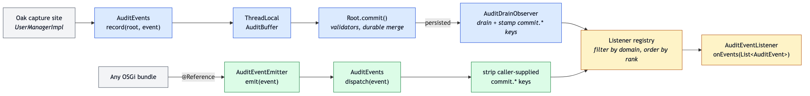
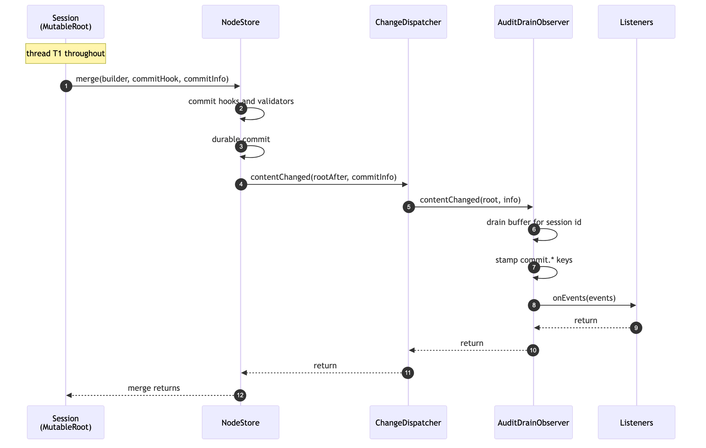
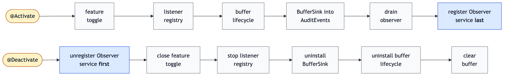

<!--
   Licensed to the Apache Software Foundation (ASF) under one or more
   contributor license agreements.  See the NOTICE file distributed with
   this work for additional information regarding copyright ownership.
   The ASF licenses this file to You under the Apache License, Version 2.0
   (the "License"); you may not use this file except in compliance with
   the License.  You may obtain a copy of the License at

       http://www.apache.org/licenses/LICENSE-2.0

   Unless required by applicable law or agreed to in writing, software
   distributed under the License is distributed on an "AS IS" BASIS,
   WITHOUT WARRANTIES OR CONDITIONS OF ANY KIND, either express or implied.
   See the License for the specific language governing permissions and
   limitations under the License.
-->

Audit Pipeline Design
--------------------------------------------------------------------------------

This document describes the design of Oak's audit pipeline: the SPI surface
in `oak-core-spi`, the security-domain constants in `oak-security-spi`, the
pipeline implementation in `oak-core`, OSGi and embedded wiring, and the
threading and ordering rules the implementation relies on.

For the consumer-facing guide (event model, listener contract, trust model),
see [Audit SPI](audit.html).

<a name="overview"></a>
### Overview

The audit pipeline transports structured `AuditEvent`s from producers to
bundle-registered `AuditEventListener` consumers, gated by a feature toggle
and a per-domain listener registry.

A *capture site* is a place in Oak's own code that records an audit event.
Today the only ones are in `UserManagerImpl`, on group membership add and
remove. The term is used throughout this document for that kind of call
site, as distinct from a bundle emitting its own events.

There are two delivery paths:

- **Commit-attached.** Oak-internal capture sites (e.g. `UserManagerImpl`)
  call `AuditEvents.record(root, event)`. Events land in a per-session
  `ThreadLocal` buffer (`AuditBuffer`), and a `NodeStore` `Observer`
  (`AuditDrainObserver`) drains and dispatches them once the following
  commit has durably persisted, whether the caller issued that commit
  explicitly or an operation issued it on their behalf. At drain time each
  event is decorated with `oak.commit.sessionId`, `oak.commit.userId`, and
  `oak.commit.timestamp` payload entries; a failed commit drops the buffer.
- **Fire-and-forget.** Any OSGi bundle resolves `AuditEventEmitter` via
  `@Reference` and calls `emit(event)`. The event is dispatched synchronously
  on the calling thread: no buffering, no commit boundary, no payload
  decoration. Caller-supplied values for the three reserved `oak.commit.*`
  attestation keys are stripped before delivery (the trust contract on
  `AuditEvent#getPayload()` is the normative statement).

Both paths converge on `AuditEventListener.onEvents(List<AuditEvent>)` and
share one listener registry. Failure isolation is layered: an outer
`Throwable` barrier in `AuditDrainObserver.contentChanged` keeps audit from
masquerading as a commit failure, and an inner per-listener `Throwable`
barrier on both paths keeps one misbehaving listener from stopping the
others.

Pipeline state is owned by `AuditPipeline` in `oak-core`, which
holds the feature toggle, the buffer, the listener registry, the sink
installed into the `AuditEvents` facade, and the singleton drain observer.
It is registered as an OSGi service of type `AuditConfiguration`. Audit is a
top-level Oak concern, not a `SecurityConfiguration`.

<a name="pipeline_diagram"></a>
### Pipeline diagram



The upper row is the commit-attached path, the lower row fire-and-forget.
They converge on the listener registry, which filters by domain and orders by
rank before invoking each listener.

On the commit-attached path, `BufferSink.record` gates on the feature toggle
and on whether any listener is registered for the event's domain, so a
capture site allocates nothing when audit is off. The observer runs on the
commit thread once the merge has persisted, drains the buffer for that
session, and stamps the three `oak.commit.*` keys. On the fire-and-forget path,
`BufferSink.dispatch` applies the same toggle and listener gates, strips
caller-supplied `oak.commit.*` values, and dispatches inline.

The short-circuit order in the observer, and the exception barriers on both
paths, are described under Implementation below.

<a name="commit_flow"></a>
### Commit flow



The observer fires synchronously on the commit thread, after durable
persistence and before `store.merge` returns. That is the property the
per-session buffer depends on: the drain has to happen on the thread that
filled it. Every production `NodeStore` notifies observers that way, though
not all by the same route. The document and composite stores dispatch
through `ChangeDispatcher`; `MemoryNodeStore` iterates its registered
observers directly from `setRoot`. Either way the notification completes
before `merge` returns.

The drain hangs off the commit, not off the API call that produced the event,
so operations that persist without an explicit `Session.save()` are covered
too. The buffer is keyed by `CommitInfo.getSessionId()`, which
`MutableRoot.commit` fills from the `ContentSession`, and anything reaching
`MutableRoot.commit` drains it. That covers the commits issued internally by
`Workspace.move` and by `VersionManager.checkin` / `checkout`, none of which
require a `Session.save()` from the caller. `Workspace.move` builds a fresh
`MutableRoot` from `ContentSession.getLatestRoot()`, but it is the same
`ContentSession`, so the buffer key still matches. The one case with no drain
is a write that never goes through `MutableRoot` at all, covered under
Migration commits below.

Two segment-store configurations are worth knowing about, because in both the
commit-attached path silently produces nothing in the segment store.
`SegmentNodeStore.addObserver` returns a no-op handle unless change dispatch
is enabled, and an observer attached through that handle is never notified.
That applies to a cold-standby instance, where the primary store turns
dispatch off, and to a store configured through `SegmentNodeStoreFactory`,
where dispatch is off unless `dispatchChanges` is set explicitly. Neither
caveat extends to the document or composite stores:
`DocumentNodeStore.addObserver` always returns a live handle, and
`DocumentNodeStore` dispatches through `ChangeDispatcher` in the `merge`
path.

Draining from an `Observer` rather than from a commit hook has two
consequences worth spelling out. Events never transit the `CommitContext`,
which is a shared string-keyed channel readable by any `CommitHook` in the
same commit; keeping audit events out of it avoids a class of cross-bundle
information disclosure. And dispatch happens only after the commit is
durable, so there is no window in which a listener sees an event for a
write that subsequently fails.

<a name="spi_layout"></a>
### SPI layout

#### oak-core-spi

Package `org.apache.jackrabbit.oak.spi.audit` holds the domain-neutral SPI:

| Type | Role |
|---|---|
| `AuditEvent` | Event interface: domain, type, timestamp, payload. Static factory `AuditEvent.of(...)`. Publishes the three reserved key names as `COMMIT_SESSION_ID`, `COMMIT_USER_ID`, `COMMIT_TIMESTAMP`, and the `isCommitAttested(event)` predicate over them. |
| `AuditDomain` / `AuditType` | Value types wrapping the domain and type strings, created via `of(name)` and validated there. |
| `AuditEventListener` | Consumer SPI: `onEvents(List<AuditEvent>)`, scoped to one domain via `getDomain()`, ordered by `getRank()`. |
| `AuditEventEmitter` | OSGi service surface for fire-and-forget emission from any bundle. |
| `AuditEvents` | Static facade: `record(root, event)` and `dispatch(event)`, routing to the installed `Sink`; `isEnabled()` / `isEnabledFor(domain)` gates. |
| `AuditEvents.Sink` | SPI implemented by the pipeline. `AuditPipeline` installs a `BufferSink`. |
| `AuditBufferLifecycle` | Session lifecycle callouts: drain on refresh and on commit failure. |
| `AuditConfiguration` | Typed handle on pipeline state (`isActive()`, `NOOP`). |

Domain and type are value types rather than bare strings so the constraint
on them has somewhere to live. A listener that persists events into the
repository wants to build a path from the domain, so a domain has to be
usable as a JCR node name. `AuditDomain.of(...)` and `AuditType.of(...)`
enforce that: the name must be non-blank, must pass `JcrNameParser` (which
rules out `/`, `[`, `]`, `|` and `*`), and must contain no colon and no
whitespace. The colon is rejected rather than escaped because in JCR it
denotes a namespace prefix, which means nothing for a flat audit
identifier; whitespace is rejected because it has no place in one either.

Validating in the factory puts the failure at the producer that supplied
the bad name, rather than at whichever listener later tried to build a path
out of it. Both types are final, with `equals`/`hashCode` over the wrapped
string, so the registry can route on them and `name()` gives listeners the
raw value back. Neither is an enum: the set of domains is open, and
consumer bundles define their own.

`AuditConfiguration.isActive()` returns `true` when the feature toggle is
enabled and at least one listener is registered. The two predicates AND
together so a deployed-but-unused pipeline reports `false`, matching the
no-allocation semantics of `AuditEvents.isEnabled()`. Both read the same
volatile sink state, so they cannot drift apart. The interface ships a
`NOOP` constant for callers that want a guaranteed-non-null handle.

Cardinality is unary optional: multiple `AuditConfiguration` implementations
are not supported. The buffer lifecycle is a singleton install, and two
observers on the same root `NodeStore` would each produce a dispatch.
Multiplexing belongs at the listener layer.

#### oak-security-spi

Security-domain constants live next to the SPI they describe:

- `spi/security/audit/SecurityAuditDomain` holds `DOMAIN`, the single
  `AuditDomain` wrapping `"oak.security"`, shared by all events Oak's security
  stack emits. The `oak.` prefix namespaces the domain so listeners in mixed
  deployments (Sling, application bundles) can tell Oak's security events
  apart from same-named domains defined by other layers.
- `spi/security/user/UserAuditTypes` holds the user-membership vocabulary:
  `AuditType` constants (`MEMBER_ADDED`, `MEMBER_REMOVED`) and payload keys
  (`PAYLOAD_GROUP_PATH`, `PAYLOAD_MEMBER_IDS`, `PAYLOAD_MEMBER_PATHS`,
  `PAYLOAD_MEMBERSHIP_SOURCE`, `PAYLOAD_IS_CONTENT_ID`,
  `PAYLOAD_FAILED_IDS`). A single and a bulk membership change share the
  same type; a bulk change is one whose `PAYLOAD_MEMBER_IDS` list holds more
  than one entry.

Future ACL, principal, or token events declare their own `*AuditTypes`
classes in the respective SPI sub-packages.

Producer-side factories are deliberately not part of the SPI. They live as
package-private classes next to their only callers, e.g.
`UserAuditEvents` next to `UserManagerImpl` in `oak-core`. The asymmetry
(read-side vocabulary public, write-side factories impl-private) raises the
bar for casually forging Oak-attested events, but it is not a hard boundary:
any bundle can call `AuditEvent.of(domain, type, payload)` directly.
Listeners that need to distinguish Oak-attested commit-attached events from
fire-and-forget emissions call `AuditEvent.isCommitAttested(event)`.

The helper exists so listeners do not hardcode the key names or re-derive
the rule. It is named for what it checks: all three reserved keys are
present and non-null. Oak does not sign events, so a positive result means
the event came through Oak's commit-attached dispatch, which is exactly the
guarantee the trust contract on `AuditEvent#getPayload()` states, and no
more. The key names themselves are public as `AuditEvent.COMMIT_SESSION_ID`,
`COMMIT_USER_ID`, and `COMMIT_TIMESTAMP`, for listeners that read individual
values rather than testing for attestation. Helper and constants both sit in
`oak-core-spi`, so a listener bundle still depends on that module alone.

<a name="implementation"></a>
### Implementation (oak-core)

<a name="design_rules"></a>
#### Design rules

The rules the components below are built on:

1. **Observers fire synchronously on the commit thread for local commits.**
   Every production store notifies observers before `merge` returns, whether
   through `ChangeDispatcher` or, as in `MemoryNodeStore`, by iterating its
   observers directly. The per-thread buffer depends on this.
2. **Observers fire after durable persistence, or not at all.** A failed
   merge never reaches the observer, so a dispatched event always
   corresponds to a persisted write.
3. **External commits are ignored at observer entry.** One predicate covers
   cluster sync, the `addObserver` replay, and external head movement.
4. **The buffer key equals `CommitInfo.getSessionId()`.** `MutableRoot`
   sets the commit info's session id from the `ContentSession`, which is the
   same key the sink used at capture time.
5. **`CompositeObserver` provides no per-observer isolation.** Hence the
   outer `Throwable` barrier in `contentChanged`.
6. **No ordering guarantee among observers.** Audit does not depend on
   observer order; listener order within the audit dispatch is defined by
   `getRank()`.
7. **Never wrap the drain observer in `BackgroundObserver`.** Queue overflow
   replaces the commit info with `CommitInfo.EMPTY_EXTERNAL`, losing the
   session id and with it the buffered events.
8. **Audit never masquerades as a commit failure.** The outer barrier
   guarantees `contentChanged` returns normally no matter what the drain,
   the decorator, or a listener does.
9. **Lifecycle callouts are unconditional.** Gating them on the toggle or on
   listener presence would let events captured while the toggle was on stay
   in the buffer across a lifecycle transition, to be dispatched later
   against an unrelated commit and stamped with that commit's metadata.

Two consequences of the destructive `ThreadLocal` drain are worth noting.
When a composite store causes the observer to be invoked twice for one
merge, the first invocation drains the buffer and the second finds it empty
and returns, so double-dispatch dedupes itself. And because `clearAll()`
removes only the calling thread's `ThreadLocal` entry, disposing the
pipeline while other threads hold sessions mid-flight leaves their staged
events behind; that residue is bounded by the per-session cap and released
when the thread is reused or discarded.

#### Components

| Component | Role |
|---|---|
| `AuditBuffer` | `ThreadLocal` per-session staging area, keyed by `ContentSession` id. Caps a session at 10,000 staged events: past that, further events are dropped and one WARN is logged for the session rather than one per event. The cap re-arms on the next drain, refresh, or commit failure, so it bounds the memory a single large or non-committing session can pin. |
| `BufferSink` (inner class of `AuditPipeline`) | The installed `AuditEvents.Sink`. Gates on the feature toggle and listener presence, buffers on `record`, dispatches inline on `dispatch`. |
| `AuditDrainObserver` | `Observer` that drains the buffer on commit success. Carries the outer and inner `Throwable` barriers. |
| `CommitMetadataDecorator` | Stamps the three reserved `oak.commit.*` entries at drain time (commit-attached) and strips caller-supplied values for the same keys at dispatch (fire-and-forget). |
| `AuditEventEmitterImpl` | OSGi `@Component` implementing `AuditEventEmitter`; delegates to `AuditEvents.dispatch`. |
| `WhiteboardAuditEventListenerRegistry` | Tracks `AuditEventListener` services on the Whiteboard. `getListeners()` returns them sorted by rank descending; `hasListenerFor(domain)` backs the pre-allocation gate. |
| `AuditMonitor` | Wraps the `StatisticsProvider`: per-domain event meter, per-listener timer and failure meter, dropped-event meter. Falls back to a no-op when no provider is bound. |
| `AuditPipeline` | Pipeline owner: feature toggle, buffer, registry, sink, drain observer, monitor. Published as `AuditConfiguration`. |

`initialize` looks the `StatisticsProvider` up on the whiteboard rather than
taking a DS `@Reference`, so the OSGi and embedded paths share one lookup.
Deployments that publish no provider, which is the normal case for tests and
embedded callers, get `AuditMonitor.NOOP` and record nothing. The monitor is
passed to the components that record: the buffer for dropped events, and both
dispatch paths for the event meter, the per-listener timer, and the failure
meter. Recording sits inside the existing per-listener `Throwable` barrier, so
a metrics failure cannot break a dispatch. The metric names and their
operational meaning are listed under [Monitoring](audit.html#Monitoring).

The event meter counts an event once per domain, when at least one listener
consumed it. Both are deliberate: counting per listener would multiply the
rate by the number of subscribers, and counting before the dispatch loop would
include events whose listener unregistered between capture and drain.

#### AuditDrainObserver

The observer's `contentChanged(root, info)` short-circuits on
`CommitInfo.isExternal()`, then drains the buffer for `info.getSessionId()`.
If events came out and the toggle is still enabled, it decorates them via
`CommitMetadataDecorator`, groups them by domain, and dispatches each group
to the listeners registered for that domain, in rank order.

The drain runs before the toggle check, not after. Draining unconditionally
means a toggle flip between capture and commit discards the staged events
cleanly; checking the toggle first would leave them in the buffer, where a
later commit on the same session would pick them up and stamp them with the
wrong commit metadata.

Three rules govern this class:

- **Outer `Throwable` barrier.** `CompositeObserver` iterates its observers
  with no per-observer isolation, and the `NodeStore` implementations invoke
  the observer chain after the commit is already durable. An exception
  escaping `contentChanged` would therefore surface as a commit failure to
  the merge caller even though the commit succeeded, and could mask other
  observers' work. The entire method body runs inside a
  `try { ... } catch (Throwable t) { log.warn(...); }`.
- **Inner per-listener barrier.** Each listener dispatch is individually
  wrapped, also at `Throwable` width, so a listener throwing a
  `LinkageError` or similar does not stop the remaining listeners. The same
  isolation covers the `getDomain()` / `getRank()` accessors consulted
  during routing.
- **Never wrap in `BackgroundObserver`.** The async wrapper replaces the
  latest queued entry with `CommitInfo.EMPTY_EXTERNAL` on queue overflow,
  which discards the session id. The drain keys exclusively on
  `CommitInfo.getSessionId()` to find the per-thread buffer, so losing the
  session id silently loses audit events for high-rate writers. Synchronous
  dispatch is mandatory, and the buffer's `ThreadLocal` semantics require
  draining on the capturing thread anyway.

The external-commit short-circuit covers cluster sync from peer nodes, the
synthetic replay invocation that `Observable.addObserver` makes at
registration time, and external head movement in the segment store. By
construction the buffer is empty for external commits (no local capture site
fired), so the explicit gate is defense in depth rather than a correctness
requirement.

#### Session lifecycle and buffer draining

The observer only sees successful commits. `MutableRoot` covers the other
paths through `AuditBufferLifecycle` callouts:

| Case | Who drains the buffer |
|---|---|
| `Root.commit()` succeeds | `AuditDrainObserver.contentChanged` |
| `Root.commit()` fails (merge throws) | `MutableRoot.commit` finally block, via `AuditBufferLifecycle.onCommitFailed` |
| `Root.refresh()` | `MutableRoot.refresh`, via `AuditBufferLifecycle.onRefresh` |
| Pipeline shutdown while sessions are mid-flight | `AuditPipeline.dispose`, via `buffer.clearAll()` |

`Root.rebase()` intentionally does not drain: rebase preserves transient
changes, so the audit events staged alongside them survive and are
dispatched when the session eventually commits.

The lifecycle callouts always fire, for the reason given in design rule 9.
The cost of that is negligible: when no pipeline is installed the callout is
one volatile read plus a virtual call into a no-op listener.

`AuditEvents.record(root, event)` requires that `root` is the `MutableRoot`
of an active JCR session, since the lifecycle callouts above are what keep
the buffer consistent. Non-JCR commits must not call it.

<a name="osgi_wiring"></a>
### OSGi wiring

`AuditPipeline` is declared as
`@Component(service = AuditConfiguration.class)`. It takes no reference to
the `NodeStore` or to `Observable`. Instead it follows Oak's established
observer-registration idiom (the same one the Lucene index observer uses):
`@Activate` registers the drain observer as an `Observer` service on the
`BundleContext`, and the `ObserverTracker` that each NodeStore service runs
picks the service up and subscribes it to the root `NodeStore`. This keeps
the audit bundle decoupled from store selection; composite deployments get
the same root store the rest of the stack uses.

Activation wires the pipeline internals first and publishes the `Observer`
service last; deactivation unregisters that service first and only then tears
the internals down:



Registering the observer last means a commit thread racing with activation
either misses the observer entirely (events stay buffered for the next
commit) or sees a fully wired pipeline. Unregistering it first means
`ObserverTracker` closes the subscription before anything is dismantled, so
no further `contentChanged` call reaches a half-torn-down buffer or registry.

Detach first, tear down internals second: the same shape as
`ChangeProcessor` in `oak-jcr`. `dispose()` checks that the observer service
has been unregistered and fails loudly otherwise, turning an out-of-order
teardown into an error instead of a dangling observer subscription over
torn-down state. The drain observer is constructed once in `initialize` and
zeroed in `dispose`; `getDrainObserver()` throws `IllegalStateException`
outside that window. It is a singleton by design: two observer instances
sharing one buffer would double-dispatch.

<a name="embedded_wiring"></a>
### Embedded (non-OSGi) wiring

Embedded callers (tests, `oak-run` tooling, custom embeds) wire the pipeline
explicitly. Several of the types below, including `AuditPipeline`
and `SecurityProviderBuilder`, live in packages oak-core does not export, so
this path is available to code on a flat classpath rather than to a bundle
running inside an OSGi framework; there, use the DS service instead.

```java
MemoryNodeStore store = new MemoryNodeStore();
DefaultWhiteboard whiteboard = new DefaultWhiteboard();

AuditPipeline audit = new AuditPipeline();
audit.initialize(whiteboard);         // toggle, registry, buffer, sink

// The toggle is created disabled. Flip it on through the FeatureToggle
// that initialize() registered, or the pipeline stays silent.
Tracker<FeatureToggle> toggles = whiteboard.track(FeatureToggle.class);
try {
    for (FeatureToggle ft : toggles.getServices()) {
        if (AuditPipeline.FEATURE_TOGGLE_NAME.equals(ft.getName())) {
            ft.setEnabled(true);
        }
    }
} finally {
    toggles.stop();
}

// Register listeners before driving any commit.
whiteboard.register(AuditEventListener.class, new MyListener(), Map.of());

Closeable observerHandle = store.addObserver(audit.getDrainObserver());

SecurityProvider securityProvider = SecurityProviderBuilder.newBuilder()
        .withWhiteboard(whiteboard)
        .build();

ContentRepository repo = new Oak(store)
        .with(new InitialContent())   // required: security setup needs jcr:system
        .with(securityProvider)
        .with(whiteboard)
        .createContentRepository();

// ... drive commits ...

observerHandle.close();               // detach observer first, as in OSGi teardown
if (repo instanceof Closeable) {
    ((Closeable) repo).close();       // ContentRepository itself declares no close()
}
audit.dispose();
```

Four things in that sequence are easy to get wrong. The toggle starts
disabled, so a pipeline that is otherwise wired correctly dispatches nothing
until something enables it. `InitialContent` is needed because the security
setup expects `jcr:system` to exist. Listeners have to be registered before
the commits you want to capture, since the capture gate checks for a listener
on the event's domain. And `ContentRepository` declares no `close()`, so the
teardown has to test for `Closeable`.

The explicit `addObserver` call is required. `Oak.with(Observer)` relies on
an auto-attach side effect of Oak's default whiteboard, and that side effect
is lost as soon as the embedder replaces the whiteboard via
`Oak.with(Whiteboard)`. Sharing one whiteboard between audit and Oak is the
common case for embedded setups (listener registrations and the audit
tracker should see the same whiteboard), so the safe path is always the
direct `Observable.addObserver(...)`. OSGi deployments are unaffected: their
subscription runs through `ObserverTracker`, not through the default
whiteboard.

<a name="migration_commits"></a>
### Migration commits

Migration tooling (`oak-upgrade`) calls `NodeStore.merge(...)` directly,
bypassing `MutableRoot` and the capture sites. Migration tools do not set the
pipeline up, so when one runs standalone there is no observer attached and no
audit machinery on the path at all. Run inside a container where audit is
deployed, the observer does fire on migration commits, finds an empty buffer
for the session id, and returns. Either way migration mutations are not
audited; if that is ever wanted, it is a capture-site addition, not a
pipeline change.

<a name="performance"></a>
### Performance characteristics

With audit off (toggle disabled, or no listener registered for the domain),
capture sites short-circuit at `AuditEvents.isEnabledFor(domain)` before
constructing an event: no allocation, no buffer touch. The check is a
volatile read of the installed sink and the toggle, and, when the toggle is
on, a linear scan of the registered listeners comparing each `getDomain()`
against the requested domain. Deployments carry a handful of listeners, so
the scan stays cheaper than maintaining a domain index. The per-commit cost
of a deployed-but-idle pipeline is the external-commit check plus an empty
buffer lookup in the observer.

With audit on, the per-event cost is the event allocation, a buffer append,
the drain, three decorator entries, the metric updates, and the listener
dispatch itself. Benchmarks in `oak-benchmarks` cover both shapes: the
pipeline running with no capture site firing, and the full captured-event
path. In both, the overhead sits below the resolution of the surrounding
commit machinery, so turning audit on does not measurably change commit
throughput. Listener work is on top of that and belongs to the listener;
implementations that do I/O are expected to hand off to their own async
executor.
